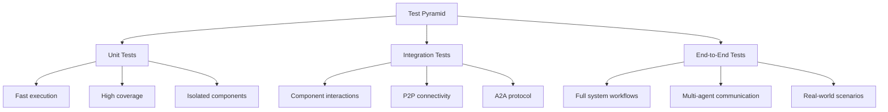
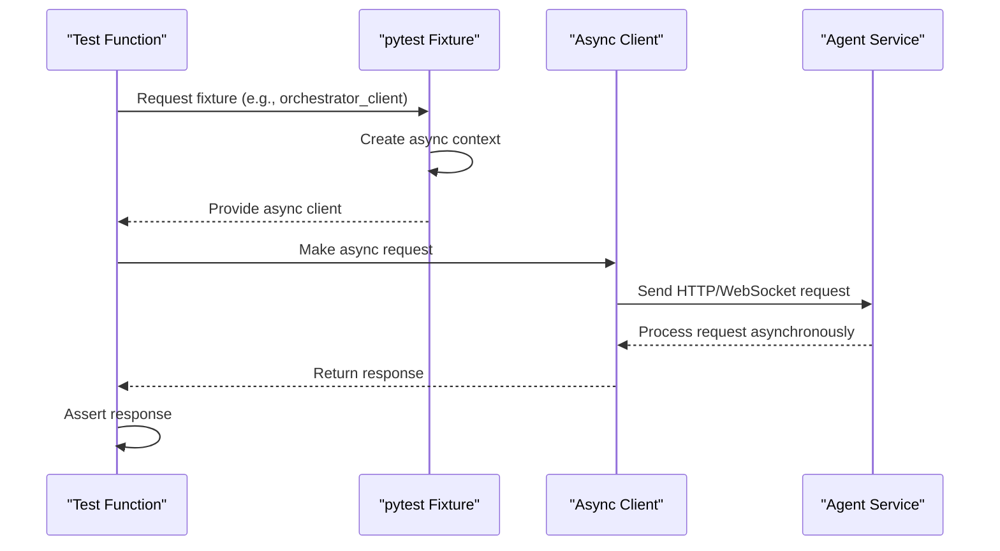
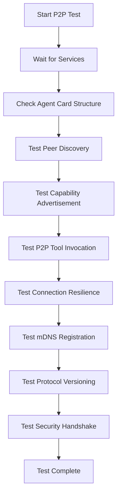
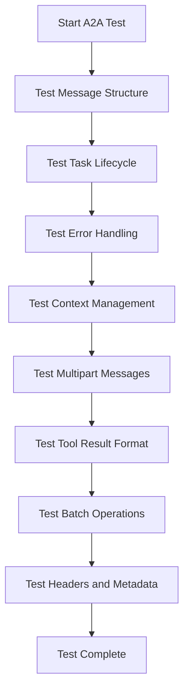
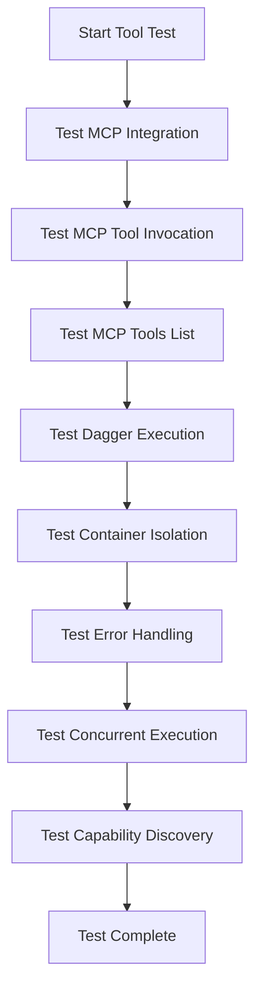
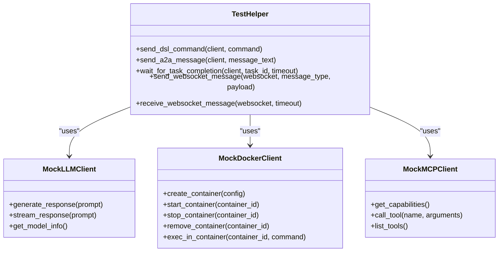
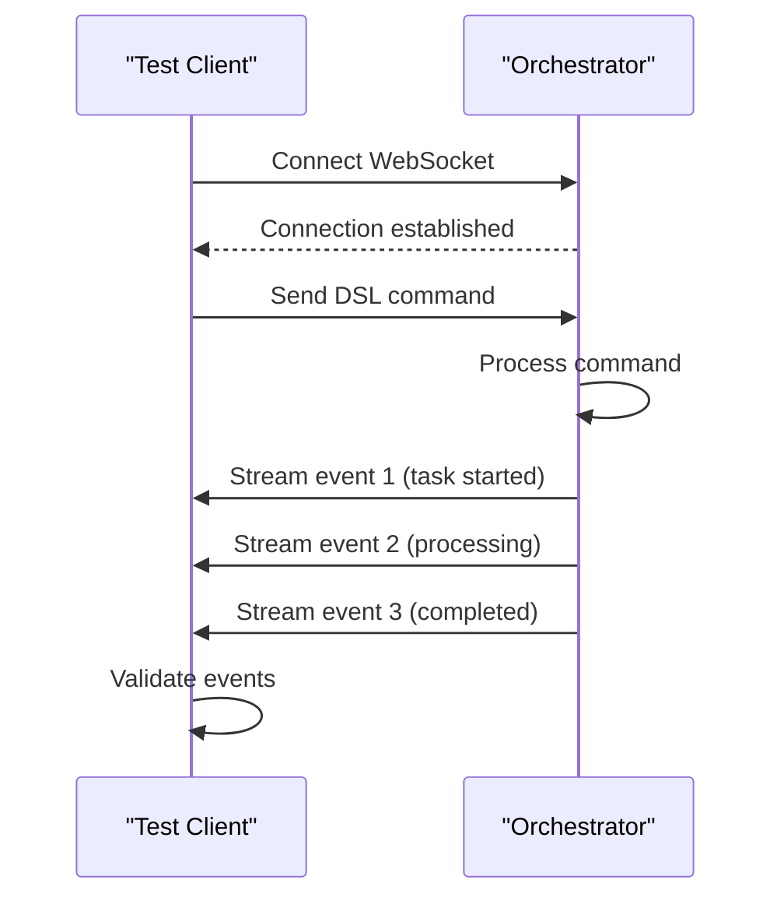

# Testing Strategy


## Table of Contents
1. [Introduction](#introduction)
2. [Test Pyramid Implementation](#test-pyramid-implementation)
3. [Asynchronous Testing with pytest and trio](#asynchronous-testing-with-pytest-and-trio)
4. [Integration Test Patterns](#integration-test-patterns)
5. [Mocking External Dependencies](#mocking-external-dependencies)
6. [Event-Driven Components and Race Conditions](#event-driven-components-and-race-conditions)
7. [Distributed Systems Testing Challenges](#distributed-systems-testing-challenges)
8. [Test Coverage and CI/CD Integration](#test-coverage-and-cicd-integration)
9. [Debugging Flaky Tests and Performance Benchmarks](#debugging-flaky-tests-and-performance-benchmarks)
10. [Contribution Guidelines for New Tests](#contribution-guidelines-for-new-tests)

## Introduction
This document outlines the comprehensive testing strategy for the Praxis Python SDK, a distributed agent system that enables multi-agent communication, P2P connectivity, and tool execution via MCP and Dagger. The testing approach follows a test pyramid model with unit, integration, and end-to-end tests to ensure reliability across all system layers. The strategy leverages pytest for test organization and trio for asynchronous testing, with a focus on validating the complex interactions between agents in a distributed environment. The tests cover critical functionality including A2A protocol compliance, P2P discovery, tool execution, WebSocket connectivity, and multi-agent workflows.

## Test Pyramid Implementation

The Praxis Python SDK implements a comprehensive test pyramid strategy with three distinct layers: unit tests, integration tests, and end-to-end tests. This approach ensures thorough validation of the system at different levels of complexity and interaction.



**Diagram sources**
- [test_p2p_connectivity.py](file://tests/integration/test_p2p_connectivity.py)
- [test_a2a_protocol.py](file://tests/integration/test_a2a_protocol.py)
- [test_multi_agent_communication.py](file://tests/integration/test_multi_agent_communication.py)

**Section sources**
- [test_p2p_connectivity.py](file://tests/integration/test_p2p_connectivity.py)
- [test_a2a_protocol.py](file://tests/integration/test_a2a_protocol.py)
- [test_multi_agent_communication.py](file://tests/integration/test_multi_agent_communication.py)

### Unit Tests
Unit tests focus on individual functions and classes in isolation, providing fast feedback and high test coverage. These tests are typically located in the root tests directory and validate specific functionality without external dependencies.

### Integration Tests
Integration tests verify the interaction between components and are the primary focus of the testing strategy. Located in the `tests/integration` directory, these tests validate P2P connectivity, A2A protocol compliance, tool execution, and WebSocket communication between agents.

### End-to-End Tests
End-to-end tests validate complete workflows involving multiple agents and services. These tests ensure that the system functions correctly as a whole, simulating real-world usage scenarios and complex multi-agent interactions.

## Asynchronous Testing with pytest and trio

The Praxis Python SDK leverages pytest as the primary testing framework with native support for asynchronous testing using asyncio. The integration tests extensively use pytest's async capabilities to test the asynchronous nature of the distributed agent system.



**Diagram sources**
- [conftest.py](file://tests/integration/conftest.py)
- [test_a2a_protocol.py](file://tests/integration/test_a2a_protocol.py)

**Section sources**
- [conftest.py](file://tests/integration/conftest.py#L0-L281)
- [test_a2a_protocol.py](file://tests/integration/test_a2a_protocol.py#L0-L480)

The testing framework uses pytest fixtures to manage asynchronous resources such as HTTP clients, WebSocket connections, and test helpers. Key fixtures include:

- `http_client`: Async HTTP client for API requests
- `orchestrator_client`: HTTP client configured for the orchestrator service
- `worker_fs_client`: HTTP client for the filesystem worker
- `orchestrator_ws`: WebSocket connection to the orchestrator
- `test_helper`: Utility class with common test operations

Each integration test is decorated with `@pytest.mark.asyncio` to enable async test functions, allowing the use of `await` syntax for asynchronous operations. The tests use `asyncio.sleep()` for timing control and `asyncio.wait_for()` for timeouts, ensuring reliable testing of asynchronous workflows.

## Integration Test Patterns

The integration tests follow specific patterns for testing different aspects of the distributed agent system, focusing on P2P connectivity, A2A protocol, and tool execution.

### P2P Connectivity Testing

P2P connectivity tests validate the peer discovery and communication capabilities between agents in the distributed system.



**Diagram sources**
- [test_p2p_connectivity.py](file://tests/integration/test_p2p_connectivity.py)

**Section sources**
- [test_p2p_connectivity.py](file://tests/integration/test_p2p_connectivity.py#L0-L333)

The P2P test suite includes:
- `test_p2p_service_startup`: Validates that P2P services start correctly
- `test_peer_discovery`: Tests peer discovery between agents
- `test_agent_card_structure`: Ensures agent cards conform to A2A specification
- `test_p2p_tool_invocation`: Tests remote tool invocation over P2P
- `test_p2p_capability_advertisement`: Validates capability advertisement
- `test_p2p_connection_resilience`: Tests connection stability
- `test_mdns_service_registration`: Validates mDNS service registration
- `test_p2p_protocol_versioning`: Tests protocol version compatibility
- `test_p2p_security_handshake`: Verifies security protocol handshake

### A2A Protocol Testing

A2A protocol tests validate compliance with the Agent-to-Agent communication specification, ensuring proper message structure, task lifecycle, and error handling.



**Diagram sources**
- [test_a2a_protocol.py](file://tests/integration/test_a2a_protocol.py)

**Section sources**
- [test_a2a_protocol.py](file://tests/integration/test_a2a_protocol.py#L0-L480)

The A2A test suite includes:
- `test_a2a_message_structure`: Validates A2A message structure compliance
- `test_a2a_task_lifecycle`: Tests complete task lifecycle from submission to completion
- `test_a2a_error_handling`: Validates error handling for invalid requests
- `test_a2a_context_management`: Tests context management across messages
- `test_a2a_multipart_messages`: Validates handling of multipart messages
- `test_a2a_tool_result_format`: Tests tool result formatting
- `test_a2a_batch_operations`: Tests batch operations handling
- `test_a2a_protocol_headers_and_metadata`: Validates headers and metadata

### Tool Execution Testing

Tool execution tests validate the integration with MCP (Model Context Protocol) and Dagger for tool execution, including error handling and concurrent execution.



**Diagram sources**
- [test_tool_execution.py](file://tests/integration/test_tool_execution.py)

**Section sources**
- [test_tool_execution.py](file://tests/integration/test_tool_execution.py#L0-L493)

The tool execution test suite includes:
- `test_mcp_filesystem_server_integration`: Validates MCP server integration
- `test_mcp_tool_invocation`: Tests direct MCP tool invocation
- `test_mcp_tools_list`: Validates tools list functionality
- `test_dagger_python_execution`: Tests Dagger-based Python execution
- `test_dagger_container_isolation`: Validates container isolation
- `test_tool_error_handling`: Tests error handling and recovery
- `test_concurrent_tool_execution`: Tests concurrent tool execution
- `test_mcp_error_handling`: Validates MCP server error handling
- `test_tool_capability_discovery`: Tests capability discovery

## Mocking External Dependencies

The testing strategy includes comprehensive mocking of external dependencies to ensure reliable and isolated tests. The framework uses pytest fixtures and context managers to mock external services such as LLM APIs and Docker services.



**Diagram sources**
- [conftest.py](file://tests/integration/conftest.py)
- [test_tool_execution.py](file://tests/integration/test_tool_execution.py)

**Section sources**
- [conftest.py](file://tests/integration/conftest.py#L0-L281)
- [test_tool_execution.py](file://tests/integration/test_tool_execution.py#L0-L493)

### LLM API Mocking
The tests use environment variables to conditionally skip LLM-dependent tests when credentials are not available:

```python
if "OPENAI_API_KEY" in os.environ:
    # Run LLM-dependent tests
    natural_command = "create a file called greeting.txt with hello world"
    response = await test_helper.send_a2a_message(orchestrator_client, natural_command)
else:
    pytest.skip("OPENAI_API_KEY not available")
```

### Docker Service Mocking
The framework uses shared directories and container volumes to simulate Docker service interactions without requiring actual container execution in all test scenarios. The `setup_test_files` fixture creates test files in the shared directory that can be accessed by containerized services.

### HTTP Client Mocking
The test framework uses pytest fixtures to provide pre-configured HTTP clients for different services:

```python
@pytest.fixture
async def orchestrator_client():
    """HTTP client specifically for orchestrator"""
    async with httpx.AsyncClient(base_url=ORCHESTRATOR_URL, timeout=60.0) as client:
        yield client
```

These fixtures allow tests to interact with services through their APIs while maintaining isolation and cleanup between test runs.

## Event-Driven Components and Race Conditions

The distributed agent system relies heavily on event-driven components, particularly through WebSocket connectivity. The testing strategy includes specific patterns for testing these components and addressing race conditions.

### WebSocket Connectivity Testing

WebSocket tests validate the event streaming capabilities of the system, ensuring reliable message delivery and handling.



**Diagram sources**
- [test_websocket_connectivity.py](file://tests/integration/test_websocket_connectivity.py)

**Section sources**
- [test_websocket_connectivity.py](file://tests/integration/test_websocket_connectivity.py#L0-L468)

The WebSocket test suite includes:
- `test_websocket_connection`: Validates basic WebSocket connectivity
- `test_websocket_dsl_command_streaming`: Tests DSL command execution with event streaming
- `test_websocket_workflow_execution`: Validates workflow execution through WebSocket
- `test_websocket_chat_interface`: Tests chat-like interface through WebSocket
- `test_websocket_concurrent_connections`: Tests multiple concurrent WebSocket connections
- `test_websocket_error_handling`: Validates error handling for malformed messages
- `test_websocket_large_message_handling`: Tests handling of large messages
- `test_websocket_heartbeat_and_keepalive`: Validates heartbeat functionality
- `test_websocket_message_ordering`: Tests message ordering and sequencing

### Race Condition Mitigation

The tests address race conditions through several strategies:

1. **Explicit waiting**: Using `asyncio.sleep()` to allow time for asynchronous operations to complete
2. **Polling with timeouts**: Implementing retry logic with timeouts for operations that may take time
3. **Event-driven validation**: Waiting for specific events rather than using fixed delays
4. **Service readiness checks**: Using the `wait_for_services` fixture to ensure all services are ready before tests begin

```python
@pytest.fixture
async def wait_for_services():
    """Wait for all services to be ready"""
    services = [
        (ORCHESTRATOR_URL, "orchestrator"),
        (WORKER_FS_URL, "worker-filesystem"),
        (WORKER_ANALYTICS_URL, "worker-analytics"),
        (MCP_FILESYSTEM_URL, "mcp-filesystem")
    ]
    
    async with httpx.AsyncClient(timeout=10.0) as client:
        for url, name in services:
            max_retries = 30
            for attempt in range(max_retries):
                try:
                    response = await client.get(f"{url}/health")
                    if response.status_code == 200:
                        logger.info(f"Service {name} is ready")
                        break
                except Exception as e:
                    if attempt == max_retries - 1:
                        pytest.fail(f"Service {name} is not available")
                    await asyncio.sleep(2)
```

## Distributed Systems Testing Challenges

Testing distributed agent systems presents unique challenges related to network partitions, timing issues, and system complexity. The testing strategy addresses these challenges through specific approaches and patterns.

### Network Partition Simulation

While the current test suite doesn't explicitly simulate network partitions, it includes resilience testing that validates the system's behavior under unstable network conditions:

```python
@pytest.mark.p2p
@pytest.mark.asyncio
async def test_p2p_connection_resilience(wait_for_services, orchestrator_client):
    """Test P2P connection resilience and recovery"""
    
    # Get initial peer count
    response = await orchestrator_client.get("/p2p/cards")
    assert response.status_code == 200
    
    initial_peers = len(response.json().get("cards", {}))
    print(f"Initial peer count: {initial_peers}")
    
    # Wait and check again - peers should remain stable
    await asyncio.sleep(30)
    
    response = await orchestrator_client.get("/p2p/cards")
    assert response.status_code == 200
    
    later_peers = len(response.json().get("cards", {}))
    print(f"Later peer count: {later_peers}")
    
    # In a stable environment, peer count should not decrease significantly
    if initial_peers > 0:
        assert later_peers >= initial_peers * 0.5  # Allow 50% tolerance
```

### Timing Issues and Asynchronous Coordination

The tests address timing issues through several mechanisms:

1. **Configurable timeouts**: Using reasonable timeouts for operations that may take time
2. **Retry logic**: Implementing retry mechanisms for operations that may fail temporarily
3. **Service readiness checks**: Ensuring services are fully started before tests begin
4. **Explicit delays**: Using `asyncio.sleep()` to allow time for asynchronous operations

The `TestHelper` class includes methods specifically designed to handle asynchronous coordination:

```python
@staticmethod
async def wait_for_task_completion(client: httpx.AsyncClient, task_id: str, timeout: float = 60.0) -> Dict[str, Any]:
    """Wait for A2A task to complete"""
    start_time = asyncio.get_event_loop().time()
    
    while True:
        try:
            response = await client.get(f"/tasks/{task_id}")
            if response.status_code == 200:
                task = response.json()
                if task.get("status", {}).get("state") in ["completed", "failed"]:
                    return task
            
            # Check timeout
            if asyncio.get_event_loop().time() - start_time > timeout:
                raise TimeoutError(f"Task {task_id} did not complete within {timeout} seconds")
            
            await asyncio.sleep(1.0)
        
        except httpx.HTTPStatusError as e:
            if e.response.status_code == 404:
                raise ValueError(f"Task {task_id} not found")
            raise
```

### System Complexity Management

The test suite manages system complexity through:

1. **Modular test organization**: Grouping tests by functionality in separate files
2. **Reusable fixtures**: Creating reusable test fixtures for common setup tasks
3. **Test categorization**: Using pytest markers to categorize tests by type
4. **Progressive complexity**: Starting with simple tests and progressing to complex workflows

```python
# Custom markers for test categorization
pytest_configure = lambda config: [
    config.addinivalue_line("markers", "unit: Unit tests"),
    config.addinivalue_line("markers", "integration: Integration tests"),
    config.addinivalue_line("markers", "p2p: P2P communication tests"),
    config.addinivalue_line("markers", "a2a: A2A protocol tests"),
    config.addinivalue_line("markers", "mcp: MCP integration tests"),
    config.addinivalue_line("markers", "dagger: Dagger execution tests"),
    config.addinivalue_line("markers", "websocket: WebSocket communication tests"),
    config.addinivalue_line("markers", "slow: Slow running tests"),
]
```

## Test Coverage and CI/CD Integration

The testing strategy includes comprehensive test coverage requirements and seamless CI/CD integration through the Makefile.

### Test Coverage Requirements

The test suite aims for high coverage of critical functionality:

- **P2P connectivity**: Full coverage of peer discovery, capability advertisement, and secure connections
- **A2A protocol**: Complete coverage of message structure, task lifecycle, and error handling
- **Tool execution**: Comprehensive coverage of MCP integration, Dagger execution, and error recovery
- **WebSocket connectivity**: Full coverage of event streaming, concurrent connections, and error handling
- **Multi-agent communication**: Coverage of health checks, capability matching, and workflow delegation

### CI/CD Integration via Makefile

The Makefile provides a comprehensive set of commands for test execution and CI/CD integration:

```makefile
# Run tests
test:
	poetry run pytest tests/

# Format code
fmt:
	poetry run black src/
	poetry run isort src/

# Lint code
lint:
	poetry run ruff check src/
	poetry run mypy src/

# Full check (format, lint, test)
check: fmt lint test

# Update dependencies
update:
	poetry update
```

**Diagram sources**
- [Makefile](file://Makefile)

**Section sources**
- [Makefile](file://Makefile#L0-L169)

The CI/CD pipeline can use the `check` target to perform a complete validation of the codebase, including formatting, linting, and testing. The `test` target runs the complete test suite, while specialized targets like `test-p2p`, `test-dsl`, and `test-a2a` allow for targeted testing of specific functionality.

The Makefile also includes commands for setup, building, and running services, enabling a complete development and testing workflow:

```makefile
# Complete setup
setup:
	@echo "Setting up Praxis Python SDK..."
	@cp -n .env.example .env || true
	@mkdir -p shared logs keys
	@poetry install
	@echo "Setup complete! Edit .env file with your OPENAI_API_KEY"
	@echo "Then run: make up"

# Start all services
up:
	@if [ ! -f .env ]; then \
		echo "Error: .env file not found. Run 'make setup' first."; \
		exit 1; \
	fi
	docker-compose up -d
	@echo "Services starting..."
	@sleep 5
	@make health
```

## Debugging Flaky Tests and Performance Benchmarks

The testing framework includes strategies for debugging flaky tests and establishing performance benchmarks.

### Flaky Test Debugging

The test suite includes several mechanisms to identify and debug flaky tests:

1. **Comprehensive logging**: Using Python's logging module to capture detailed test execution information
2. **Retry mechanisms**: Implementing retry logic for operations that may fail due to timing issues
3. **Conditional skipping**: Skipping tests when external dependencies are not available
4. **Detailed error reporting**: Providing detailed error messages and context when tests fail

```python
@pytest.fixture
def sample_test_data():
    """Sample test data for various tests"""
    return {
        "test_file_content": "Hello, World!\nThis is a test file.",
        "test_json_data": {
            "name": "Test User",
            "age": 30,
            "skills": ["Python", "JavaScript", "Docker"],
            "active": True
        },
        "test_csv_data": "name,age,city\nAlice,25,New York\nBob,30,London\nCharlie,35,Tokyo",
        "test_analysis_script": '''
import json
import sys
from pathlib import Path

def analyze_data(input_file, output_file=None):
    """Simple data analysis script"""
    try:
        with open(input_file, 'r') as f:
            content = f.read()
        
        analysis = {
            "file_size": len(content),
            "line_count": len(content.splitlines()),
            "word_count": len(content.split()),
            "character_count": len(content)
        }
        
        if output_file:
            with open(output_file, 'w') as f:
                json.dump(analysis, f, indent=2)
        
        return analysis
    
    except Exception as e:
        return {"error": str(e)}
'''
    }
```

### Performance Benchmarks

While the current test suite doesn't include explicit performance benchmarks, it provides the foundation for establishing them:

1. **Timing measurements**: Using `asyncio.get_event_loop().time()` to measure operation durations
2. **Timeout configuration**: Setting reasonable timeouts that can be used as performance baselines
3. **Concurrent execution tests**: Testing concurrent operations that can reveal performance bottlenecks

The `test_concurrent_tool_execution` and `test_concurrent_task_execution` tests serve as de facto performance tests by validating the system's ability to handle multiple concurrent operations.

## Contribution Guidelines for Adding New Tests

When implementing new features, contributors should follow these guidelines for adding tests:

### Test Organization
- Place unit tests in the root `tests` directory
- Place integration tests in the `tests/integration` directory
- Use descriptive test file names that reflect the functionality being tested
- Group related tests in the same file

### Test Structure
- Use pytest fixtures for common setup and teardown operations
- Use descriptive test function names following the pattern `test_[feature]_[behavior]`
- Include comprehensive docstrings explaining the test purpose
- Use appropriate pytest markers to categorize tests

```python
@pytest.mark.p2p
@pytest.mark.asyncio
async def test_p2p_service_startup(wait_for_services, orchestrator_client):
    """Test that P2P services start correctly"""
    
    # Check if P2P is enabled in agent configuration
    response = await orchestrator_client.get("/agent/card")
    assert response.status_code == 200
    
    card = response.json()
    assert "name" in card
    assert "capabilities" in card
    assert "tools" in card
```

### Fixture Usage
- Leverage existing fixtures when possible
- Create new fixtures for reusable setup code
- Use appropriate fixture scopes (function, module, session)
- Document fixtures with clear docstrings

### Asynchronous Testing
- Decorate async test functions with `@pytest.mark.asyncio`
- Use `await` for asynchronous operations
- Use `asyncio.sleep()` for timing control
- Use `asyncio.wait_for()` for timeouts

### Error Handling
- Test both success and failure cases
- Validate proper error responses
- Test recovery from errors
- Use `pytest.raises()` when appropriate

### Coverage Requirements
- Ensure new functionality has unit test coverage
- Add integration tests for component interactions
- Test edge cases and error conditions
- Validate performance characteristics for critical paths

By following these guidelines, contributors can ensure that new features are thoroughly tested and maintain the overall reliability of the distributed agent system.

**Referenced Files in This Document**   
- [conftest.py](file://tests/integration/conftest.py)
- [test_p2p_connectivity.py](file://tests/integration/test_p2p_connectivity.py)
- [test_a2a_protocol.py](file://tests/integration/test_a2a_protocol.py)
- [test_tool_execution.py](file://tests/integration/test_tool_execution.py)
- [test_websocket_connectivity.py](file://tests/integration/test_websocket_connectivity.py)
- [test_multi_agent_communication.py](file://tests/integration/test_multi_agent_communication.py)
- [Makefile](file://Makefile)