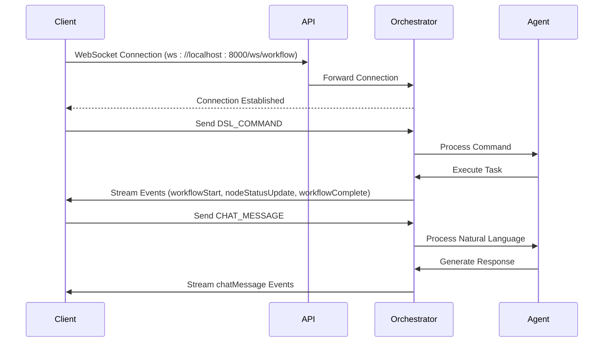
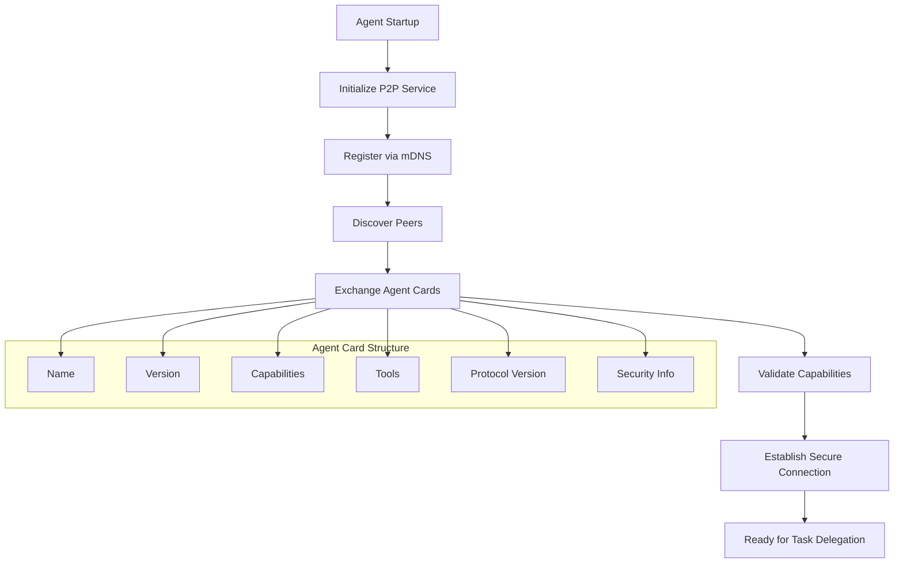
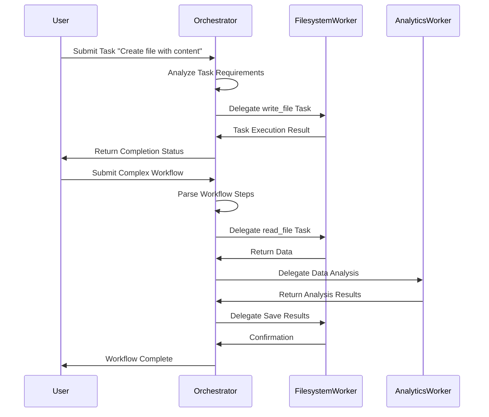
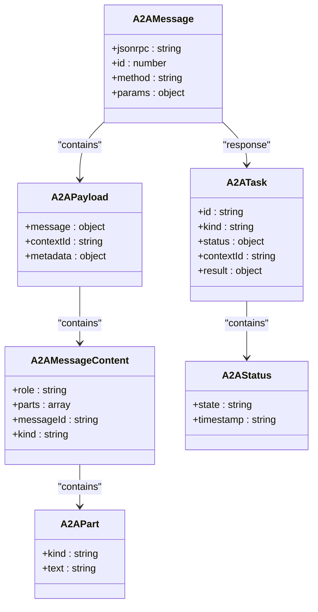
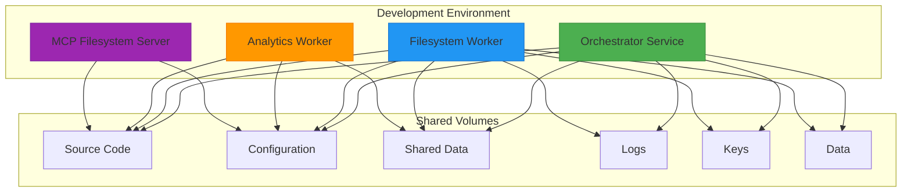
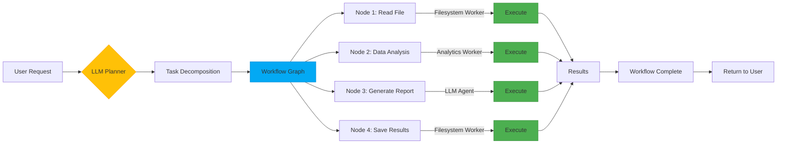

# End-to-End Testing


## Table of Contents
1. [Introduction](#introduction)
2. [WebSocket Connectivity Testing](#websocket-connectivity-testing)
3. [P2P Discovery and Capability Negotiation](#p2p-discovery-and-capability-negotiation)
4. [Multi-Agent Communication and Task Delegation](#multi-agent-communication-and-task-delegation)
5. [A2A Protocol Compliance](#a2a-protocol-compliance)
6. [Docker-Based Multi-Container Testing](#docker-based-multi-container-testing)
7. [Complex Workflow Orchestration](#complex-workflow-orchestration)
8. [Test Orchestration Challenges](#test-orchestration-challenges)
9. [Resilient E2E Test Design Guidelines](#resilient-e2e-test-design-guidelines)

## Introduction
This document provides a comprehensive analysis of end-to-end (E2E) testing strategies for the Praxis agent system. It examines how integration tests validate complete user workflows across multiple agents, communication protocols, and execution layers. The focus is on real-time communication verification, agent lifecycle testing, distributed task execution, and multi-container environment orchestration using Docker Compose. The analysis covers test design patterns, protocol compliance, and resilience strategies essential for validating complex agent interactions in distributed environments.

## WebSocket Connectivity Testing

The `test_websocket_connectivity.py` file implements comprehensive tests for real-time communication between clients and agents through the API layer. These tests validate the WebSocket interface that enables bidirectional event streaming, command execution, and workflow monitoring.



**Diagram sources**
- [test_websocket_connectivity.py](file://tests/integration/test_websocket_connectivity.py#L20-L450)

**Section sources**
- [test_websocket_connectivity.py](file://tests/integration/test_websocket_connectivity.py#L1-L470)

The test suite includes several key test cases:
- **Basic connectivity**: Verifies WebSocket handshake and ping/pong functionality
- **DSL command streaming**: Tests execution of Domain-Specific Language commands with event streaming
- **Workflow execution**: Validates complete workflow lifecycle through WebSocket interface
- **Chat interface**: Tests natural language interaction via WebSocket
- **Concurrent connections**: Ensures multiple clients can connect simultaneously
- **Error handling**: Validates graceful handling of malformed messages
- **Large message handling**: Tests transmission of substantial payloads
- **Heartbeat and keep-alive**: Verifies connection stability over time
- **Message ordering**: Confirms proper sequencing of rapid-fire messages

The tests use the `test_helper` utility to abstract WebSocket message sending and receiving, with configurable timeouts and error handling. Event streaming is a core feature, allowing clients to receive real-time updates about workflow progress, node status changes, and completion events.

## P2P Discovery and Capability Negotiation

The `test_p2p_connectivity.py` file validates peer-to-peer (P2P) discovery, capability advertisement, and secure connection establishment between agents in the network. This testing ensures that agents can autonomously discover each other, exchange capability information, and establish secure communication channels.



**Diagram sources**
- [test_p2p_connectivity.py](file://tests/integration/test_p2p_connectivity.py#L20-L330)

**Section sources**
- [test_p2p_connectivity.py](file://tests/integration/test_p2p_connectivity.py#L1-L334)

Key aspects of P2P testing include:
- **Service startup validation**: Confirms P2P services initialize correctly
- **Peer discovery**: Tests mDNS-based discovery of neighboring agents
- **Agent card structure**: Validates A2A-compliant agent metadata exchange
- **Capability advertisement**: Verifies agents correctly advertise their functional capabilities
- **Protocol versioning**: Ensures compatibility between different agent versions
- **Security handshake**: Confirms secure connection establishment using Noise protocol
- **Connection resilience**: Tests stability of P2P connections over time

The agent card structure follows the A2A (Agent-to-Agent) specification, containing essential information such as name, version, capabilities, available tools, and protocol version. This metadata enables intelligent task routing and capability-based agent selection.

## Multi-Agent Communication and Task Delegation

The `test_multi_agent_communication.py` file implements integration tests for cross-agent collaboration, task delegation, and workflow coordination. These tests validate the system's ability to distribute work across specialized agents based on their advertised capabilities.



**Diagram sources**
- [test_multi_agent_communication.py](file://tests/integration/test_multi_agent_communication.py#L20-L280)

**Section sources**
- [test_multi_agent_communication.py](file://tests/integration/test_multi_agent_communication.py#L1-L281)

The test suite covers:
- **Agent health checks**: Validates all agents are operational
- **Card exchange**: Tests capability discovery through A2A cards
- **DSL to A2A translation**: Verifies natural language commands are properly converted
- **Task delegation**: Confirms work is routed to appropriate specialized agents
- **Multi-agent workflows**: Tests complex processes requiring multiple agents
- **Error handling and recovery**: Validates system resilience to failures
- **Concurrent execution**: Ensures multiple tasks can run in parallel
- **Capability matching**: Tests intelligent agent selection based on skills

The orchestrator agent acts as a central coordinator, analyzing incoming requests and delegating tasks to specialized worker agents based on their advertised capabilities. This architecture enables efficient resource utilization and specialization.

## A2A Protocol Compliance

The `test_a2a_protocol.py` file implements rigorous validation of A2A (Agent-to-Agent) protocol compliance, ensuring all agents adhere to the standardized communication format based on JSON-RPC 2.0.



**Diagram sources**
- [test_a2a_protocol.py](file://tests/integration/test_a2a_protocol.py#L20-L480)

**Section sources**
- [test_a2a_protocol.py](file://tests/integration/test_a2a_protocol.py#L1-L481)

The protocol compliance tests verify:
- **Message structure**: Ensures proper JSON-RPC 2.0 formatting
- **Task lifecycle**: Validates complete task flow from submission to completion
- **Error handling**: Tests standardized error responses for invalid requests
- **Context management**: Confirms conversation context persistence across messages
- **Multipart messages**: Validates handling of complex messages with multiple parts
- **Tool result formatting**: Ensures consistent result structures
- **Batch operations**: Tests concurrent request processing
- **Metadata support**: Validates optional headers and metadata fields

The A2A protocol serves as the universal communication standard across all agents, enabling interoperability regardless of implementation details. The JSON-RPC foundation provides a robust, well-documented RPC mechanism with built-in error handling and extensibility.

## Docker-Based Multi-Container Testing

The `docker-compose.dev.yml` file defines the development environment configuration for realistic multi-container testing, enabling comprehensive E2E validation of the distributed agent system.



**Diagram sources**
- [docker-compose.dev.yml](file://docker-compose.dev.yml#L1-L28)

**Section sources**
- [docker-compose.dev.yml](file://docker-compose.dev.yml#L1-L29)

The development environment provides:
- **Live code reloading**: Source code mounted as read-only volumes for immediate updates
- **Shared configuration**: Centralized config files accessible to all services
- **Persistent data storage**: Shared directories for data exchange between agents
- **Centralized logging**: Unified log directory for cross-service debugging
- **Security keys**: Shared key storage for P2P authentication
- **Development environment variables**: Debug mode and verbose logging enabled
- **Consistent service configuration**: Uniform environment settings across containers

The volume mounting strategy allows developers to modify code without rebuilding containers, significantly accelerating the development-test cycle. The shared directories enable realistic data exchange scenarios, simulating production-like conditions where agents collaborate on shared resources.

## Complex Workflow Orchestration

The integration tests demonstrate how multiple agents can be orchestrated to execute complex workflows involving LLM planning and tool chaining. These scenarios validate the system's ability to decompose high-level goals into executable steps and coordinate their execution across distributed agents.



**Diagram sources**
- [test_multi_agent_communication.py](file://tests/integration/test_multi_agent_communication.py#L150-L200)
- [test_websocket_connectivity.py](file://tests/integration/test_websocket_connectivity.py#L100-L150)

The workflow orchestration process involves:
1. **Natural language understanding**: The LLM interprets user requests and decomposes them into actionable steps
2. **Workflow planning**: The system creates a directed acyclic graph (DAG) of dependent tasks
3. **Agent selection**: Tasks are assigned to agents based on capability matching
4. **Execution scheduling**: The orchestrator manages task dependencies and execution order
5. **Real-time monitoring**: Progress is streamed to clients via WebSocket
6. **Error recovery**: Failed tasks trigger retry mechanisms or alternative strategies
7. **Result aggregation**: Outputs from multiple agents are combined into a cohesive response

The system supports both imperative commands (DSL syntax) and declarative goals (natural language), with the LLM serving as a bridge between human intent and executable workflows.

## Test Orchestration Challenges

Testing distributed agent systems presents several challenges that require specialized approaches and infrastructure:

**Timing and Synchronization Issues**
- **Discovery delays**: P2P agents may take time to discover each other
- **Service startup variability**: Different containers initialize at different rates
- **Network latency**: Message transmission delays affect test timing
- **Solution**: Implement retry mechanisms and configurable timeouts

**Log Aggregation and Debugging**
- **Distributed logs**: Each agent generates separate log streams
- **Correlation difficulty**: Tracing requests across multiple services
- **Volume management**: High log volume during concurrent testing
- **Solution**: Centralized logging with shared directories and structured logging

**State Verification Across Nodes**
- **Eventual consistency**: State changes may propagate asynchronously
- **Partial failures**: Some agents may succeed while others fail
- **Race conditions**: Concurrent operations affecting shared resources
- **Solution**: Implement comprehensive state checking and idempotent operations

**Resource Contention**
- **File system conflicts**: Multiple agents accessing shared files
- **Port conflicts**: Network port allocation in containerized environments
- **Memory pressure**: High resource usage during concurrent testing
- **Solution**: Proper isolation and resource limits in Docker configuration

**Test Isolation**
- **Shared state pollution**: Tests affecting each other through shared resources
- **Database contamination**: Persistent data affecting subsequent tests
- **Solution**: Implement proper test setup/teardown and data cleanup routines

## Resilient E2E Test Design Guidelines

To create robust end-to-end tests for the agent system, follow these guidelines:

**Handle Timing and Delays**
```python
# Use configurable timeouts and retry mechanisms
async def wait_for_task_completion(client, task_id, timeout=60.0):
    start_time = asyncio.get_event_loop().time()
    while (asyncio.get_event_loop().time() - start_time) < timeout:
        response = await client.get(f"/tasks/{task_id}")
        if response.status_code == 200:
            task = response.json()
            if task["status"]["state"] in ["completed", "failed"]:
                return task
        await asyncio.sleep(2)
    raise TimeoutError(f"Task {task_id} did not complete within {timeout}s")
```

**Implement Comprehensive Error Handling**
- Always wrap test operations in try-catch blocks
- Provide meaningful error messages with context
- Implement graceful degradation when components are unavailable
- Use pytest.skip() for optional features not available in test environment

**Ensure Test Isolation**
- Clean up shared resources after each test
- Use unique identifiers for test artifacts
- Reset agent state between test runs
- Isolate test data in dedicated directories

**Validate Protocol Compliance**
- Verify message structures against specifications
- Test edge cases and invalid inputs
- Validate error responses follow standard formats
- Ensure backward compatibility with protocol versions

**Monitor Resource Usage**
- Track memory and CPU consumption during tests
- Set resource limits in Docker configuration
- Monitor log file growth
- Implement cleanup routines for temporary files

**Use Realistic Test Data**
- Include various data sizes and formats
- Test with malformed or edge-case inputs
- Simulate network latency and failures
- Validate data integrity after processing

**Implement Comprehensive Assertions**
- Validate both success and failure scenarios
- Check intermediate states, not just final outcomes
- Verify side effects (file creation, database changes)
- Confirm event streaming behavior

By following these guidelines, E2E tests can effectively validate the complete functionality of the agent system while remaining resilient to the inherent challenges of distributed testing environments.

**Referenced Files in This Document**   
- [docker-compose.dev.yml](file://docker-compose.dev.yml)
- [test_websocket_connectivity.py](file://tests/integration/test_websocket_connectivity.py)
- [test_p2p_connectivity.py](file://tests/integration/test_p2p_connectivity.py)
- [test_multi_agent_communication.py](file://tests/integration/test_multi_agent_communication.py)
- [test_a2a_protocol.py](file://tests/integration/test_a2a_protocol.py)