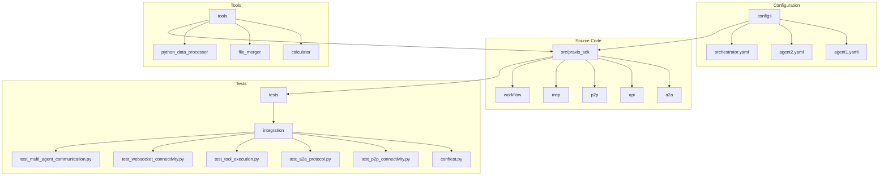
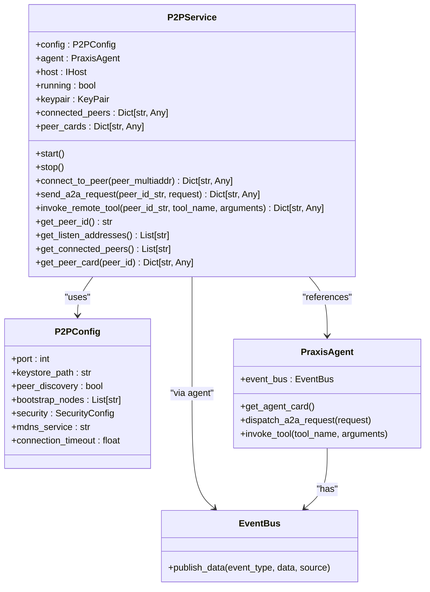
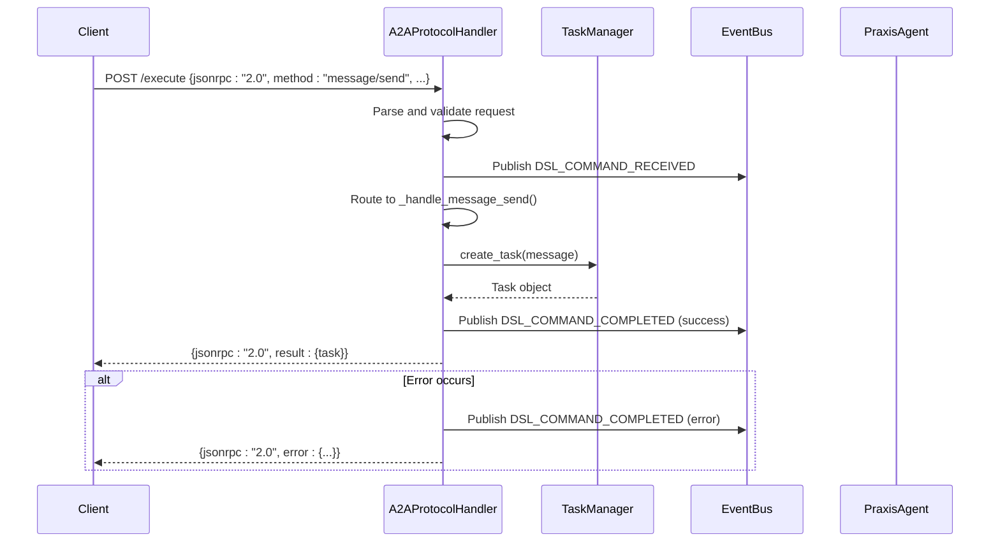
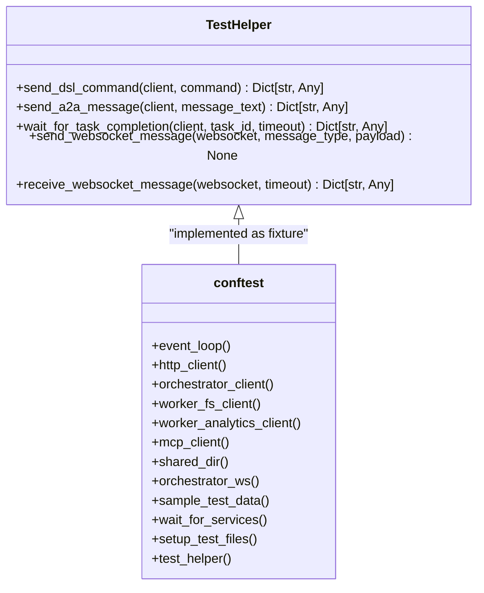
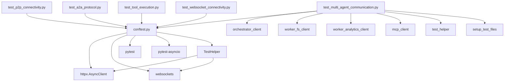

# Integration Testing


## Table of Contents
1. [Introduction](#introduction)
2. [Project Structure](#project-structure)
3. [Core Components](#core-components)
4. [Architecture Overview](#architecture-overview)
5. [Detailed Component Analysis](#detailed-component-analysis)
6. [Dependency Analysis](#dependency-analysis)
7. [Performance Considerations](#performance-considerations)
8. [Troubleshooting Guide](#troubleshooting-guide)
9. [Conclusion](#conclusion)

## Introduction
This document provides a comprehensive overview of the integration testing framework for a distributed agent system. The system leverages libp2p for peer-to-peer (P2P) connectivity, implements the Agent-to-Agent (A2A) protocol for message exchange, and utilizes the Model Context Protocol (MCP) for tool execution. Integration tests validate the interaction between these core components, ensuring reliable cross-agent communication and coordination. The test suite is structured to verify P2P discovery, A2A protocol compliance, tool execution via MCP, WebSocket-based API interactions, and event propagation through a central event bus. This documentation details the test design, shared fixture setup, and key implementation patterns.

## Project Structure
The project follows a modular structure with distinct directories for source code, configuration, tests, and tools. The `src/praxis_sdk` directory contains the core application logic, organized into submodules for P2P networking, A2A protocol, API services, and more. The `tests/integration` directory houses the integration test suite, which is the primary focus of this document. Configuration files in the `configs` directory define agent behavior, while the `tools` directory contains executable scripts that can be invoked by agents.



**Diagram sources**
- [src/praxis_sdk](file://src/praxis_sdk)
- [configs](file://configs)
- [tests/integration](file://tests/integration)
- [tools](file://tools)

**Section sources**
- [src/praxis_sdk](file://src/praxis_sdk)
- [configs](file://configs)
- [tests/integration](file://tests/integration)
- [tools](file://tools)

## Core Components
The integration testing framework focuses on several core components that enable distributed agent functionality. These include the P2P service for decentralized networking, the A2A protocol handler for structured agent communication, the MCP server for tool integration, and the WebSocket API for real-time event streaming. The `conftest.py` file provides shared fixtures that instantiate these components for testing. Key files include `service.py` for P2P implementation, `protocol.py` for A2A message handling, and the various test files in the integration directory that validate component interactions.

**Section sources**
- [src/praxis_sdk/p2p/service.py](file://src/praxis_sdk/p2p/service.py#L1-L627)
- [src/praxis_sdk/a2a/protocol.py](file://src/praxis_sdk/a2a/protocol.py#L1-L536)
- [tests/integration/conftest.py](file://tests/integration/conftest.py#L1-L282)

## Architecture Overview
The system architecture is designed for distributed agent collaboration. Agents connect via a libp2p-based P2P network, enabling direct communication without a central server. Each agent exposes an HTTP API and a WebSocket endpoint. The A2A protocol, built on JSON-RPC 2.0, standardizes message exchange for task delegation and status updates. Tools are executed either locally or via the MCP server, which provides a standardized interface for external tool invocation. The event bus facilitates internal event propagation, while shared storage (e.g., a Docker volume) allows for file exchange between agents.

```mermaid
graph TB
subgraph "Agent 1: Orchestrator"
A1[HTTP API]
A2[WebSocket]
A3[P2P Service]
A4[A2A Handler]
A5[Event Bus]
A6[Dagger Executor]
end
subgraph "Agent 2: Worker"
B1[HTTP API]
B2[WebSocket]
B3[P2P Service]
B4[A2A Handler]
B5[Event Bus]
B6[Local Tools]
end
subgraph "MCP Server"
C1[HTTP API]
C2[MCP Protocol]
C3[Filesystem Tools]
end
A3 < --> B3
A1 < --> C1
A2 < --> Client[External Client]
B2 < --> Client
A5 < --> A4
A5 < --> A6
B5 < --> B4
A4 < --> B4
A6 < --> Shared[(Shared Volume)]
B6 < --> Shared
C3 < --> Shared
style A1 fill:#f9f,stroke:#333
style B1 fill:#f9f,stroke:#333
style C1 fill:#f9f,stroke:#333
```

**Diagram sources**
- [src/praxis_sdk/p2p/service.py](file://src/praxis_sdk/p2p/service.py#L1-L627)
- [src/praxis_sdk/a2a/protocol.py](file://src/praxis_sdk/a2a/protocol.py#L1-L536)
- [src/praxis_sdk/mcp/server.py](file://src/praxis_sdk/mcp/server.py)
- [src/praxis_sdk/api/server.py](file://src/praxis_sdk/api/server.py)
- [src/praxis_sdk/api/websocket.py](file://src/praxis_sdk/api/websocket.py)

## Detailed Component Analysis

### P2P Service Analysis
The P2P service, implemented in `service.py`, uses the libp2p library to establish a decentralized network. It runs a trio event loop in a separate thread to handle asynchronous P2P operations, bridging to the main asyncio loop using `trio_asyncio`. The service manages peer discovery via mDNS and bootstrap nodes, handles secure connections using the Noise protocol, and facilitates direct communication through protocol-specific streams for A2A messages, agent cards, and tool invocation.

#### P2P Service Class Diagram


**Diagram sources**
- [src/praxis_sdk/p2p/service.py](file://src/praxis_sdk/p2p/service.py#L1-L627)
- [src/praxis_sdk/config.py](file://src/praxis_sdk/config.py)
- [src/praxis_sdk/agent.py](file://src/praxis_sdk/agent.py)
- [src/praxis_sdk/bus.py](file://src/praxis_sdk/bus.py)

**Section sources**
- [src/praxis_sdk/p2p/service.py](file://src/praxis_sdk/p2p/service.py#L1-L627)

### A2A Protocol Handler Analysis
The A2A protocol handler, defined in `protocol.py`, implements a JSON-RPC 2.0 server for agent communication. It processes requests like `message/send`, `tasks/get`, and `agent/card`, routing them to appropriate handlers. The handler uses Pydantic models for request validation and emits events to the internal event bus for monitoring. It manages task lifecycles through a `TaskManager` and ensures structured error responses according to the A2A specification.

#### A2A Protocol Handler Sequence Diagram


**Diagram sources**
- [src/praxis_sdk/a2a/protocol.py](file://src/praxis_sdk/a2a/protocol.py#L1-L536)
- [src/praxis_sdk/a2a/task_manager.py](file://src/praxis_sdk/a2a/task_manager.py)
- [src/praxis_sdk/bus.py](file://src/praxis_sdk/bus.py)
- [src/praxis_sdk/agent.py](file://src/praxis_sdk/agent.py)

**Section sources**
- [src/praxis_sdk/a2a/protocol.py](file://src/praxis_sdk/a2a/protocol.py#L1-L536)

### Integration Test Suite Analysis
The integration test suite validates the interaction between core components. Tests are organized by functionality (P2P, A2A, MCP, WebSocket) and use shared fixtures defined in `conftest.py`. The `TestHelper` class provides utility methods for common operations like sending DSL commands and waiting for task completion. Tests use asynchronous fixtures to manage HTTP and WebSocket clients, ensuring proper resource cleanup.

#### Test Helper Class Diagram


**Diagram sources**
- [tests/integration/conftest.py](file://tests/integration/conftest.py#L1-L282)

**Section sources**
- [tests/integration/conftest.py](file://tests/integration/conftest.py#L1-L282)

## Dependency Analysis
The integration tests depend on several external services and internal components. The primary dependencies are the orchestrator, worker agents, and MCP server, which must be running for tests to execute. The tests use HTTPX for HTTP communication and websockets for WebSocket interactions. Internally, the P2P service depends on libp2p and trio, while the A2A handler depends on Pydantic for data validation. The test suite itself depends on pytest and pytest-asyncio for asynchronous testing.



**Diagram sources**
- [tests/integration/test_multi_agent_communication.py](file://tests/integration/test_multi_agent_communication.py#L1-L281)
- [tests/integration/conftest.py](file://tests/integration/conftest.py#L1-L282)

**Section sources**
- [tests/integration/test_multi_agent_communication.py](file://tests/integration/test_multi_agent_communication.py#L1-L281)
- [tests/integration/conftest.py](file://tests/integration/conftest.py#L1-L282)

## Performance Considerations
Integration tests can be slow due to network latency and service startup times. The `wait_for_services` fixture ensures all dependent services are ready before tests begin, preventing premature failures. For performance-critical tests, the `@pytest.mark.slow` marker can be used to categorize them. Concurrent task execution tests verify the system's ability to handle multiple operations, while WebSocket tests assess real-time event streaming performance. Containerized environments, as defined in `docker-compose.yml`, provide a realistic but potentially slower test scenario compared to in-memory mocks.

## Troubleshooting Guide
Flaky tests are common in integration suites due to network dependencies. If a test fails, first verify that all services are running and accessible. Check the `wait_for_services` fixture output to confirm health checks pass. For P2P connectivity issues, ensure that mDNS is working or that bootstrap node addresses are correct. For A2A protocol errors, inspect the JSON-RPC request and response structure. WebSocket connection issues may require checking CORS settings or authentication. Use the `sample_test_data` and `setup_test_files` fixtures to ensure test data is correctly prepared. Logging is configured in `conftest.py` to help diagnose issues.

**Section sources**
- [tests/integration/conftest.py](file://tests/integration/conftest.py#L1-L282)
- [tests/integration/test_p2p_connectivity.py](file://tests/integration/test_p2p_connectivity.py#L1-L334)
- [tests/integration/test_a2a_protocol.py](file://tests/integration/test_a2a_protocol.py#L1-L481)

## Conclusion
The integration testing framework for this distributed agent system provides comprehensive coverage of P2P connectivity, A2A protocol messaging, MCP tool execution, and WebSocket event streaming. By leveraging shared fixtures and a well-structured test suite, it ensures reliable validation of cross-agent interactions. The use of containerized environments allows for realistic testing scenarios, while the modular design of the tests makes them easy to extend and maintain. This documentation serves as a guide for understanding, executing, and troubleshooting the integration tests.

**Referenced Files in This Document**   
- [conftest.py](file://tests/integration/conftest.py)
- [test_multi_agent_communication.py](file://tests/integration/test_multi_agent_communication.py)
- [test_p2p_connectivity.py](file://tests/integration/test_p2p_connectivity.py)
- [test_a2a_protocol.py](file://tests/integration/test_a2a_protocol.py)
- [test_tool_execution.py](file://tests/integration/test_tool_execution.py)
- [test_websocket_connectivity.py](file://tests/integration/test_websocket_connectivity.py)
- [service.py](file://src/praxis_sdk/p2p/service.py)
- [protocol.py](file://src/praxis_sdk/a2a/protocol.py)