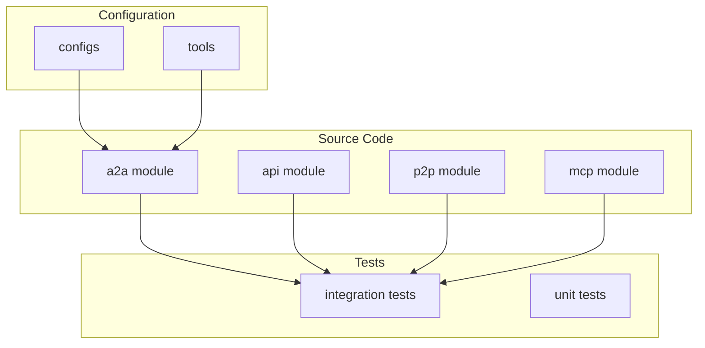
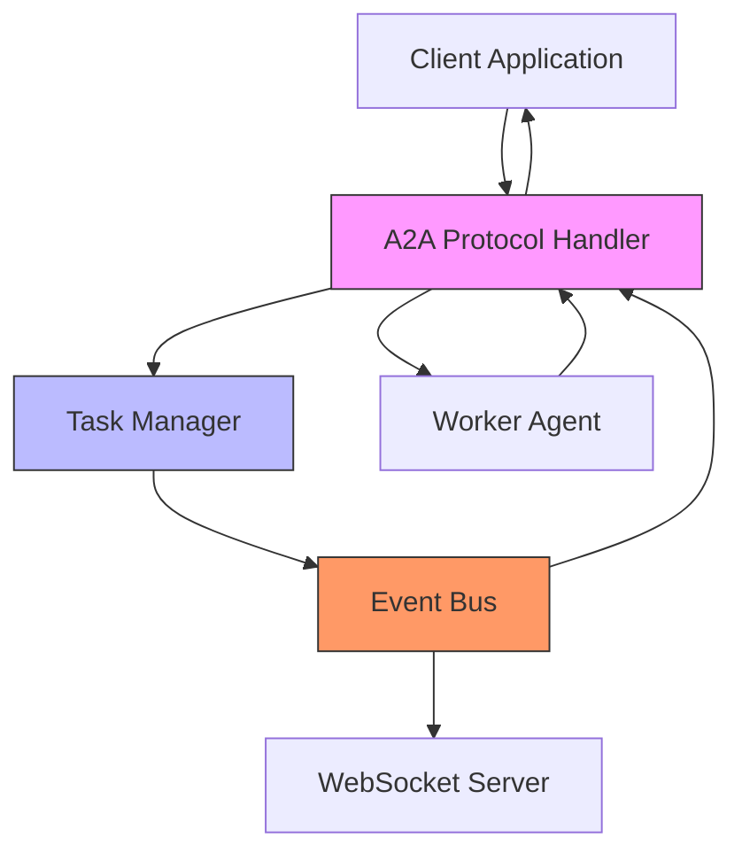
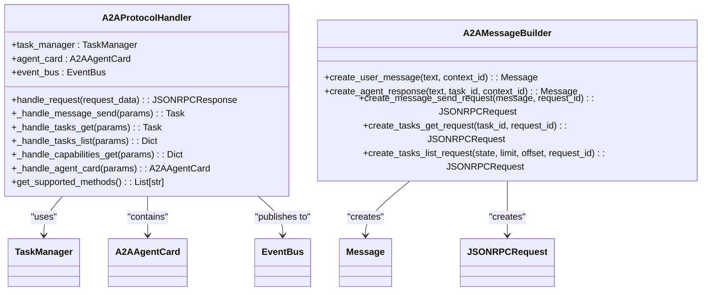
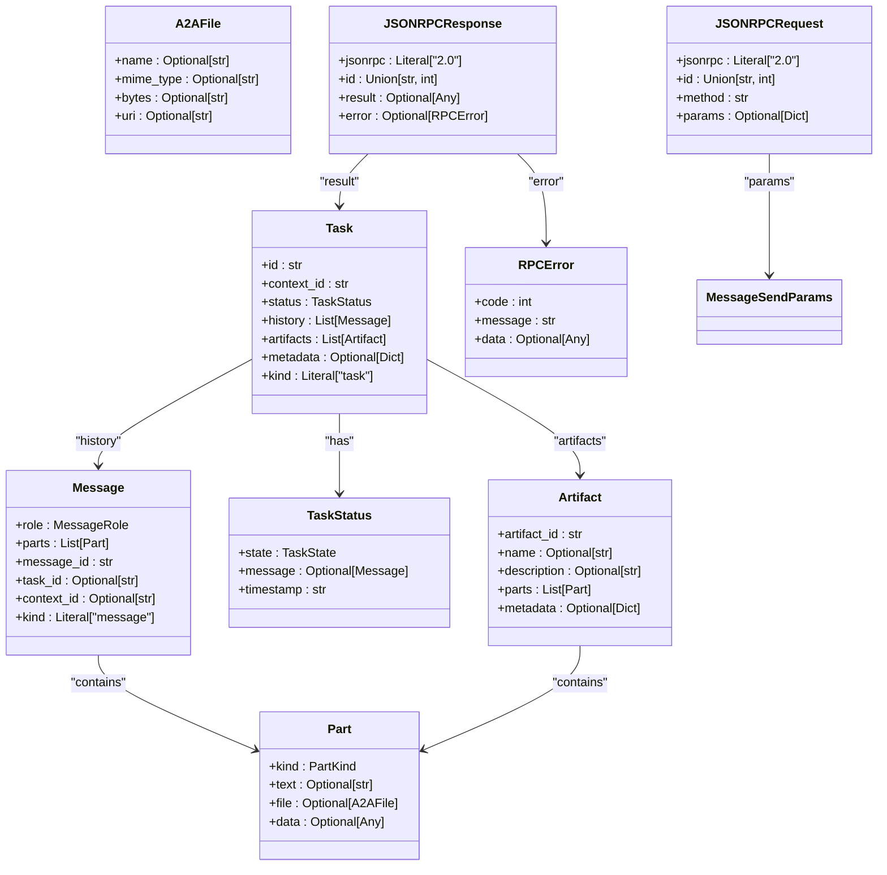
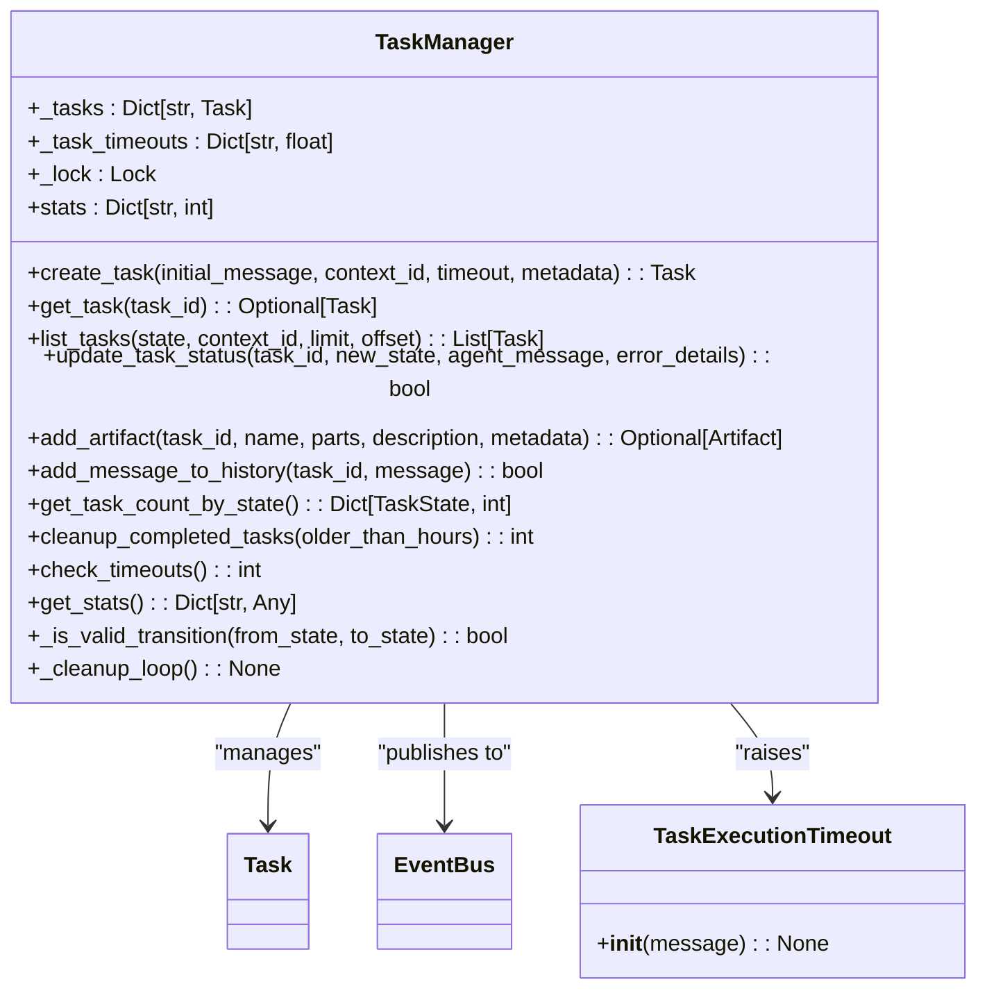
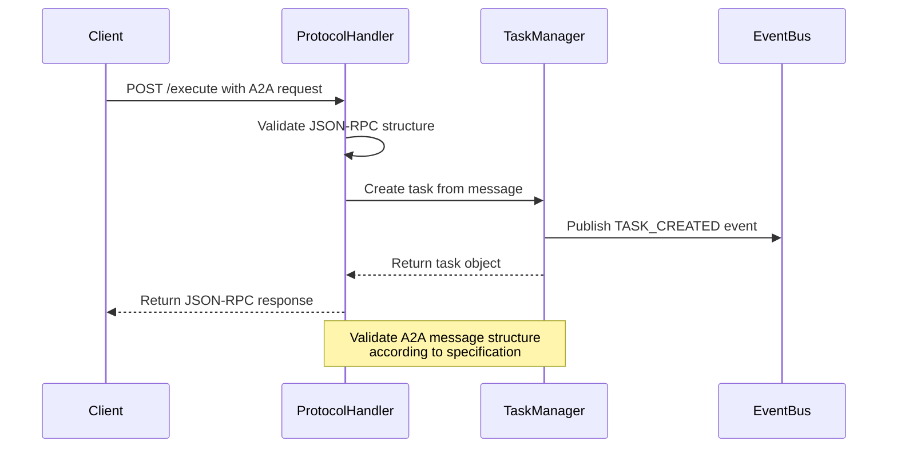
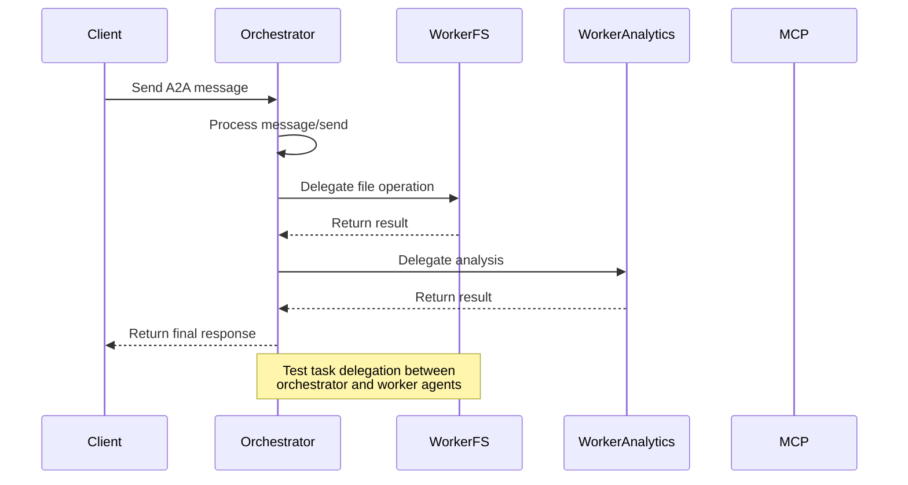
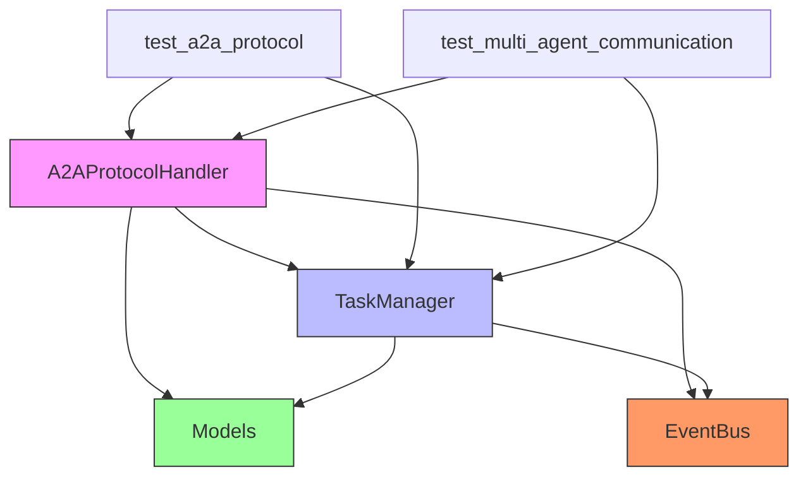

# A2A Protocol Testing


## Table of Contents
1. [Introduction](#introduction)
2. [Project Structure](#project-structure)
3. [Core Components](#core-components)
4. [Architecture Overview](#architecture-overview)
5. [Detailed Component Analysis](#detailed-component-analysis)
6. [Dependency Analysis](#dependency-analysis)
7. [Performance Considerations](#performance-considerations)
8. [Troubleshooting Guide](#troubleshooting-guide)
9. [Conclusion](#conclusion)

## Introduction
This document provides a comprehensive analysis of the A2A (Agent-to-Agent) protocol testing framework within the Praxis AI agent system. The focus is on message serialization, task delegation, response handling, and end-to-end communication between distributed agents. The analysis covers test implementations in `test_a2a_protocol.py` and `test_multi_agent_communication.py`, examining how they validate handshake sequences, encrypted payload transmission, timeout behaviors, message integrity, role-based access control, fault recovery, and performance characteristics under load.

## Project Structure
The project follows a modular architecture with clear separation of concerns. The A2A protocol implementation resides in the `src/praxis_sdk/a2a` directory, while integration tests are located in `tests/integration`. Configuration files for different agents and environments are organized under `configs`, and various tools with their contracts are defined in the `tools` directory.



**Diagram sources**
- [project_structure](file://README.md#L1-L50)

**Section sources**
- [project_structure](file://README.md#L1-L50)

## Core Components
The A2A protocol implementation consists of several core components that work together to enable agent-to-agent communication. These include the protocol handler, message models, task manager, and event bus integration. The system uses JSON-RPC 2.0 for message serialization and follows the A2A specification for task lifecycle management.

**Section sources**
- [protocol.py](file://src/praxis_sdk/a2a/protocol.py#L1-L536)
- [models.py](file://src/praxis_sdk/a2a/models.py#L1-L494)
- [task_manager.py](file://src/praxis_sdk/a2a/task_manager.py#L1-L553)

## Architecture Overview
The A2A protocol architecture follows a request-response pattern with full JSON-RPC 2.0 compliance. Agents communicate through well-defined methods such as `message/send`, `tasks/get`, and `tasks/list`. The system uses an event-driven architecture with an event bus that publishes state changes and progress updates.



**Diagram sources**
- [protocol.py](file://src/praxis_sdk/a2a/protocol.py#L1-L536)
- [task_manager.py](file://src/praxis_sdk/a2a/task_manager.py#L1-L553)
- [websocket.py](file://src/praxis_sdk/api/websocket.py#L1-L100)

## Detailed Component Analysis

### A2A Protocol Handler Analysis
The `A2AProtocolHandler` class is responsible for processing incoming JSON-RPC requests and routing them to appropriate handlers. It validates request structure, handles errors according to the A2A specification, and ensures proper response formatting.



**Diagram sources**
- [protocol.py](file://src/praxis_sdk/a2a/protocol.py#L1-L536)

**Section sources**
- [protocol.py](file://src/praxis_sdk/a2a/protocol.py#L1-L536)

### A2A Models Analysis
The A2A models implement the protocol specification using Pydantic for data validation. They define the structure of messages, tasks, artifacts, and JSON-RPC requests/responses. The models ensure type safety and data integrity throughout the system.



**Diagram sources**
- [models.py](file://src/praxis_sdk/a2a/models.py#L1-L494)

**Section sources**
- [models.py](file://src/praxis_sdk/a2a/models.py#L1-L494)

### Task Manager Analysis
The `TaskManager` class manages the complete lifecycle of A2A tasks, including creation, status updates, artifact generation, and cleanup. It integrates with the event bus to publish real-time status updates and handles timeouts and error recovery.



**Diagram sources**
- [task_manager.py](file://src/praxis_sdk/a2a/task_manager.py#L1-L553)

**Section sources**
- [task_manager.py](file://src/praxis_sdk/a2a/task_manager.py#L1-L553)

### A2A Protocol Testing Analysis
The integration tests validate various aspects of the A2A protocol implementation, including message structure, task lifecycle, error handling, context management, and batch operations.

#### A2A Message Structure Test


**Diagram sources**
- [test_a2a_protocol.py](file://tests/integration/test_a2a_protocol.py#L10-L80)

**Section sources**
- [test_a2a_protocol.py](file://tests/integration/test_a2a_protocol.py#L10-L80)

#### A2A Task Lifecycle Test
```mermaid
sequenceDiagram
participant Client
participant ProtocolHandler
participant TaskManager
participant EventBus
Client->>ProtocolHandler : Submit A2A task
ProtocolHandler->>TaskManager : Create task (submitted)
TaskManager->>EventBus : Publish TASK_CREATED
TaskManager-->>ProtocolHandler : Task object
ProtocolHandler-->>Client : Return task ID
loop Poll every 2 seconds
Client->>ProtocolHandler : GET /tasks/{task_id}
ProtocolHandler->>TaskManager : Get task status
TaskManager-->>ProtocolHandler : Current status
ProtocolHandler-->>Client : Return status
alt Status is completed or failed
break
end
end
Note over Client,ProtocolHandler : Validate complete task lifecycle<br/>from submission to completion
```

**Diagram sources**
- [test_a2a_protocol.py](file://tests/integration/test_a2a_protocol.py#L82-L140)

**Section sources**
- [test_a2a_protocol.py](file://tests/integration/test_a2a_protocol.py#L82-L140)

#### Multi-Agent Communication Test


**Diagram sources**
- [test_multi_agent_communication.py](file://tests/integration/test_multi_agent_communication.py#L100-L150)

**Section sources**
- [test_multi_agent_communication.py](file://tests/integration/test_multi_agent_communication.py#L100-L150)

## Dependency Analysis
The A2A protocol implementation has a well-defined dependency structure with clear separation between components. The protocol handler depends on the task manager and event bus, while the task manager depends on the models and event bus.



**Diagram sources**
- [protocol.py](file://src/praxis_sdk/a2a/protocol.py#L1-L536)
- [task_manager.py](file://src/praxis_sdk/a2a/task_manager.py#L1-L553)
- [test_a2a_protocol.py](file://tests/integration/test_a2a_protocol.py#L1-L480)
- [test_multi_agent_communication.py](file://tests/integration/test_multi_agent_communication.py#L1-L280)

**Section sources**
- [protocol.py](file://src/praxis_sdk/a2a/protocol.py#L1-L536)
- [task_manager.py](file://src/praxis_sdk/a2a/task_manager.py#L1-L553)
- [test_a2a_protocol.py](file://tests/integration/test_a2a_protocol.py#L1-L480)
- [test_multi_agent_communication.py](file://tests/integration/test_multi_agent_communication.py#L1-L280)

## Performance Considerations
The A2A protocol implementation includes several performance optimizations and considerations:

- **Task Cleanup**: The `TaskManager` includes a background cleanup loop that removes completed tasks older than a configurable threshold (default 24 hours), preventing memory leaks.
- **History Size Limiting**: Task message history is limited to a configurable maximum size (default 1000 messages) to prevent unbounded memory growth.
- **Concurrent Processing**: The system uses asyncio and trio for asynchronous processing, allowing it to handle multiple concurrent requests efficiently.
- **Batch Operations**: The protocol supports batch operations, allowing multiple requests to be processed in parallel.
- **Caching**: While not explicitly implemented in the core components, the architecture allows for caching at various levels (e.g., task status, agent capabilities).

The system also includes comprehensive performance testing:

- **Batch Operations Test**: Validates that the system can handle multiple concurrent A2A requests.
- **Concurrent Task Execution Test**: Tests the system's ability to execute multiple tasks simultaneously.
- **Timeout Handling**: Tests that tasks are properly timed out and cleaned up when they exceed their execution time limit.

**Section sources**
- [task_manager.py](file://src/praxis_sdk/a2a/task_manager.py#L1-L553)
- [test_a2a_protocol.py](file://tests/integration/test_a2a_protocol.py#L300-L350)
- [test_multi_agent_communication.py](file://tests/integration/test_multi_agent_communication.py#L200-L250)

## Troubleshooting Guide
When troubleshooting A2A protocol issues, consider the following common problems and their solutions:

### Message Structure Validation Failures
If A2A messages are being rejected, verify that they conform to the JSON-RPC 2.0 specification and include all required fields:

- `jsonrpc` must be "2.0"
- `id` must be present (string or integer)
- `method` must be a valid A2A method (e.g., "message/send")
- `params` must contain the expected structure for the method

```python
# Correct A2A message structure
a2a_request = {
    "jsonrpc": "2.0",
    "id": 1,
    "method": "message/send",
    "params": {
        "message": {
            "role": "user",
            "parts": [{"kind": "text", "text": "Hello"}],
            "messageId": "msg-123",
            "kind": "message"
        }
    }
}
```

**Section sources**
- [test_a2a_protocol.py](file://tests/integration/test_a2a_protocol.py#L10-L80)
- [protocol.py](file://src/praxis_sdk/a2a/protocol.py#L1-L536)

### Task Lifecycle Issues
If tasks are not progressing through their lifecycle correctly, check:

- State transition validation in `TaskManager._is_valid_transition()`
- Proper event publishing for state changes
- Timeout handling in the background cleanup loop
- Error handling in protocol method handlers

### Agent Discovery Problems
If agents are not discovering each other in multi-agent scenarios:

- Verify P2P connectivity between agents
- Check that agent cards are properly configured with capabilities
- Ensure the discovery interval is sufficient (current test uses 10 seconds)
- Validate that security schemes are properly configured

### Performance Bottlenecks
If experiencing performance issues:

- Monitor task manager statistics (`get_stats()`)
- Check for memory leaks from unclosed tasks
- Verify that the cleanup interval is appropriate for the workload
- Consider increasing the default timeout for long-running tasks

**Section sources**
- [task_manager.py](file://src/praxis_sdk/a2a/task_manager.py#L1-L553)
- [protocol.py](file://src/praxis_sdk/a2a/protocol.py#L1-L536)
- [test_a2a_protocol.py](file://tests/integration/test_a2a_protocol.py#L1-L480)
- [test_multi_agent_communication.py](file://tests/integration/test_multi_agent_communication.py#L1-L280)

## Conclusion
The A2A protocol implementation in the Praxis AI agent system provides a robust foundation for agent-to-agent communication. The system follows the JSON-RPC 2.0 specification and implements a comprehensive set of features for task management, error handling, and multi-agent coordination.

Key strengths of the implementation include:

- **Comprehensive Testing**: Extensive integration tests cover message structure, task lifecycle, error handling, and multi-agent scenarios.
- **Event-Driven Architecture**: The use of an event bus enables real-time status updates and loose coupling between components.
- **State Management**: The task manager provides robust lifecycle management with proper state transition validation.
- **Scalability**: The asynchronous design allows for concurrent processing of multiple tasks.
- **Extensibility**: The modular architecture makes it easy to add new capabilities and integrate with additional agents.

The system could be further improved by:

- Implementing more sophisticated caching mechanisms
- Adding support for distributed task storage
- Enhancing monitoring and observability features
- Expanding the set of supported transport protocols
- Improving error recovery mechanisms for network partitions

Overall, the A2A protocol implementation provides a solid foundation for building distributed AI agent systems with reliable communication and task coordination.

**Referenced Files in This Document**   
- [test_a2a_protocol.py](file://tests/integration/test_a2a_protocol.py)
- [test_multi_agent_communication.py](file://tests/integration/test_multi_agent_communication.py)
- [protocol.py](file://src/praxis_sdk/a2a/protocol.py)
- [models.py](file://src/praxis_sdk/a2a/models.py)
- [task_manager.py](file://src/praxis_sdk/a2a/task_manager.py)