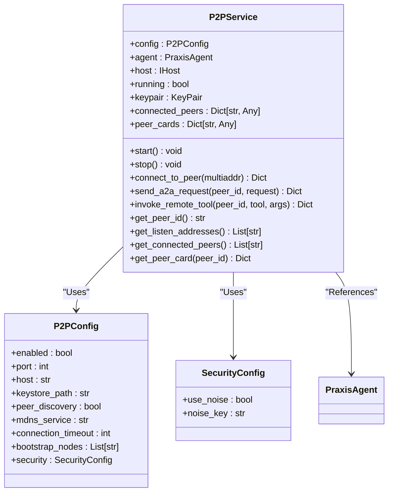
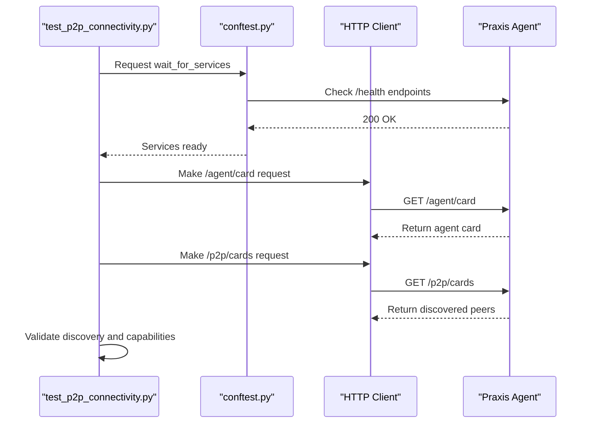
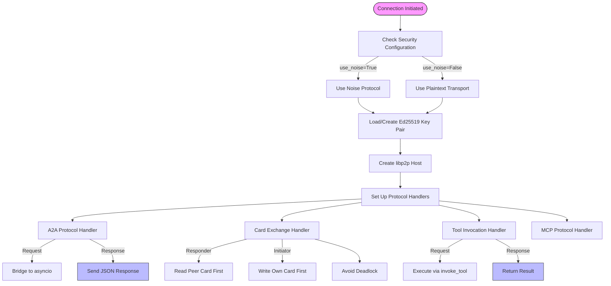
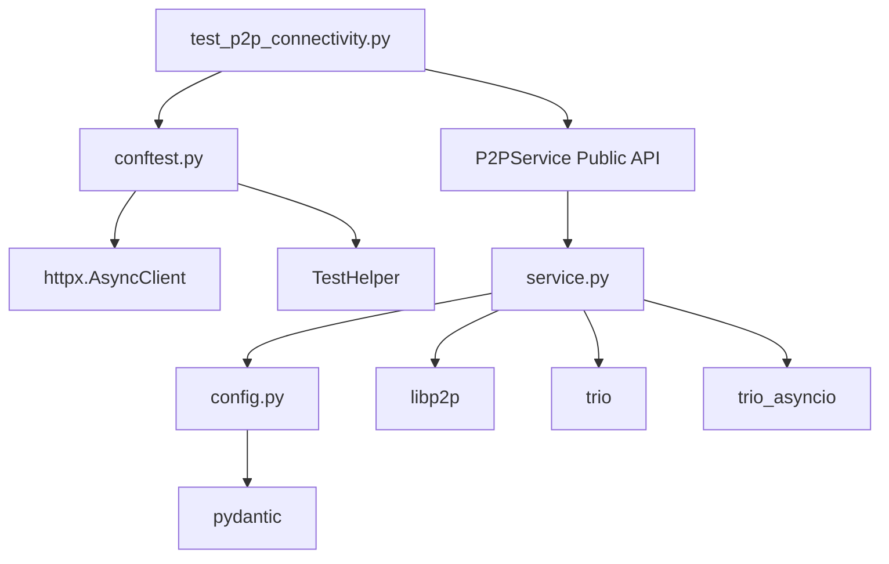

# P2P Connectivity Testing


## Table of Contents
1. [Introduction](#introduction)
2. [Project Structure](#project-structure)
3. [Core Components](#core-components)
4. [Architecture Overview](#architecture-overview)
5. [Detailed Component Analysis](#detailed-component-analysis)
6. [Dependency Analysis](#dependency-analysis)
7. [Performance Considerations](#performance-considerations)
8. [Troubleshooting Guide](#troubleshooting-guide)
9. [Conclusion](#conclusion)

## Introduction
This document provides a comprehensive analysis of P2P connectivity testing within the Praxis agent network. The focus is on validating libp2p-based peer discovery, secure channel establishment, and message routing. The test suite `test_p2p_connectivity.py` verifies critical aspects such as peer bootstrapping, multiaddr resolution, connection persistence under churn, and protocol negotiation. Shared fixtures from `conftest.py` are used to simulate isolated network topologies for integration testing. This documentation details the implementation, assertions, and strategies employed to ensure robust P2P communication across agents.

## Project Structure
The project follows a modular structure with clear separation of concerns. The P2P-related functionality is primarily located in the `src/praxis_sdk/p2p/` directory, while integration tests reside in `tests/integration/`. Configuration files in the `configs/` directory define agent-specific settings including P2P parameters.

```mermaid
graph TD
subgraph "Source Code"
P2P[p2p/]
API[api/]
DSL[dsl/]
LLM[llm/]
MCP[mcp/]
end
subgraph "Tests"
Integration[integration/]
Unit[other test files]
end
Integration --> P2P : "Tests"
Integration --> API : "Tests"
P2P --> Config[config.py] : "Uses"
Integration --> Config : "Uses"
Conftest[conftest.py] --> HTTPClient[httpx.AsyncClient] : "Provides"
TestP2P[test_p2p_connectivity.py] --> Conftest : "Uses fixtures"
```

**Diagram sources**
- [test_p2p_connectivity.py](file://tests/integration/test_p2p_connectivity.py)
- [conftest.py](file://tests/integration/conftest.py)
- [config.py](file://src/praxis_sdk/config.py)

**Section sources**
- [test_p2p_connectivity.py](file://tests/integration/test_p2p_connectivity.py)
- [conftest.py](file://tests/integration/conftest.py)

## Core Components
The core components involved in P2P connectivity include the `P2PService` class responsible for managing libp2p operations, the `P2PConfig` class defining network parameters, and the integration test suite that validates end-to-end functionality. The system uses Trio for async concurrency with a bridge to asyncio via `trio_asyncio`, enabling interoperability between different async frameworks.

**Section sources**
- [service.py](file://src/praxis_sdk/p2p/service.py)
- [config.py](file://src/praxis_sdk/config.py)

## Architecture Overview
The P2P architecture is built on libp2p with a multi-threaded design where the libp2p host runs in a dedicated Trio event loop thread, while the main application runs on asyncio. This separation allows for stable P2P operations without blocking the main event loop. Communication between threads is managed through `trio_asyncio` bridges.

```mermaid
graph TB
subgraph "Main Thread (asyncio)"
Agent[PraxisAgent]
EventBus[EventBus]
P2PService[P2PService]
end
subgraph "P2P Thread (Trio)"
TrioLoop[Trio Event Loop]
Libp2pHost[libp2p Host]
Security[Noise/Plaintext]
end
Agent --> P2PService : "Control"
P2PService --> TrioLoop : "Starts"
TrioLoop --> Libp2pHost : "Runs"
Libp2pHost --> Security : "Uses"
P2PService < --> Libp2pHost : "trio_asyncio bridge"
EventBus < --> P2PService : "Events"
```

**Diagram sources**
- [service.py](file://src/praxis_sdk/p2p/service.py#L37-L625)
- [config.py](file://src/praxis_sdk/config.py#L24-L63)

## Detailed Component Analysis

### P2P Service Implementation
The `P2PService` class encapsulates all libp2p functionality, providing a clean API for peer management, secure communication, and protocol handling. It uses a threading model to isolate the Trio-based libp2p stack from the main asyncio application.

#### Class Diagram


**Diagram sources**
- [service.py](file://src/praxis_sdk/p2p/service.py#L37-L625)
- [config.py](file://src/praxis_sdk/config.py#L24-L63)

**Section sources**
- [service.py](file://src/praxis_sdk/p2p/service.py#L37-L625)

### P2P Connectivity Testing Framework
The integration test suite validates various aspects of P2P functionality including peer discovery, capability advertisement, tool invocation, and connection resilience.

#### Test Execution Flow


**Diagram sources**
- [test_p2p_connectivity.py](file://tests/integration/test_p2p_connectivity.py)
- [conftest.py](file://tests/integration/conftest.py)

**Section sources**
- [test_p2p_connectivity.py](file://tests/integration/test_p2p_connectivity.py)
- [conftest.py](file://tests/integration/conftest.py)

### Protocol Handling and Security
The P2P service implements multiple protocols for different types of communication, each with specific security considerations.

#### Protocol Flowchart


**Diagram sources**
- [service.py](file://src/praxis_sdk/p2p/service.py#L37-L625)
- [config.py](file://src/praxis_sdk/config.py#L14-L21)

**Section sources**
- [service.py](file://src/praxis_sdk/p2p/service.py#L37-L625)

## Dependency Analysis
The P2P system has well-defined dependencies between components, with clear separation between the networking layer, configuration, and application logic.



**Diagram sources**
- [test_p2p_connectivity.py](file://tests/integration/test_p2p_connectivity.py)
- [conftest.py](file://tests/integration/conftest.py)
- [service.py](file://src/praxis_sdk/p2p/service.py)
- [config.py](file://src/praxis_sdk/config.py)

**Section sources**
- [test_p2p_connectivity.py](file://tests/integration/test_p2p_connectivity.py)
- [conftest.py](file://tests/integration/conftest.py)
- [service.py](file://src/praxis_sdk/p2p/service.py)
- [config.py](file://src/praxis_sdk/config.py)

## Performance Considerations
The P2P implementation includes several performance optimizations and considerations:

- **Thread Isolation**: Running libp2p in a separate thread prevents network operations from blocking the main event loop
- **Connection Pooling**: Persistent connections reduce handshake overhead
- **Asynchronous I/O**: All operations are non-blocking, allowing high concurrency
- **Timeout Configuration**: Configurable timeouts prevent hanging operations
- **Efficient Serialization**: JSON is used for message serialization with reasonable size limits

The test suite includes resilience testing with `test_p2p_connection_resilience` which verifies that peer connections remain stable over time and can handle repeated discovery requests without degradation.

## Troubleshooting Guide
When diagnosing P2P connectivity issues, consider the following:

**Section sources**
- [test_p2p_connectivity.py](file://tests/integration/test_p2p_connectivity.py#L200-L250)
- [service.py](file://src/praxis_sdk/p2p/service.py#L37-L625)

### Common Issues and Solutions
- **Peer Discovery Failure**: Verify that `peer_discovery` is enabled and mDNS is properly configured
- **Connection Timeouts**: Check network connectivity and firewall settings; verify that ports are open
- **Authentication Errors**: Ensure Noise keys are properly configured and match across peers
- **Protocol Mismatch**: Confirm that all agents support compatible protocol versions
- **Bootstrap Node Issues**: Validate bootstrap node addresses and ensure they include the correct PeerID

### Debugging Workflows
1. Enable verbose logging in `loguru` to capture detailed P2P events
2. Use `trio` structured output to trace async operations
3. Check libp2p host initialization logs for startup errors
4. Verify keypair loading and generation in the keystore directory
5. Monitor event bus messages for P2P-related events

The test suite provides debugging output through print statements that show discovery results, capability advertisements, and connection status.

## Conclusion
The P2P connectivity testing framework provides comprehensive validation of the Praxis agent network's peer-to-peer capabilities. By leveraging shared fixtures and isolated test environments, it effectively verifies peer discovery, secure channel establishment, and message routing. The architecture's use of Trio for libp2p operations with asyncio bridging ensures stable and performant P2P communication. The test cases cover critical functionality including bootstrapping, capability advertisement, tool invocation, and connection resilience, providing confidence in the system's distributed operation. Future improvements could include more sophisticated NAT traversal testing and performance benchmarking under high-latency conditions.

**Referenced Files in This Document**   
- [test_p2p_connectivity.py](file://tests/integration/test_p2p_connectivity.py)
- [conftest.py](file://tests/integration/conftest.py)
- [service.py](file://src/praxis_sdk/p2p/service.py)
- [config.py](file://src/praxis_sdk/config.py)