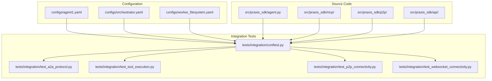
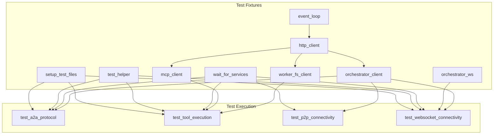
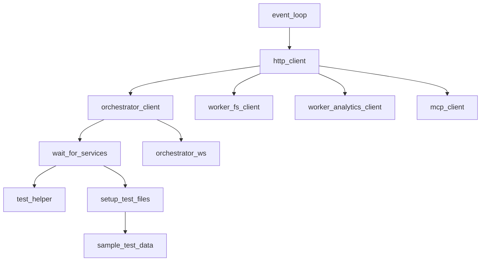
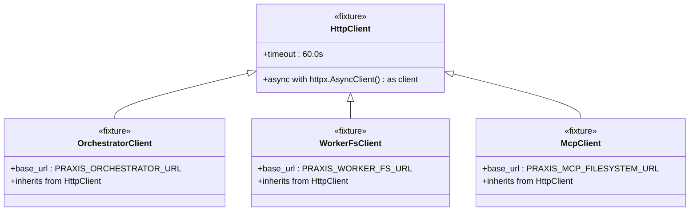
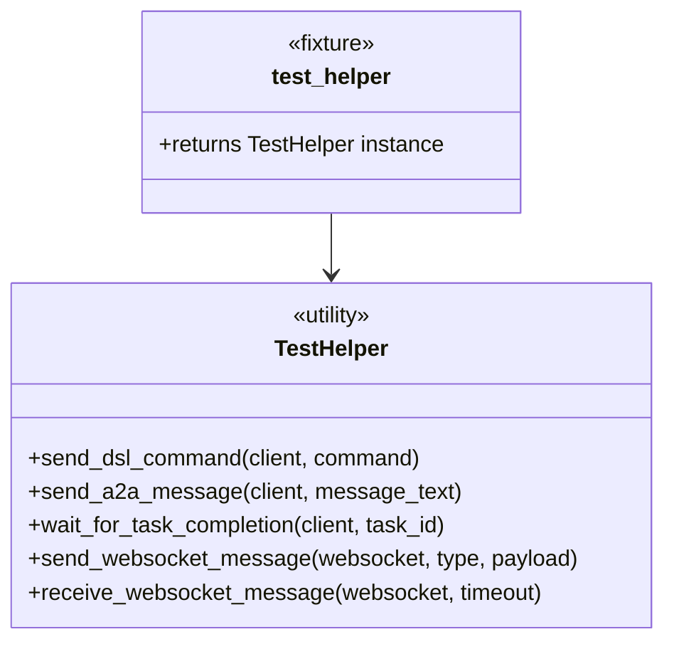
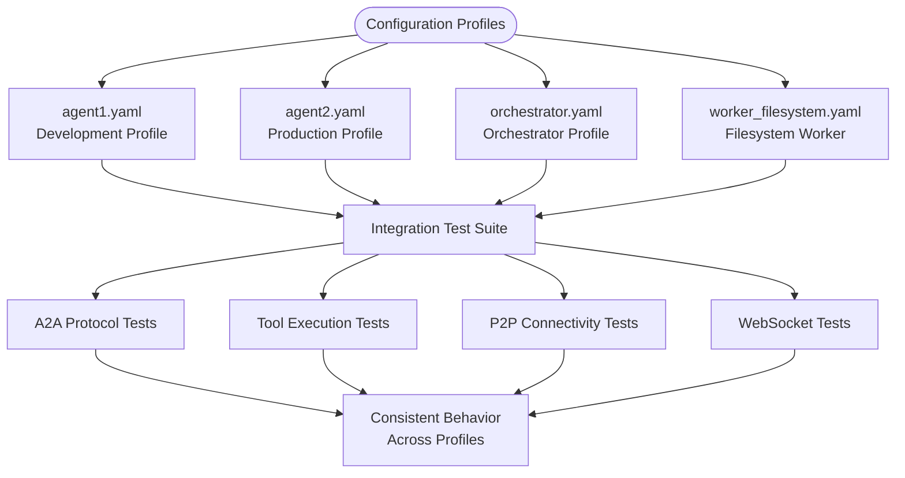
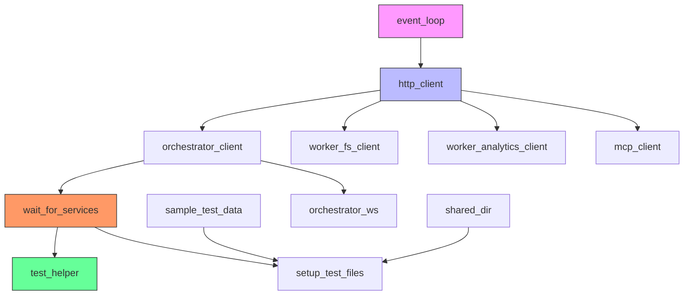

# Test Fixtures and Setup

## Table of Contents
1. [Introduction](#introduction)
2. [Project Structure](#project-structure)
3. [Core Components](#core-components)
4. [Architecture Overview](#architecture-overview)
5. [Detailed Component Analysis](#detailed-component-analysis)
6. [Dependency Analysis](#dependency-analysis)
7. [Performance Considerations](#performance-considerations)
8. [Troubleshooting Guide](#troubleshooting-guide)
9. [Conclusion](#conclusion)

## Introduction
This document provides a comprehensive overview of the integration test fixtures and setup for the Praxis P2P Agent system. It details the pytest-based testing infrastructure used to validate agent communication, tool execution, P2P connectivity, and WebSocket interactions. The focus is on reusable test scaffolding implemented in `conftest.py`, which establishes shared resources such as configured agent instances, virtualized networks, and mock MCP registries. The documentation covers fixture dependency chains, configuration profiles, and best practices for async test environments.

## Project Structure
The project follows a modular structure with clear separation between configuration, source code, and tests. Integration tests are located in the `tests/integration/` directory, with shared fixtures defined in `conftest.py`. Configuration files for different agents and workers are stored in the `configs/` directory, enabling testing across various deployment profiles.

**Diagram sources**
- [conftest.py](file://tests/integration/conftest.py)
- [agent1.yaml](file://configs/agent1.yaml)
- [orchestrator.yaml](file://configs/orchestrator.yaml)

**Section sources**
- [conftest.py](file://tests/integration/conftest.py)
- [agent1.yaml](file://configs/agent1.yaml)
- [orchestrator.yaml](file://configs/orchestrator.yaml)

## Core Components
The integration test suite relies on several core components defined in `conftest.py`:

- **HTTP Clients**: Async clients for interacting with orchestrator, workers, and MCP servers
- **WebSocket Connections**: For real-time event streaming and bidirectional communication
- **Test Helper Class**: Utility methods for common test operations
- **Service Readiness Checks**: Waits for all dependent services to be available
- **Shared Directory Management**: Setup and cleanup of shared file storage
- **Sample Test Data**: Predefined data sets for consistent testing

These components are implemented as pytest fixtures with appropriate scopes to ensure efficient resource reuse while preventing test contamination.

**Section sources**
- [conftest.py](file://tests/integration/conftest.py#L1-L281)

## Architecture Overview
The test architecture is designed around reusable fixtures that establish a complete Praxis agent ecosystem for integration testing. The architecture enables testing of distributed agent interactions, tool execution across different engines, and protocol compliance.

**Diagram sources**
- [conftest.py](file://tests/integration/conftest.py#L1-L281)

## Detailed Component Analysis

### Test Fixture Components

#### Fixture Dependency Chain
The test fixtures form a hierarchical dependency structure where lower-level fixtures provide foundational services to higher-level ones.

**Diagram sources**
- [conftest.py](file://tests/integration/conftest.py#L1-L281)

#### HTTP Client Fixtures
The HTTP client fixtures provide async access to various services in the Praxis ecosystem:

**Diagram sources**
- [conftest.py](file://tests/integration/conftest.py#L1-L281)

#### Test Helper Class
The `TestHelper` class encapsulates common test operations for protocol interactions:

**Diagram sources**
- [conftest.py](file://tests/integration/conftest.py#L1-L281)

### Configuration Profile Testing
The test suite supports parameterized testing across different configuration profiles, allowing validation of agent behavior under various deployment scenarios.

**Diagram sources**
- [agent1.yaml](file://configs/agent1.yaml)
- [orchestrator.yaml](file://configs/orchestrator.yaml)

## Dependency Analysis
The integration test fixtures have a well-defined dependency structure that ensures proper initialization and teardown of resources.

**Diagram sources**
- [conftest.py](file://tests/integration/conftest.py#L1-L281)

## Performance Considerations
The fixture design incorporates several performance optimizations:

- **Session-scoped event loop**: Avoids recreation of the event loop for each test
- **Connection pooling**: HTTP clients maintain persistent connections
- **Parallel service readiness checks**: The `wait_for_services` fixture checks multiple services concurrently
- **Ephemeral resource management**: Shared directory cleanup is optional, relying on Docker volume ephemerality
- **Async operations**: All I/O operations are non-blocking, allowing efficient test execution

The fixture dependency graph minimizes redundant setup operations, with higher-level fixtures reusing established connections and resources.

## Troubleshooting Guide
Common issues and their solutions when working with the test fixtures:

**Section sources**
- [conftest.py](file://tests/integration/conftest.py#L1-L281)
- [test_a2a_protocol.py](file://tests/integration/test_a2a_protocol.py#L1-L480)
- [test_tool_execution.py](file://tests/integration/test_tool_execution.py#L1-L493)

### Service Not Available
If tests fail with "Service not available" errors, ensure all required services are running. The `wait_for_services` fixture will automatically retry health checks for up to 30 attempts with 2-second intervals.

### WebSocket Connection Failures
WebSocket fixtures use pytest.skip() when connections fail, allowing tests to proceed in environments where WebSocket services are not available. Check the MCP_FILESYSTEM_URL and ORCHESTRATOR_URL environment variables.

### Test Contamination in Async Environments
To prevent test contamination:
- Use function-scoped fixtures when possible
- Ensure proper cleanup of shared resources
- Isolate state between tests using unique identifiers
- Avoid global mutable state

### Configuration Profile Issues
When testing across different configuration profiles:
- Verify environment variables are set correctly
- Check that configuration files are properly mounted in containerized environments
- Ensure tool dependencies are available for Dagger execution tests

## Conclusion
The integration test fixtures provide a robust foundation for testing the Praxis agent ecosystem. By leveraging pytest's fixture system, the implementation achieves high reusability while maintaining test isolation. The architecture supports comprehensive testing of agent-to-agent communication, tool execution across multiple engines, P2P connectivity, and WebSocket interactions. The fixture dependency management ensures efficient resource utilization, and the design patterns established here can be extended to support additional test scenarios and configuration profiles.

**Referenced Files in This Document**   
- [conftest.py](file://tests/integration/conftest.py)
- [test_a2a_protocol.py](file://tests/integration/test_a2a_protocol.py)
- [test_tool_execution.py](file://tests/integration/test_tool_execution.py)
- [test_p2p_connectivity.py](file://tests/integration/test_p2p_connectivity.py)
- [test_websocket_connectivity.py](file://tests/integration/test_websocket_connectivity.py)
- [agent1.yaml](file://configs/agent1.yaml)
- [orchestrator.yaml](file://configs/orchestrator.yaml)