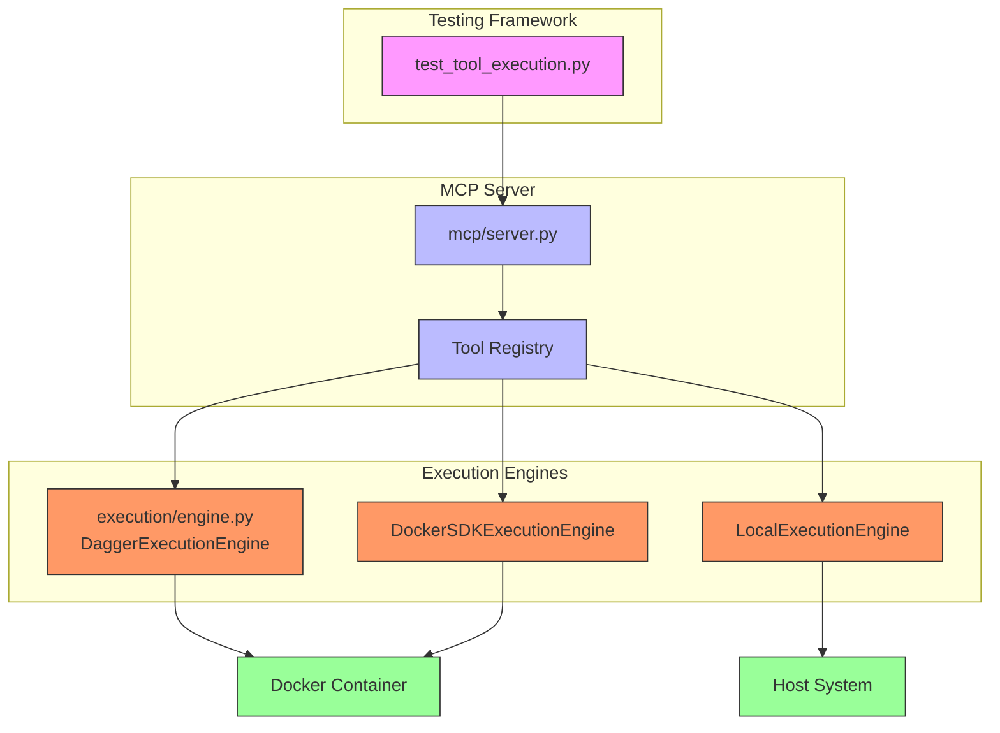
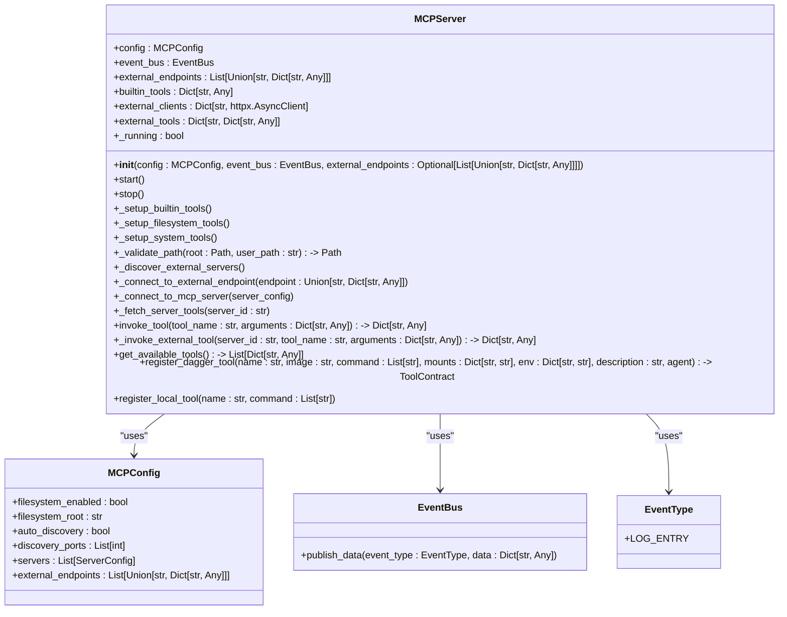
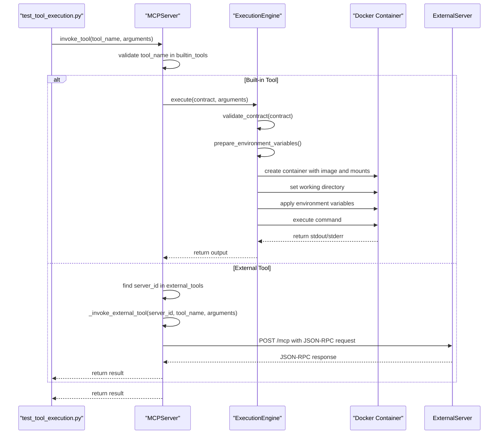
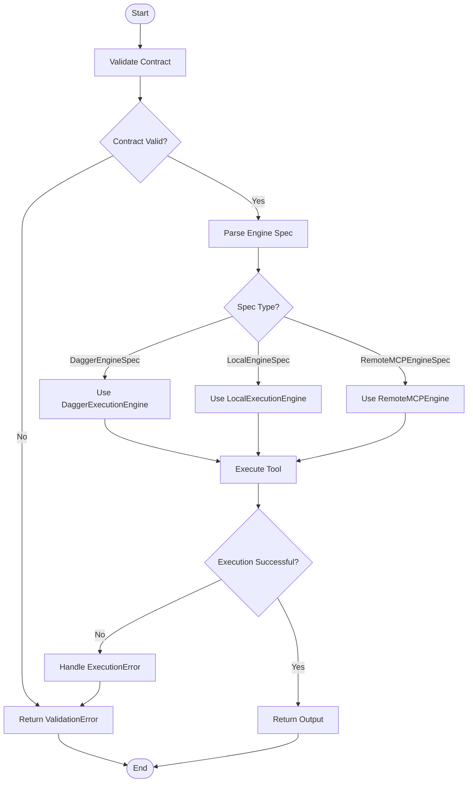
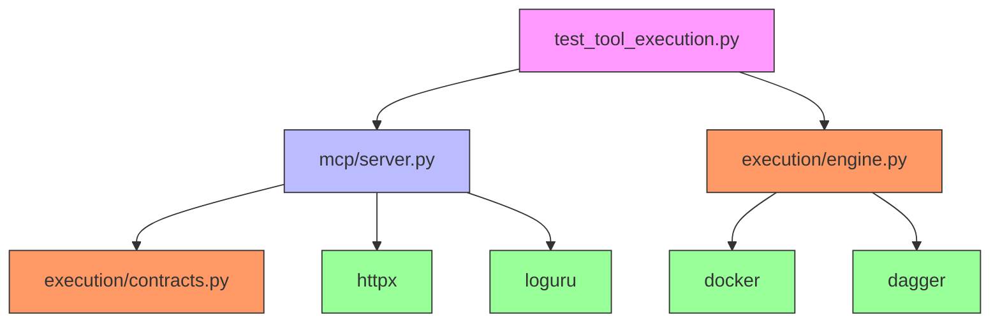

# Tool Execution Testing

## Table of Contents
1. [Introduction](#introduction)
2. [Project Structure](#project-structure)
3. [Core Components](#core-components)
4. [Architecture Overview](#architecture-overview)
5. [Detailed Component Analysis](#detailed-component-analysis)
6. [Dependency Analysis](#dependency-analysis)
7. [Performance Considerations](#performance-considerations)
8. [Troubleshooting Guide](#troubleshooting-guide)
9. [Conclusion](#conclusion)

## Introduction
This document provides a comprehensive analysis of tool execution testing in the Praxis Py SDK, focusing on validating containerized tool invocation via MCP (Model Context Protocol) contracts and execution engine orchestration. The analysis covers how `test_tool_execution.py` verifies correct tool discovery, input validation against contract schemas, and sandboxed runtime execution using Docker or Dagger. It includes examples of asserting output formatting, error propagation, and resource limits enforcement, along with integration points with `mcp/server.py` for capability registration and `execution/engine.py` for runtime selection. The document also addresses testing edge cases such as dependency resolution, timeout handling, and filesystem isolation, and provides guidance on extending tests for custom tool types.

## Project Structure
The project structure is organized into several key directories:
- `configs/`: Configuration files for agents, orchestrators, and workers.
- `docker/mcp_filesystem/`: Docker configuration for the MCP filesystem server.
- `src/praxis_sdk/`: Core source code including modules for A2A communication, API, cache, DSL, execution, LLM, MCP, P2P, tools, and workflow management.
- `tests/`: Integration and unit tests, including `test_tool_execution.py`.
- `tools/`: Various tool implementations with their contract files.

This structure supports a modular architecture where different components can be developed and tested independently.

## Core Components
The core components involved in tool execution testing include:
- **MCP Server**: Manages tool registration and invocation via JSON-RPC.
- **Execution Engines**: Handle the actual execution of tools using different backends (Dagger, Docker SDK, local subprocess).
- **Tool Contracts**: Define the schema and execution parameters for tools.

These components work together to ensure that tools are discovered, validated, and executed correctly in a secure and isolated environment.

**Section sources**
- [test_tool_execution.py](file://tests/integration/test_tool_execution.py)
- [server.py](file://src/praxis_sdk/mcp/server.py)
- [engine.py](file://src/praxis_sdk/execution/engine.py)

## Architecture Overview
The architecture for tool execution testing involves several key components interacting through well-defined interfaces. The MCP server acts as the central hub for tool discovery and invocation, while the execution engines handle the actual execution of tools in isolated environments.

**Diagram sources**
- [test_tool_execution.py](file://tests/integration/test_tool_execution.py)
- [server.py](file://src/praxis_sdk/mcp/server.py)
- [engine.py](file://src/praxis_sdk/execution/engine.py)

## Detailed Component Analysis

### MCP Server Analysis
The MCP server is responsible for managing tool registration and invocation. It uses JSON-RPC over HTTP to communicate with clients and supports both built-in and external tools.

#### Class Diagram for MCP Server

**Diagram sources**
- [server.py](file://src/praxis_sdk/mcp/server.py)

### Execution Engine Analysis
The execution engines are responsible for running tools in isolated environments. The main engines are `DaggerExecutionEngine`, `DockerSDKExecutionEngine`, and `LocalExecutionEngine`.

#### Sequence Diagram for Tool Execution

**Diagram sources**
- [engine.py](file://src/praxis_sdk/execution/engine.py)

### Tool Contract Analysis
Tool contracts define the schema and execution parameters for tools. They are used by the execution engines to validate and execute tools.

#### Flowchart for Tool Contract Validation

**Diagram sources**
- [engine.py](file://src/praxis_sdk/execution/engine.py)

## Dependency Analysis
The components in the tool execution testing framework have the following dependencies:
- `test_tool_execution.py` depends on `mcp/server.py` and `execution/engine.py`.
- `mcp/server.py` depends on `execution/contracts.py` for tool contracts.
- `execution/engine.py` depends on `docker` and `dagger` libraries for containerized execution.

These dependencies ensure that the framework can handle both local and remote tool execution in a secure and isolated manner.

**Diagram sources**
- [test_tool_execution.py](file://tests/integration/test_tool_execution.py)
- [server.py](file://src/praxis_sdk/mcp/server.py)
- [engine.py](file://src/praxis_sdk/execution/engine.py)

## Performance Considerations
The performance of tool execution testing is influenced by several factors:
- **Container Startup Time**: The time taken to start a Docker container can impact the overall execution time.
- **Network Latency**: For remote MCP servers, network latency can affect the response time.
- **Resource Limits**: The execution engines should enforce resource limits to prevent resource exhaustion.

To optimize performance, consider the following:
- Use caching for frequently used Docker images.
- Minimize the number of external tool invocations.
- Use efficient data serialization formats.

## Troubleshooting Guide
Common issues in tool execution testing include:
- **Tool Not Found**: Ensure that the tool is registered with the MCP server.
- **Invalid Arguments**: Validate the arguments against the tool contract schema.
- **Container Execution Failure**: Check the container logs for errors.
- **Network Issues**: Verify the network connectivity to remote MCP servers.

For debugging, enable verbose logging in the MCP server and execution engines to get detailed information about the execution process.

**Section sources**
- [test_tool_execution.py](file://tests/integration/test_tool_execution.py)
- [server.py](file://src/praxis_sdk/mcp/server.py)
- [engine.py](file://src/praxis_sdk/execution/engine.py)

## Conclusion
This document has provided a comprehensive analysis of tool execution testing in the Praxis Py SDK. It covers the key components, architecture, and dependencies involved in validating containerized tool invocation via MCP contracts and execution engine orchestration. By following the guidelines and best practices outlined in this document, developers can ensure that their tools are discovered, validated, and executed correctly in a secure and isolated environment.

**Referenced Files in This Document**   
- [test_tool_execution.py](file://tests/integration/test_tool_execution.py)
- [server.py](file://src/praxis_sdk/mcp/server.py)
- [engine.py](file://src/praxis_sdk/execution/engine.py)