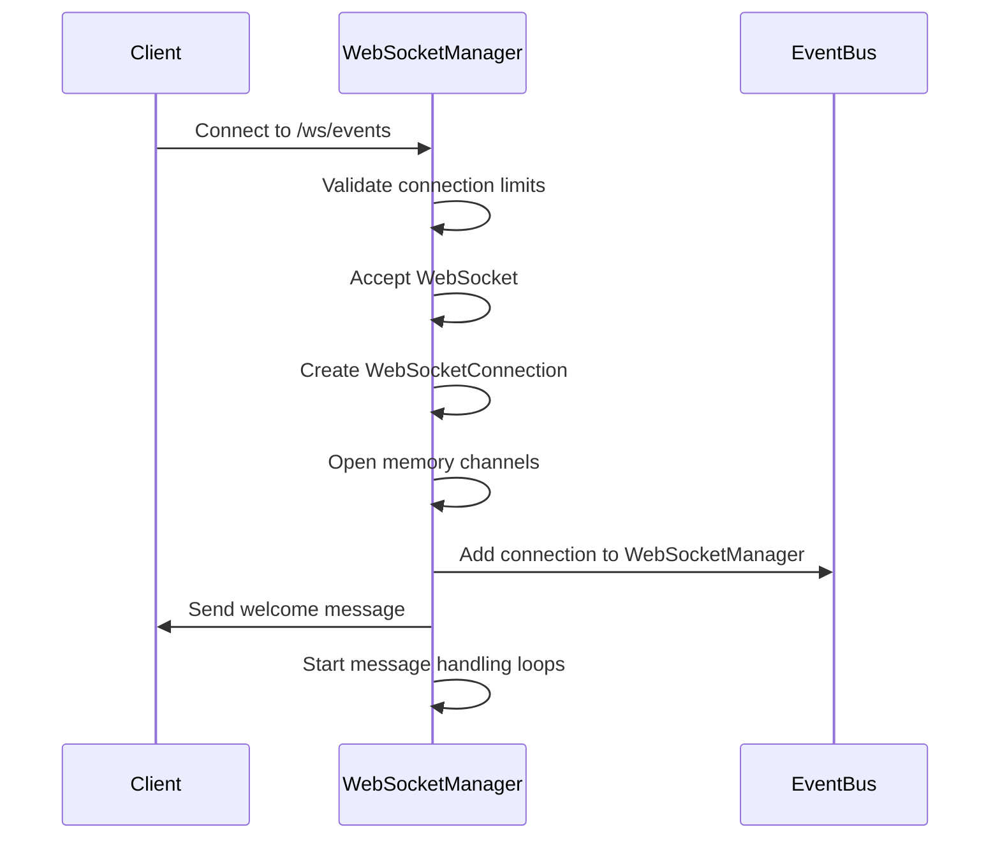
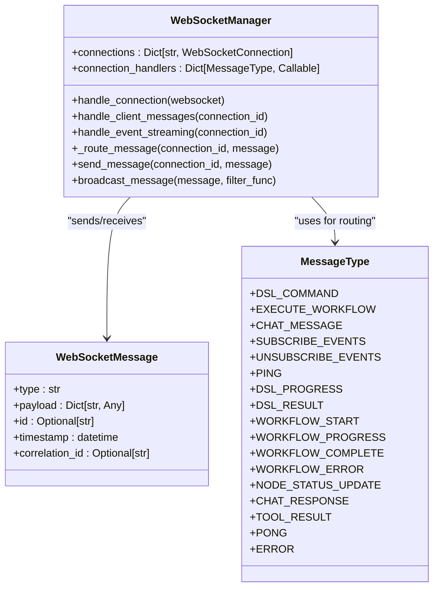
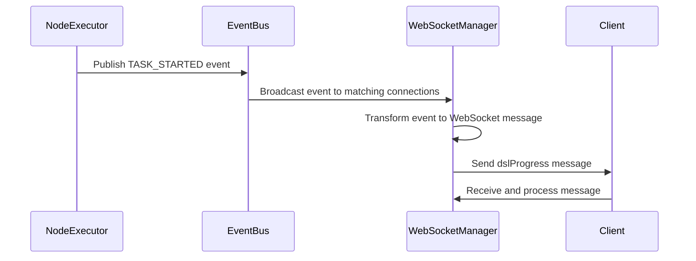
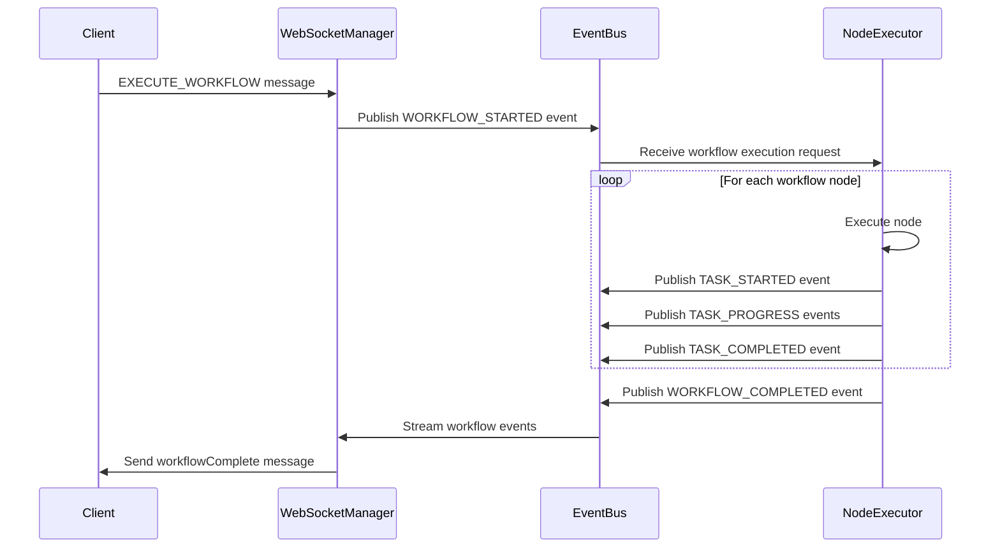
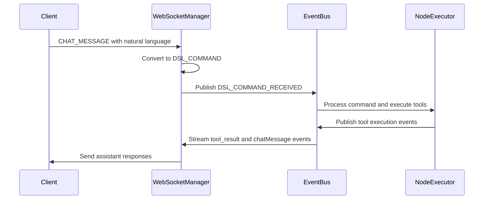
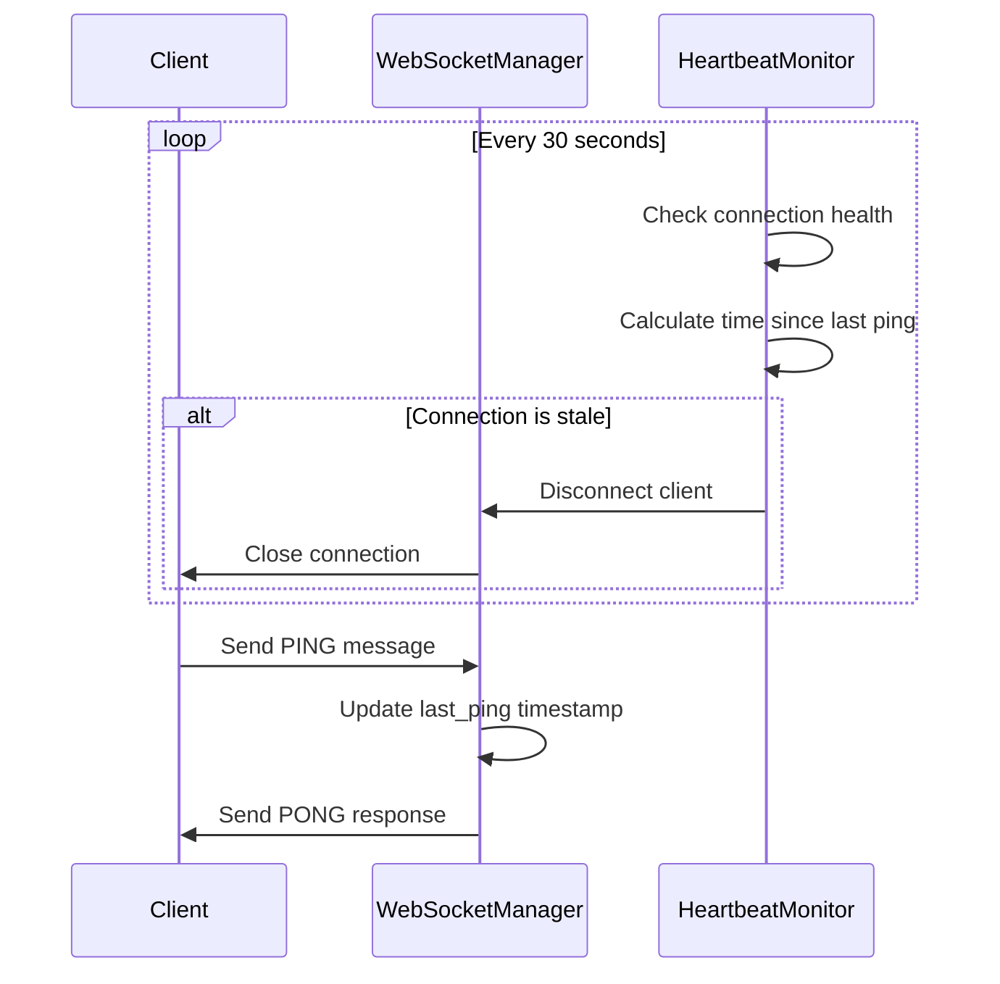
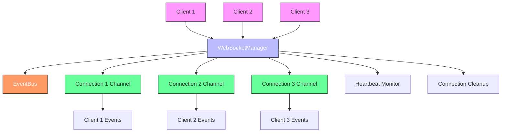
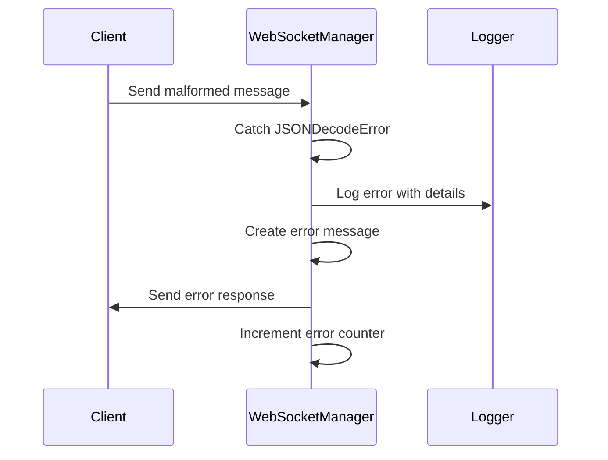
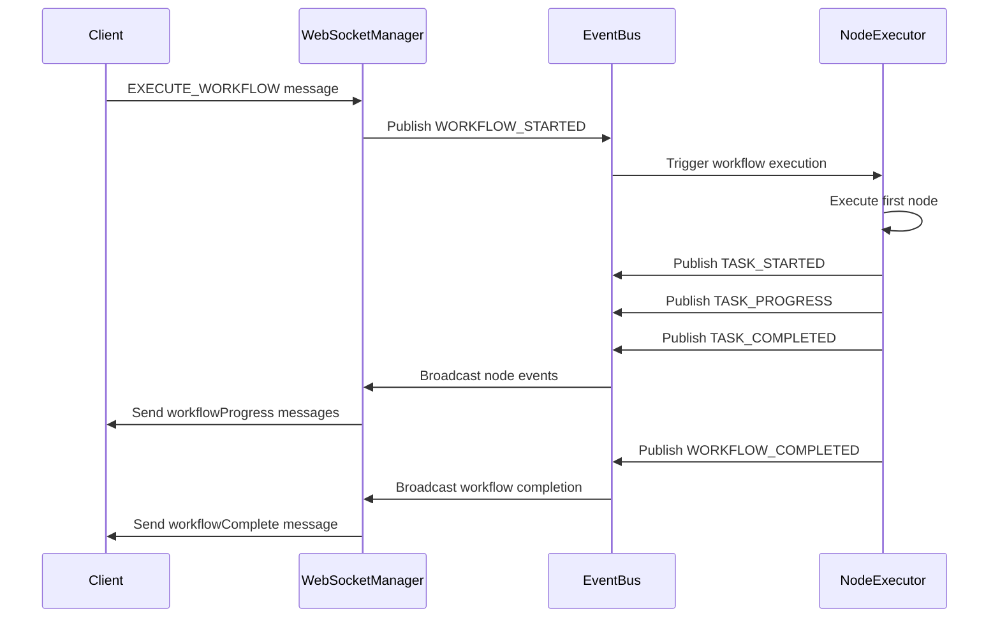

# WebSocket API Testing


## Table of Contents
1. [Introduction](#introduction)
2. [WebSocket Connection Lifecycle](#websocket-connection-lifecycle)
3. [Message Framing and Protocol](#message-framing-and-protocol)
4. [Event Streaming and Subscription](#event-streaming-and-subscription)
5. [Workflow Execution via WebSocket](#workflow-execution-via-websocket)
6. [Test Strategies for Real-Time Communication](#test-strategies-for-real-time-communication)
7. [Connection Resilience and Heartbeat Monitoring](#connection-resilience-and-heartbeat-monitoring)
8. [Concurrent Client Handling](#concurrent-client-handling)
9. [Error Handling and Debugging](#error-handling-and-debugging)
10. [Integration with Node Executor and Bus](#integration-with-node-executor-and-bus)

## Introduction
This document provides comprehensive documentation for WebSocket API testing in the Praxis Python SDK. It focuses on real-time event streaming, bidirectional communication, and session management between clients and the Praxis agent. The analysis centers on `test_websocket_connectivity.py` which validates connection handshake, message framing, and event subscription/unsubscription workflows. The document explains how live logs, progress updates, and error notifications are pushed from `node_executor.py` and `bus.py` through the WebSocket infrastructure. It also covers test strategies for connection resilience, heartbeat monitoring, and concurrent client handling, including debugging techniques using WebSocket message inspectors and Trio cancellation tracing.

## WebSocket Connection Lifecycle

The WebSocket connection lifecycle in the Praxis SDK is managed through a well-defined state machine that ensures reliable communication between clients and the agent. The process begins with the client establishing a connection to the WebSocket endpoint, typically `/ws/events` or the legacy `/ws/workflow`. The server-side implementation in `src/praxis_sdk/api/websocket.py` handles the connection through the `WebSocketManager.handle_connection()` method, which performs several critical steps:

1. Validates connection limits
2. Accepts the WebSocket handshake
3. Creates a `WebSocketConnection` object with unique ID
4. Sets up Trio memory channels for event streaming
5. Registers the connection in the global connections dictionary
6. Subscribes to default event types via the event bus
7. Sends a welcome message to the client



**Diagram sources**
- [websocket.py](file://src/praxis_sdk/api/websocket.py#L200-L250)
- [bus.py](file://src/praxis_sdk/bus.py#L250-L300)

**Section sources**
- [websocket.py](file://src/praxis_sdk/api/websocket.py#L200-L250)
- [server.py](file://src/praxis_sdk/api/server.py#L500-L550)

## Message Framing and Protocol

The WebSocket messaging protocol in Praxis follows a structured JSON format with consistent fields for type identification, payload data, and metadata. The `WebSocketMessage` class defined in `src/praxis_sdk/api/websocket.py` serves as the foundation for all WebSocket communication, with the following structure:

```python
class WebSocketMessage(BaseModel):
    type: str
    payload: Dict[str, Any] = Field(default_factory=dict)
    id: Optional[str] = Field(default_factory=lambda: str(uuid4()))
    timestamp: datetime = Field(default_factory=datetime.utcnow)
    correlation_id: Optional[str] = None
```

The protocol supports bidirectional communication with distinct message types for client-to-server and server-to-client communication:

**Client-to-Server Message Types:**
- `DSL_COMMAND`: Execute a DSL command
- `EXECUTE_WORKFLOW`: Execute a workflow
- `CHAT_MESSAGE`: Send a chat message
- `SUBSCRIBE_EVENTS`: Subscribe to specific event types
- `UNSUBSCRIBE_EVENTS`: Unsubscribe from event types
- `PING`: Heartbeat/ping message

**Server-to-Client Message Types:**
- `dslProgress`: DSL command progress update
- `dslResult`: DSL command result
- `workflowStart`: Workflow execution started
- `workflowProgress`: Workflow progress update
- `workflowComplete`: Workflow completed successfully
- `workflowError`: Workflow execution error
- `nodeStatusUpdate`: Node status update
- `chatMessage`: Chat response
- `tool_result`: Tool execution result
- `PONG`: Ping response
- `error`: Error message

The message routing is handled by the `WebSocketManager._route_message()` method, which dispatches incoming messages to appropriate handlers based on the message type. This ensures that different message types are processed by specialized handlers, maintaining separation of concerns and enabling extensibility.



**Diagram sources**
- [websocket.py](file://src/praxis_sdk/api/websocket.py#L50-L150)
- [websocket.py](file://src/praxis_sdk/api/websocket.py#L250-L300)

**Section sources**
- [websocket.py](file://src/praxis_sdk/api/websocket.py#L50-L150)

## Event Streaming and Subscription

Event streaming is a core feature of the Praxis WebSocket API, enabling real-time updates to be pushed from the server to connected clients. The system uses an event bus architecture where components publish events, and the WebSocket manager subscribes to these events and forwards them to appropriate clients.

The `EventBus` class in `src/praxis_sdk/bus.py` serves as the central event distribution mechanism. Components such as the `NodeExecutor` publish events when significant operations occur (e.g., node execution started, workflow completed, tool executed). The `WebSocketManager` integrates with the event bus through its `websocket_manager` property, which maintains a mapping of connection IDs to send channels and event filters.

When a client connects, it is automatically subscribed to a default set of event types through the `EventFilter`:

```python
default_filter = EventFilter(
    event_types={
        EventType.DSL_COMMAND_PROGRESS,
        EventType.DSL_COMMAND_COMPLETED,
        EventType.TASK_STARTED,
        EventType.TASK_PROGRESS,
        EventType.TASK_COMPLETED,
        EventType.TASK_FAILED,
        EventType.WORKFLOW_STARTED,
        EventType.WORKFLOW_PROGRESS,
        EventType.WORKFLOW_COMPLETED,
        EventType.P2P_TOOL_RESPONSE
    }
)
```

Clients can also explicitly subscribe to additional event types using the `SUBSCRIBE_EVENTS` message:

```python
{
    "type": "SUBSCRIBE_EVENTS",
    "payload": {
        "event_types": ["dsl.command_progress", "workflow.started", "tool.executed"]
    }
}
```

The event transformation pipeline converts backend `Event` objects to frontend-compatible WebSocket messages through the `_transform_event_for_frontend()` method. This method maps backend event types to frontend message types and formats the payload appropriately for client consumption.



**Diagram sources**
- [bus.py](file://src/praxis_sdk/bus.py#L250-L300)
- [websocket.py](file://src/praxis_sdk/api/websocket.py#L400-L450)

**Section sources**
- [bus.py](file://src/praxis_sdk/bus.py#L250-L300)
- [websocket.py](file://src/praxis_sdk/api/websocket.py#L400-L450)

## Workflow Execution via WebSocket

The WebSocket API provides a comprehensive interface for workflow execution, allowing clients to initiate workflows and receive real-time updates on their progress. The workflow execution process begins when a client sends an `EXECUTE_WORKFLOW` message:

```python
{
    "type": "EXECUTE_WORKFLOW",
    "payload": {
        "workflowId": "ws-workflow-123",
        "nodes": [
            {
                "id": "node1",
                "type": "tool_call",
                "tool": "write_file",
                "params": {
                    "filename": "workflow_test.txt",
                    "content": "Workflow via WebSocket"
                }
            }
        ],
        "edges": []
    }
}
```

The `WebSocketManager._handle_execute_workflow()` method processes this message by publishing a `WORKFLOW_STARTED` event to the event bus with the workflow details. This triggers the workflow execution engine to begin processing the workflow nodes.

As the workflow executes, various events are published to the event bus and streamed to the client:

- `workflowStart`: When the workflow begins execution
- `nodeStatusUpdate`: When a node's status changes
- `workflowProgress`: Periodic progress updates
- `workflowComplete`: When the workflow completes successfully
- `workflowError`: When the workflow fails

The `test_websocket_connectivity.py` file contains a comprehensive test for workflow execution via WebSocket (`test_websocket_workflow_execution`). This test verifies that:
1. The workflow execution request is properly received
2. Multiple workflow-related events are streamed to the client
3. The event types match expected values
4. The workflow completes successfully



**Diagram sources**
- [websocket.py](file://src/praxis_sdk/api/websocket.py#L700-L750)
- [node_executor.py](file://src/praxis_sdk/workflow/node_executor.py#L50-L100)
- [bus.py](file://src/praxis_sdk/bus.py#L250-L300)

**Section sources**
- [test_websocket_connectivity.py](file://tests/integration/test_websocket_connectivity.py#L150-L200)
- [websocket.py](file://src/praxis_sdk/api/websocket.py#L700-L750)

## Test Strategies for Real-Time Communication

The integration tests in `test_websocket_connectivity.py` employ several strategies to validate real-time communication through the WebSocket API. These tests use the pytest-asyncio framework to handle asynchronous operations and ensure proper timing of events.

### DSL Command Streaming Test
The `test_websocket_dsl_command_streaming` test verifies that DSL commands are properly executed and that progress events are streamed to the client:

```python
async def test_websocket_dsl_command_streaming(wait_for_services, orchestrator_ws, test_helper):
    # Send DSL command
    await test_helper.send_websocket_message(
        orchestrator_ws, 
        "DSL_COMMAND", 
        {"command": "CALL write_file websocket_test.txt 'WebSocket DSL test'"}
    )
    
    # Collect streaming events
    events = []
    for i in range(10):
        try:
            event = await test_helper.receive_websocket_message(orchestrator_ws, timeout=5.0)
            events.append(event)
            if event.get("type") in ["dslResult", "workflowComplete", "error"]:
                break
        except asyncio.TimeoutError:
            break
```

This test validates that:
- The DSL command is properly received and processed
- Multiple streaming events are generated during command execution
- The event structure is valid (contains type and payload)
- The workflow eventually completes or returns a result

### Chat Interface Test
The `test_websocket_chat_interface` test validates the chat-like interface through WebSocket, where user messages are treated as DSL commands and assistant responses are streamed back:

```python
async def test_websocket_chat_interface(wait_for_services, orchestrator_ws, test_helper):
    # Send chat message
    await test_helper.send_websocket_message(
        orchestrator_ws,
        "CHAT_MESSAGE",
        {
            "content": "Create a file called chat_test.txt with content 'Hello from chat'",
            "sender": "user"
        }
    )
    
    # Collect chat responses
    for i in range(8):
        try:
            response = await test_helper.receive_websocket_message(orchestrator_ws, timeout=6.0)
            if (response.get("type") in ["chatMessage", "tool_result", "dslResult"] and 
                response.get("payload", {}).get("sender") == "assistant"):
                break
        except asyncio.TimeoutError:
            break
```

This test ensures that:
- Chat messages are properly received and processed
- Assistant responses are generated and sent back to the client
- The response format is correct for chat interfaces
- The system handles natural language commands appropriately



**Diagram sources**
- [test_websocket_connectivity.py](file://tests/integration/test_websocket_connectivity.py#L50-L100)
- [websocket.py](file://src/praxis_sdk/api/websocket.py#L750-L800)

**Section sources**
- [test_websocket_connectivity.py](file://tests/integration/test_websocket_connectivity.py#L50-L150)

## Connection Resilience and Heartbeat Monitoring

The WebSocket API includes robust mechanisms for connection resilience and health monitoring. The `WebSocketManager` implements a heartbeat system to detect and handle stale connections.

### Heartbeat Implementation
The heartbeat system consists of two components:

1. **Client-initiated heartbeats**: Clients can send `PING` messages to test connection health
2. **Server-side heartbeat monitoring**: The server periodically checks for stale connections

The `test_websocket_heartbeat_and_keepalive` test validates this functionality:

```python
async def test_websocket_heartbeat_and_keepalive(wait_for_services, orchestrator_ws, test_helper):
    # Send periodic heartbeat messages
    for i in range(5):
        await test_helper.send_websocket_message(
            orchestrator_ws,
            "heartbeat",
            {"sequence": i, "timestamp": asyncio.get_event_loop().time()}
        )
        if i < 4:
            await asyncio.sleep(2.0)
    
    # Check for heartbeat responses
    received_responses = 0
    for i in range(5):
        try:
            response = await test_helper.receive_websocket_message(orchestrator_ws, timeout=1.0)
            received_responses += 1
        except asyncio.TimeoutError:
            break
```

### Connection Health Monitoring
The server-side heartbeat monitor runs as a background task in the `WebSocketManager._heartbeat_monitor()` method:

```python
async def _heartbeat_monitor(self):
    while self._running:
        current_time = datetime.utcnow()
        
        # Check for stale connections
        stale_connections = []
        for connection in self.connections.values():
            if connection.last_ping:
                time_since_ping = (current_time - connection.last_ping).total_seconds()
                if time_since_ping > self.heartbeat_interval * 3:
                    stale_connections.append(connection.id)
        
        # Disconnect stale connections
        for connection_id in stale_connections:
            await self._disconnect_client(connection_id, reason="Heartbeat timeout")
        
        await trio.sleep(self.heartbeat_interval)
```

This monitor disconnects clients that haven't sent a ping within three times the heartbeat interval (default 90 seconds), preventing resource leaks from abandoned connections.



**Diagram sources**
- [websocket.py](file://src/praxis_sdk/api/websocket.py#L1000-L1050)
- [test_websocket_connectivity.py](file://tests/integration/test_websocket_connectivity.py#L350-L400)

**Section sources**
- [websocket.py](file://src/praxis_sdk/api/websocket.py#L1000-L1050)
- [test_websocket_connectivity.py](file://tests/integration/test_websocket_connectivity.py#L350-L400)

## Concurrent Client Handling

The WebSocket API is designed to handle multiple concurrent connections efficiently. The `test_websocket_concurrent_connections` test validates this capability:

```python
async def test_websocket_concurrent_connections(wait_for_services):
    ORCHESTRATOR_WS = os.getenv("PRAXIS_ORCHESTRATOR_URL", "http://localhost:8000").replace("http://", "ws://") + "/ws/workflow"
    
    # Create multiple WebSocket connections
    connections = []
    for i in range(3):
        try:
            ws = await websockets.connect(ORCHESTRATOR_WS)
            connections.append(ws)
        except Exception as e:
            print(f"Failed to establish WebSocket connection {i+1}: {e}")
    
    # Send messages from each connection
    tasks = []
    for i, ws in enumerate(connections):
        message = {
            "type": "ping",
            "payload": {"connection_id": i}
        }
        task = asyncio.create_task(ws.send(json.dumps(message)))
        tasks.append(task)
    
    # Wait for all sends to complete
    await asyncio.gather(*tasks, return_exceptions=True)
```

The `WebSocketManager` handles concurrent connections through several mechanisms:

1. **Connection Limits**: The manager enforces a maximum connection limit (default 100) to prevent resource exhaustion
2. **Per-Connection Channels**: Each connection has its own Trio memory channels for event streaming, ensuring isolation
3. **Thread-Safe Operations**: The manager uses Trio's concurrency primitives to safely manage the connections dictionary
4. **Independent Message Handling**: Each connection's message handling runs in its own task, preventing one slow client from blocking others

The connection cleanup task (`_connection_cleanup`) also runs periodically to remove dead connections, freeing up resources:

```python
async def _connection_cleanup(self):
    while self._running:
        dead_connections = []
        for connection in self.connections.values():
            if (connection.state in [ConnectionState.DISCONNECTED, ConnectionState.ERROR] or 
                connection.error_count > 10):
                dead_connections.append(connection.id)
        
        for connection_id in dead_connections:
            await self._disconnect_client(connection_id, reason="Connection cleanup")
        
        await trio.sleep(60)
```



**Diagram sources**
- [websocket.py](file://src/praxis_sdk/api/websocket.py#L1050-L1100)
- [test_websocket_connectivity.py](file://tests/integration/test_websocket_connectivity.py#L300-L350)

**Section sources**
- [websocket.py](file://src/praxis_sdk/api/websocket.py#L1050-L1100)
- [test_websocket_connectivity.py](file://tests/integration/test_websocket_connectivity.py#L300-L350)

## Error Handling and Debugging

The WebSocket API includes comprehensive error handling mechanisms to ensure robust operation and provide meaningful feedback to clients.

### Error Message Structure
Error messages follow a consistent format:

```python
{
    "type": "error",
    "payload": {
        "message": "Descriptive error message",
        "code": "ERROR_CODE",
        "timestamp": "ISO8601 timestamp"
    }
}
```

The `WebSocketManager._send_error()` method handles error message creation and delivery:

```python
async def _send_error(self, connection_id: str, error_message: str):
    await self.send_message(connection_id, WebSocketMessage(
        type=MessageType.ERROR.value,
        payload={
            "message": error_message,
            "code": "WEBSOCKET_ERROR",
            "timestamp": datetime.utcnow().isoformat() + "Z"
        }
    ))
```

### Error Testing
The `test_websocket_error_handling` test validates the system's response to malformed and invalid messages:

```python
async def test_websocket_error_handling(wait_for_services, orchestrator_ws, test_helper):
    # Test malformed JSON
    try:
        malformed_message = '{"type": "invalid", "malformed": json}'
        await orchestrator_ws.send(malformed_message)
        response = await test_helper.receive_websocket_message(orchestrator_ws, timeout=5.0)
        assert "error" in response or response.get("type") == "error"
    except Exception as e:
        print(f"Error sending malformed message: {e}")
    
    # Test invalid message type
    invalid_message = {
        "type": "NONEXISTENT_MESSAGE_TYPE",
        "payload": {"test": "invalid message type"}
    }
    await test_helper.send_websocket_message(
        orchestrator_ws,
        "NONEXISTENT_MESSAGE_TYPE",
        invalid_message["payload"]
    )
    try:
        response = await test_helper.receive_websocket_message(orchestrator_ws, timeout=5.0)
        assert "error" in response or response.get("type") == "error"
    except asyncio.TimeoutError:
        print("No response to invalid message type")
```

### Debugging Techniques
The system provides several debugging capabilities:

1. **Message Logging**: All incoming and outgoing messages are logged with timestamps
2. **Connection Statistics**: The WebSocket manager maintains detailed statistics on connections, messages, and errors
3. **Event Bus Monitoring**: The event bus tracks published and processed events, handler errors, and active handlers
4. **Trio Cancellation Tracing**: The use of Trio enables detailed tracing of task cancellations and timeouts

The statistics endpoint (`/stats`) provides a comprehensive view of the WebSocket system's health:

```python
@app.get("/stats")
async def get_statistics():
    return {
        "websocket_manager": websocket_manager.get_stats(),
        "event_bus": event_bus.get_stats(),
        "server": {
            "running": self._running,
            "config": {
                "websocket_enabled": self.config.api.websocket_enabled,
            }
        }
    }
```



**Diagram sources**
- [websocket.py](file://src/praxis_sdk/api/websocket.py#L950-L1000)
- [test_websocket_connectivity.py](file://tests/integration/test_websocket_connectivity.py#L250-L300)

**Section sources**
- [websocket.py](file://src/praxis_sdk/api/websocket.py#L950-L1000)
- [test_websocket_connectivity.py](file://tests/integration/test_websocket_connectivity.py#L250-L300)

## Integration with Node Executor and Bus

The WebSocket API's real-time capabilities are enabled by its tight integration with the `NodeExecutor` and `EventBus` components. This integration allows events from workflow execution to be streamed to clients in real-time.

### Event Flow from Node Execution
When a node is executed by the `NodeExecutor`, it publishes events to the `EventBus`, which are then transformed and streamed to WebSocket clients:

```python
async def execute_node(self, node: WorkflowNode, context: ExecutionContext) -> NodeResult:
    # ... execution logic ...
    
    # Publish task started event
    await event_bus.publish_data(
        EventType.TASK_STARTED,
        {
            "node_id": node.id,
            "workflow_id": context.workflow_id,
            "command": node.command
        },
        source="node_executor",
        correlation_id=context.execution_id
    )
    
    # ... more execution steps ...
    
    # Publish task completed event
    await event_bus.publish_data(
        EventType.TASK_COMPLETED,
        {
            "node_id": node.id,
            "workflow_id": context.workflow_id,
            "result": result.result
        },
        source="node_executor",
        correlation_id=context.execution_id
    )
```

### Event Transformation Pipeline
The `WebSocketManager` listens for these events through its integration with the `EventBus` and transforms them into frontend-compatible messages:

```python
def _transform_event_for_frontend(self, event: Event) -> Optional[WebSocketMessage]:
    frontend_type_map = {
        EventType.TASK_STARTED: "workflowStart",
        EventType.TASK_PROGRESS: "workflowProgress",
        EventType.TASK_COMPLETED: "workflowComplete",
        EventType.TASK_FAILED: "workflowError",
        EventType.NODE_STATUS_UPDATE: "nodeStatusUpdate",
    }
    
    frontend_type = frontend_type_map.get(event.type)
    if not frontend_type:
        frontend_type = "eventStream"
    
    # Create appropriate message based on event type
    if event.type == EventType.TASK_STARTED:
        return self._create_workflow_start_message(event, frontend_type)
    elif event.type == EventType.TASK_PROGRESS:
        return self._create_workflow_progress_message(event, frontend_type)
    # ... other event types
```

### End-to-End Flow
The complete flow from client request to node execution and back to client notification:



This integration enables the Praxis agent to provide real-time feedback on workflow execution, allowing clients to monitor progress, receive intermediate results, and handle errors as they occur.

**Diagram sources**
- [node_executor.py](file://src/praxis_sdk/workflow/node_executor.py#L50-L100)
- [bus.py](file://src/praxis_sdk/bus.py#L250-L300)
- [websocket.py](file://src/praxis_sdk/api/websocket.py#L400-L450)

**Section sources**
- [node_executor.py](file://src/praxis_sdk/workflow/node_executor.py#L50-L100)
- [bus.py](file://src/praxis_sdk/bus.py#L250-L300)
- [websocket.py](file://src/praxis_sdk/api/websocket.py#L400-L450)

**Referenced Files in This Document**   
- [test_websocket_connectivity.py](file://tests/integration/test_websocket_connectivity.py)
- [websocket.py](file://src/praxis_sdk/api/websocket.py)
- [bus.py](file://src/praxis_sdk/bus.py)
- [node_executor.py](file://src/praxis_sdk/workflow/node_executor.py)
- [server.py](file://src/praxis_sdk/api/server.py)