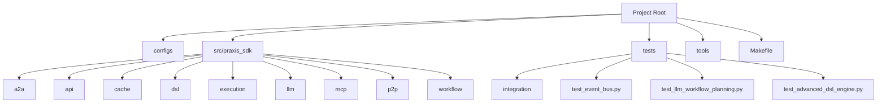
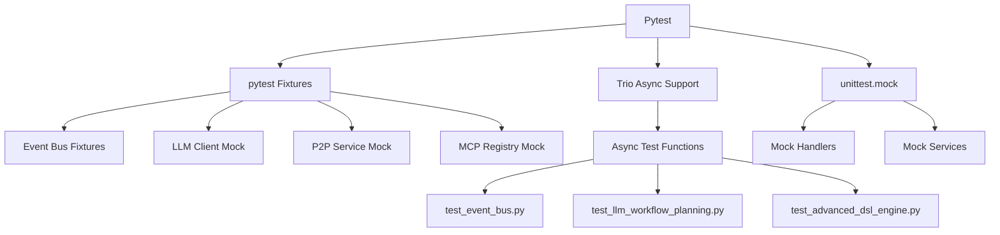
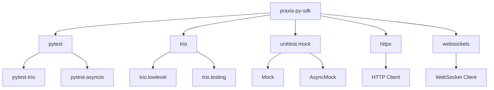

# Unit Testing


## Table of Contents
1. [Introduction](#introduction)
2. [Project Structure](#project-structure)
3. [Core Components](#core-components)
4. [Architecture Overview](#architecture-overview)
5. [Detailed Component Analysis](#detailed-component-analysis)
6. [Dependency Analysis](#dependency-analysis)
7. [Performance Considerations](#performance-considerations)
8. [Troubleshooting Guide](#troubleshooting-guide)
9. [Conclusion](#conclusion)

## Introduction
This document provides a comprehensive guide to unit testing in the praxis-py-sdk. It details how to write isolated, fast-running tests for key components such as the event bus, DSL engine, and LLM workflow planner. The documentation covers the use of pytest fixtures and mocking with unittest.mock to simulate dependencies like external APIs and execution engines. Real examples from test files illustrate assertion patterns, async test setup with trio, and edge case validation. Best practices for testing pure functions in the DSL and workflow modules are highlighted, along with strategies for handling asynchronous components and ensuring deterministic execution.

## Project Structure
The praxis-py-sdk follows a modular structure with clearly defined directories for configuration, source code, tests, and tools. The `src/praxis_sdk` directory contains the core implementation, while the `tests` directory is organized into unit and integration test suites. The `Makefile` provides convenient commands for running tests and managing the development environment.



**Diagram sources**
- [Makefile](file://Makefile#L0-L169)
- [test_event_bus.py](file://tests/test_event_bus.py#L0-L452)

**Section sources**
- [Makefile](file://Makefile#L0-L169)

## Core Components
The praxis-py-sdk's unit testing framework focuses on three core components: the event bus system, the DSL engine, and the LLM workflow planner. These components are tested in isolation using pytest fixtures and mocking to ensure fast, reliable test execution.

### Event Bus System
The event bus system uses trio for asynchronous event handling and provides mechanisms for publishing, subscribing, and filtering events. It supports WebSocket integration and trio channel communication.

### DSL Engine
The DSL engine processes domain-specific language commands through a pipeline of tokenizer, AST builder, parser, validator, and executor components. It supports complex constructs like parallel execution, sequences, and conditionals.

### LLM Workflow Planner
The LLM workflow planner generates executable workflows from natural language requests by leveraging large language models and network context awareness. It includes fallback mechanisms when LLM services are unavailable.

**Section sources**
- [test_event_bus.py](file://tests/test_event_bus.py#L0-L452)
- [test_advanced_dsl_engine.py](file://tests/test_advanced_dsl_engine.py#L0-L654)
- [test_llm_workflow_planning.py](file://tests/test_llm_workflow_planning.py#L0-L316)

## Architecture Overview
The unit testing architecture in praxis-py-sdk is built around pytest with trio support for asynchronous testing. Mocking is used extensively to isolate components and simulate external dependencies. The test suite is organized by component, with shared fixtures defined in conftest.py.



**Diagram sources**
- [test_event_bus.py](file://tests/test_event_bus.py#L0-L452)
- [test_llm_workflow_planning.py](file://tests/test_llm_workflow_planning.py#L0-L316)
- [test_advanced_dsl_engine.py](file://tests/test_advanced_dsl_engine.py#L0-L654)

## Detailed Component Analysis

### Event Bus Testing
The event bus system is thoroughly tested for event publication, subscription, filtering, and delivery. Tests verify both synchronous and asynchronous handler execution, WebSocket integration, and trio channel communication.

#### Test Event Creation and Serialization
```python
def test_event_creation(self):
    metadata = EventMetadata(source="test", tags={"test": "true"})
    event = Event(EventType.TASK_CREATED, {"task_id": "123"}, metadata)
    
    assert event.type == EventType.TASK_CREATED
    assert event.payload == {"task_id": "123"}
    assert event.metadata.source == "test"
    assert event.metadata.tags == {"test": "true"}

def test_event_to_dict(self):
    event = Event(EventType.TASK_CREATED, {"task_id": "123"})
    event_dict = event.to_dict()
    
    assert event_dict["type"] == "task.created"
    assert event_dict["payload"] == {"task_id": "123"}
    assert "metadata" in event_dict
    assert "event_id" in event_dict["metadata"]
```

#### Test Event Filtering
```python
def test_event_type_filtering(self):
    event_filter = EventFilter(event_types={EventType.TASK_CREATED, EventType.TASK_COMPLETED})
    
    event1 = Event(EventType.TASK_CREATED, {})
    event2 = Event(EventType.TASK_STARTED, {})
    
    assert event_filter.matches(event1) is True
    assert event_filter.matches(event2) is False
```

#### Test WebSocket Integration
```python
async def test_broadcast_event(self, websocket_manager, mock_websocket):
    websocket_manager.add_connection("client1", mock_websocket)
    
    event = Event(EventType.TASK_CREATED, {"task_id": "123"})
    await websocket_manager.broadcast_event(event)
    
    mock_websocket.send_text.assert_called_once()
    call_args = mock_websocket.send_text.call_args[0][0]
    event_data = json.loads(call_args)
    
    assert event_data["type"] == "task.created"
    assert event_data["payload"] == {"task_id": "123"}
```

**Section sources**
- [test_event_bus.py](file://tests/test_event_bus.py#L0-L452)

### LLM Workflow Planning Testing
The LLM workflow planner is tested for initialization, network context retrieval, and workflow generation from natural language. Mocks are used to simulate P2P services and MCP registries.

#### Test Workflow Generation
```python
@pytest.mark.asyncio
async def test_fallback_workflow_generation(self, workflow_planner):
    workflow_planner.llm_client = None
    await workflow_planner.initialize()
    
    result = await workflow_planner.generate_from_natural_language(
        "read a file and write backup"
    )
    
    assert result.success is True
    assert result.fallback_used is True
    assert result.workflow_plan is not None
    assert "file" in result.workflow_plan.dsl.lower()
```

#### Test Network Context Builder
```python
@pytest.mark.asyncio
async def test_build_network_context(self, context_builder):
    context = await context_builder.build_network_context()
    
    assert isinstance(context, NetworkContext)
    assert isinstance(context.available_agents, list)
    assert isinstance(context.available_tools, list)
    assert isinstance(context.agent_capabilities, dict)
    assert isinstance(context.tool_routing, dict)
```

**Section sources**
- [test_llm_workflow_planning.py](file://tests/test_llm_workflow_planning.py#L0-L316)

### DSL Engine Testing
The DSL engine is tested through its complete processing pipeline, from tokenization to execution. Tests cover syntax validation, AST building, and execution of complex workflows.

#### Test Tokenization
```python
def test_quoted_string_parsing(self):
    dsl = 'CALL write_file "my file.txt" "hello world"'
    tokens = self.tokenizer.tokenize(dsl)
    
    assert len(tokens) == 1
    assert tokens[0].args == ["write_file", "my file.txt", "hello world"]
```

#### Test AST Building
```python
def test_parallel_node(self):
    tokens = [
        Token(TokenType.COMMAND, "PARALLEL", []),
        Token(TokenType.COMMAND, "CALL", ["read_file", "file1.txt"]),
        Token(TokenType.COMMAND, "CALL", ["read_file", "file2.txt"])
    ]
    ast = self.builder.build_ast(tokens)
    
    assert len(ast.nodes) == 3
    parallel_node = ast.nodes[0]
    assert parallel_node.type == NodeType.PARALLEL
    assert parallel_node.value == "PARALLEL"
```

#### Test Execution with Caching
```python
@pytest.mark.asyncio
async def test_caching_functionality(self):
    dsl = "CALL read_file --filename test.txt"
    
    result1 = await self.parser.parse_and_execute(dsl, use_cache=True)
    assert result1.success
    
    result2 = await self.parser.parse_and_execute(dsl, use_cache=True)
    assert result2.success
    
    stats = self.parser.get_stats()
    assert stats["cache_stats"]["hits"] > 0
```

**Section sources**
- [test_advanced_dsl_engine.py](file://tests/test_advanced_dsl_engine.py#L0-L654)

## Dependency Analysis
The unit testing framework relies on several key dependencies that are mocked during testing to ensure isolation and determinism.



**Diagram sources**
- [conftest.py](file://tests/integration/conftest.py#L0-L281)
- [test_event_bus.py](file://tests/test_event_bus.py#L0-L452)

**Section sources**
- [conftest.py](file://tests/integration/conftest.py#L0-L281)

## Performance Considerations
Unit tests in praxis-py-sdk are designed to be fast and deterministic. The use of mocking eliminates external dependencies that could introduce latency or flakiness. Asynchronous tests are carefully managed with trio to ensure proper cleanup and avoid resource leaks.

### Test Speed Optimization
- **Mocking**: External services are mocked to eliminate network latency
- **In-memory operations**: File operations use temporary in-memory structures
- **Parallel execution**: Tests can be run in parallel using pytest-xdist
- **Caching**: Test fixtures are reused where appropriate

### Deterministic Execution
- **Fixed test data**: Sample data is predefined and consistent
- **Controlled randomness**: Any random elements are seeded for reproducibility
- **Time control**: Time-dependent tests use frozen time patterns
- **Isolated state**: Each test runs in a clean environment

## Troubleshooting Guide
Common issues in unit testing praxis-py-sdk and their solutions:

### Async Test Failures
**Symptom**: Async tests hang or timeout
**Solution**: Ensure proper nursery management and use of trio.run

```python
async def test_with_nursery(self, event_bus):
    async with trio.open_nursery() as nursery:
        event_bus.set_nursery(nursery)
        await event_bus.publish(EventType.TASK_CREATED, {"task_id": "123"})
        await trio.sleep(0.01)
```

### Mocking Issues
**Symptom**: Mocks not being called as expected
**Solution**: Verify mock setup and call assertions

```python
mock_websocket.send_text.assert_called_once()
call_args = mock_websocket.send_text.call_args[0][0]
event_data = json.loads(call_args)
```

### Fixture Scope Problems
**Symptom**: Test state leaking between tests
**Solution**: Use appropriate fixture scopes and cleanup

```python
@pytest.fixture
def test_files(shared_dir):
    # Setup
    files = create_test_files(shared_dir)
    yield files
    # Cleanup
    remove_test_files(files)
```

**Section sources**
- [test_event_bus.py](file://tests/test_event_bus.py#L0-L452)
- [test_llm_workflow_planning.py](file://tests/test_llm_workflow_planning.py#L0-L316)
- [test_advanced_dsl_engine.py](file://tests/test_advanced_dsl_engine.py#L0-L654)

## Conclusion
The unit testing framework in praxis-py-sdk provides comprehensive coverage of core components through isolated, fast-running tests. By leveraging pytest fixtures and mocking, the framework ensures reliable and deterministic test execution. The use of trio for asynchronous testing enables proper handling of the SDK's concurrent architecture. Following the patterns demonstrated in the existing test files, new components can be tested effectively, maintaining high code quality and reliability.

**Referenced Files in This Document**   
- [test_event_bus.py](file://tests/test_event_bus.py)
- [test_llm_workflow_planning.py](file://tests/test_llm_workflow_planning.py)
- [test_advanced_dsl_engine.py](file://tests/test_advanced_dsl_engine.py)
- [conftest.py](file://tests/integration/conftest.py)
- [Makefile](file://Makefile)