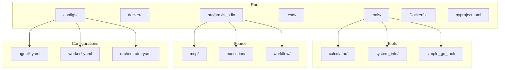
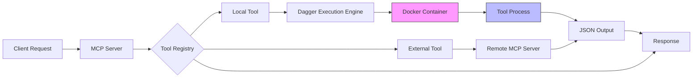
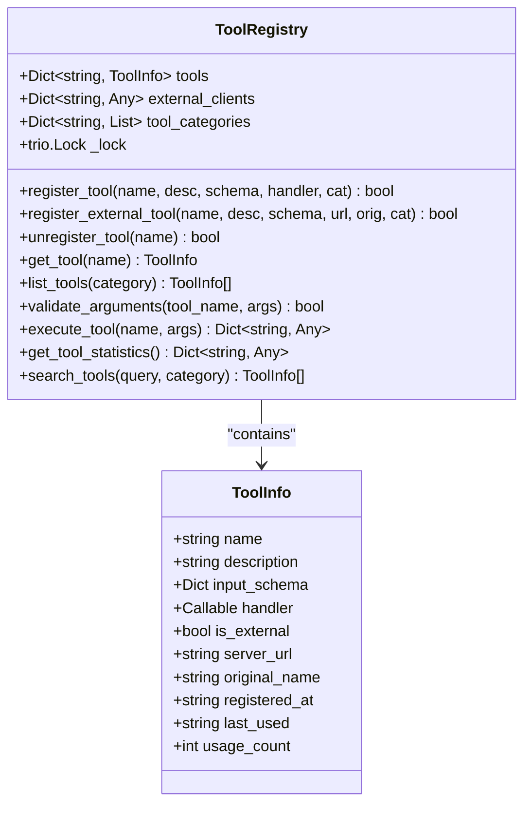
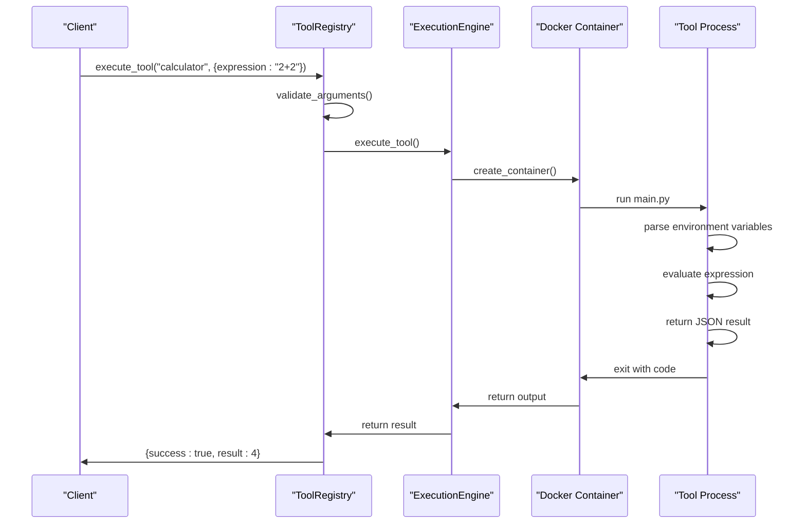
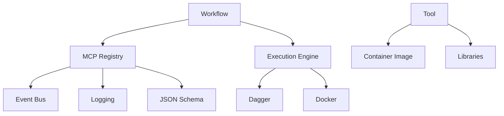

# Tool System


## Table of Contents
1. [Introduction](#introduction)
2. [Project Structure](#project-structure)
3. [Core Components](#core-components)
4. [Architecture Overview](#architecture-overview)
5. [Detailed Component Analysis](#detailed-component-analysis)
6. [Dependency Analysis](#dependency-analysis)
7. [Performance Considerations](#performance-considerations)
8. [Troubleshooting Guide](#troubleshooting-guide)
9. [Conclusion](#conclusion)

## Introduction
The Tool System is a containerized execution framework for modular tools written in multiple programming languages. It enables secure, isolated execution of tools through Docker containers, with standardized contracts defined in YAML. Tools can be implemented in Python, Go, or other languages, and are registered dynamically with the MCP (Modular Capability Protocol) execution engine. This document details the architecture, implementation, and usage patterns for creating, testing, and deploying tools within this system.

## Project Structure
The repository follows a modular structure with clear separation between core SDK components, configuration files, and tool implementations. The `tools/` directory contains standalone tools with self-contained contract and execution logic, while `src/praxis_sdk/` houses the core framework including the MCP registry, execution engine, and workflow orchestrator.



**Diagram sources**
- [tools](file://tools)
- [src/praxis_sdk](file://src/praxis_sdk)
- [configs](file://configs)

**Section sources**
- [tools](file://tools)
- [src/praxis_sdk](file://src/praxis_sdk)

## Core Components
The system's core functionality revolves around three key components: the Tool Contract system, the MCP Registry, and the Container Execution Engine. The contract.yaml files define the interface for each tool, specifying parameters, types, and execution requirements. The MCP Registry manages tool discovery, validation, and routing, while the execution engine handles containerized execution with proper isolation and resource management.

**Section sources**
- [contract.yaml](file://tools/calculator/contract.yaml)
- [registry.py](file://src/praxis_sdk/mcp/registry.py)
- [execution/engine.py](file://src/praxis_sdk/execution/engine.py)

## Architecture Overview
The tool system operates on a microservices-inspired architecture where each tool runs in its own isolated environment. Tools are discovered via MCP protocol, validated against JSON schemas, and executed in Docker containers with controlled resource access. The registry acts as a central hub for tool metadata and routing, enabling both local and remote tool invocation.



**Diagram sources**
- [mcp/server.py](file://src/praxis_sdk/mcp/server.py)
- [mcp/registry.py](file://src/praxis_sdk/mcp/registry.py)
- [execution/engine.py](file://src/praxis_sdk/execution/engine.py)

## Detailed Component Analysis

### Tool Contract System
The tool contract system uses YAML files to define the interface and execution requirements for each tool. Contracts specify the tool name, description, parameters, and container execution specifications including Docker image, command, and environment variables.

#### Calculator Tool Contract
The calculator tool demonstrates a Python-based implementation with flexible input handling through environment variables and command-line arguments.

```yaml
name: "calculator"
description: "Performs mathematical calculations with support for basic operations and expressions"
engine: "dagger"
params:
  - name: "expression"
    type: "string"
    description: "Mathematical expression to evaluate (e.g., '2+2*3', 'sqrt(16)')"
    required: "false"
  - name: "operation"
    type: "string"
    description: "Basic operation: add, subtract, multiply, divide, power, modulo"
    required: "false"
  - name: "num1"
    type: "string"
    description: "First number for basic operations"
    required: "false"
  - name: "num2"
    type: "string"
    description: "Second number for basic operations"
    required: "false"
engineSpec:
  image: "python:3.11-slim"
  command: ["python", "/shared/tools/calculator/main.py"]
  mounts:
    ./shared: /shared
    ./tools: /shared/tools
  env_passthrough: ["EXPRESSION", "expression", "OPERATION", "operation", "NUM1", "num1", "NUM2", "num2"]
```

**Section sources**
- [contract.yaml](file://tools/calculator/contract.yaml)

#### System Information Tool
The system_info tool provides detailed system metrics using the psutil library, installed at runtime within the container.

```yaml
name: "system_info"
description: "Provides detailed system information including CPU, memory, disk, and network details"
engine: "dagger"
params:
  - name: "detailed"
    type: "string"
    description: "Set to 'false' for simplified output (default: true)"
    required: "false"
  - name: "format"
    type: "string"
    description: "Output format: 'json' or 'compact' (default: json)"
    required: "false"
engineSpec:
  image: "python:3.11-slim"
  command: ["sh", "-c", "pip install psutil > /dev/null 2>&1 && python /shared/tools/system_info/main.py"]
  mounts:
    ./shared: /shared
    ./tools: /shared/tools
  env_passthrough: ["DETAILED", "detailed", "FORMAT", "format"]
```

**Section sources**
- [contract.yaml](file://tools/system_info/contract.yaml)

#### Go-based Tool Implementation
The simple_go_tool demonstrates Go language support, compiling and executing Go code within an Alpine container.

```yaml
name: "go_analyzer"
description: "Analyzes files using a Go binary with Go-specific metrics"
engine: "dagger"
params:
  - name: "input_file"
    type: "string"
    description: "Path to the file to analyze"
    required: "true"
engineSpec:
  image: "golang:1.21-alpine"
  command: ["sh", "-c", "cd /shared/tools/simple_go_tool && go run main.go"]
  mounts:
    ./shared: /shared
    ./tools: /shared/tools
  env_passthrough: []
```

**Section sources**
- [contract.yaml](file://tools/simple_go_tool/contract.yaml)

### MCP Registry Analysis
The ToolRegistry class provides centralized management of all available tools, handling registration, validation, execution, and statistics tracking.



**Diagram sources**
- [registry.py](file://src/praxis_sdk/mcp/registry.py#L25-L463)

**Section sources**
- [registry.py](file://src/praxis_sdk/mcp/registry.py#L25-L463)

### Execution Flow Analysis
The sequence of tool execution involves contract parsing, environment setup, container execution, and result processing.



**Diagram sources**
- [registry.py](file://src/praxis_sdk/mcp/registry.py#L300-L350)
- [execution/engine.py](file://src/praxis_sdk/execution/engine.py)

## Dependency Analysis
The tool system has a layered dependency structure with clear separation between components. The MCP module depends on the event bus and logging system, while tools depend only on their specified container images and libraries.



**Diagram sources**
- [mcp/registry.py](file://src/praxis_sdk/mcp/registry.py)
- [execution/engine.py](file://src/praxis_sdk/execution/engine.py)
- [workflow](file://src/praxis_sdk/workflow)

**Section sources**
- [mcp/registry.py](file://src/praxis_sdk/mcp/registry.py)
- [execution/engine.py](file://src/praxis_sdk/execution/engine.py)

## Performance Considerations
The containerized execution model introduces startup overhead but provides strong isolation. For frequently used tools, consider:
- Using lightweight base images (e.g., Alpine Linux)
- Pre-installing dependencies in custom images
- Implementing result caching
- Setting appropriate resource limits
- Reusing containers for multiple executions when possible

The MCP registry maintains usage statistics to identify high-frequency tools that might benefit from optimization.

## Troubleshooting Guide
Common issues and their solutions:

**Tool not found in registry**
- Verify the tool contract is properly loaded
- Check registry registration logs
- Ensure the tool name matches exactly

**Container execution failures**
- Validate the Docker image exists and is accessible
- Check mounted paths and permissions
- Verify environment variable names match contract
- Review container logs for startup errors

**Parameter validation errors**
- Ensure required parameters are provided
- Verify parameter types match contract specification
- Check for typos in parameter names

**External tool connectivity issues**
- Validate the MCP server URL is reachable
- Check network configuration and firewalls
- Verify the external server has the requested tool

**Section sources**
- [registry.py](file://src/praxis_sdk/mcp/registry.py#L300-L350)
- [execution/engine.py](file://src/praxis_sdk/execution/engine.py)

## Conclusion
The Tool System provides a robust framework for containerized tool execution with strong isolation, language flexibility, and standardized interfaces. By leveraging YAML contracts and the MCP protocol, it enables secure execution of untrusted code while maintaining discoverability and orchestration capabilities. The architecture supports both local and distributed tool execution, making it suitable for complex workflows requiring diverse computational capabilities.

**Referenced Files in This Document**   
- [contract.yaml](file://tools/calculator/contract.yaml)
- [main.py](file://tools/calculator/main.py)
- [contract.yaml](file://tools/system_info/contract.yaml)
- [main.py](file://tools/system_info/main.py)
- [contract.yaml](file://tools/simple_go_tool/contract.yaml)
- [main.go](file://tools/simple_go_tool/main.go)
- [registry.py](file://src/praxis_sdk/mcp/registry.py)
- [filesystem.py](file://src/praxis_sdk/mcp/tools/filesystem.py)