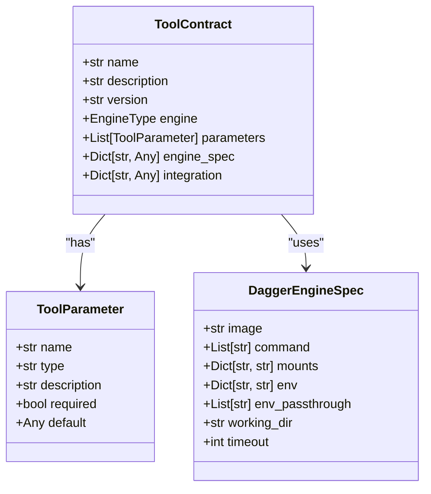
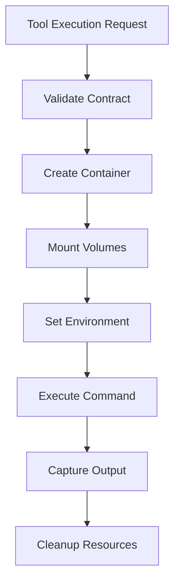
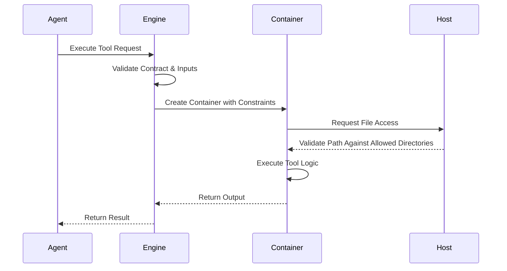
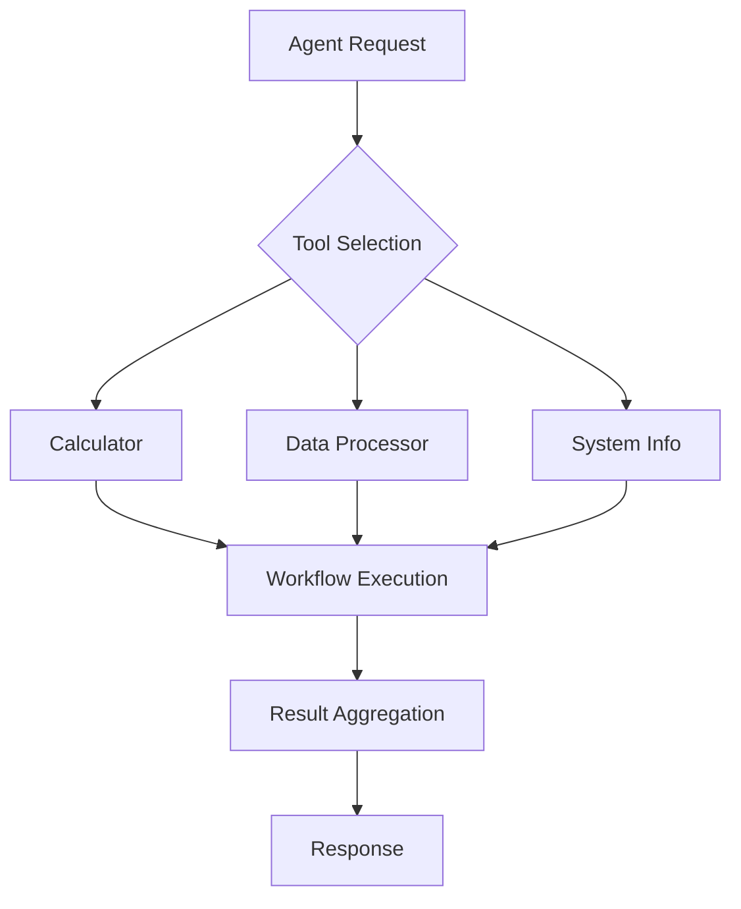

# Tool Contracts


## Table of Contents
1. [Introduction](#introduction)
2. [YAML Schema Structure](#yaml-schema-structure)
3. [Execution Environment and Resource Constraints](#execution-environment-and-resource-constraints)
4. [Input/Output Validation and Mapping](#inputoutput-validation-and-mapping)
5. [Security Implications](#security-implications)
6. [Versioning and Backward Compatibility](#versioning-and-backward-compatibility)
7. [Dynamic Tool Discovery and Integration](#dynamic-tool-discovery-and-integration)
8. [Examples from Real Contract Files](#examples-from-real-contract-files)
9. [Best Practices](#best-practices)
10. [Conclusion](#conclusion)

## Introduction
Tool contracts define the interface between the Praxis agent and external tools, enabling secure, standardized, and dynamic execution of operations. These contracts are defined in YAML format and specify execution parameters, input/output schemas, resource constraints, and integration metadata. The execution engine validates and enforces these contracts to ensure safe and predictable behavior across diverse tool implementations.

**Section sources**
- [contracts.py](file://src/praxis_sdk/execution/contracts.py#L1-L50)

## YAML Schema Structure

### Core Fields
The tool contract schema includes the following key fields:

- **name**: Unique identifier for the tool
- **description**: Human-readable description of tool functionality
- **version**: Semantic version of the contract
- **engine**: Execution engine type (e.g., "dagger", "local", "remote-mcp")
- **parameters**: Schema defining input parameters
- **engine_spec**: Engine-specific configuration
- **integration**: Metadata for discovery and categorization



**Diagram sources**
- [contracts.py](file://src/praxis_sdk/execution/contracts.py#L250-L300)

**Section sources**
- [contracts.py](file://src/praxis_sdk/execution/contracts.py#L200-L350)
- [python_data_processor/contract.yaml](file://tools/python_data_processor/contract.yaml#L1-L10)

### Parameter Schema
Parameters are defined with type, description, and validation rules. The schema supports:
- **type**: string, number, boolean, or object
- **required**: Whether parameter is mandatory
- **default**: Default value if omitted
- **enum**: Allowed values for constrained inputs

Example from `python_data_processor` contract:
```yaml
parameters:
  type: object
  properties:
    operation:
      type: string
      enum: ["stats", "numbers", "text", "file"]
      default: "stats"
    format:
      type: string
      enum: ["text", "json"]
      default: "text"
```

**Section sources**
- [python_data_processor/contract.yaml](file://tools/python_data_processor/contract.yaml#L20-L50)

## Execution Environment and Resource Constraints

### Engine Specification
The `engine_spec` field configures the execution environment with containerization parameters:

- **image**: Docker base image (e.g., "python:3.11-slim")
- **command**: Execution command array
- **mounts**: Host-to-container volume mappings
- **env**: Environment variables
- **env_passthrough**: Host environment variables to expose
- **timeout**: Maximum execution duration in seconds
- **working_dir**: Working directory in container



**Diagram sources**
- [contracts.py](file://src/praxis_sdk/execution/contracts.py#L100-L150)

**Section sources**
- [calculator/contract.yaml](file://tools/calculator/contract.yaml#L10-L20)
- [contracts.py](file://src/praxis_sdk/execution/contracts.py#L50-L100)

### Resource Limits
Contracts can specify resource constraints:
- **memory_limit**: Memory allocation (e.g., "512m")
- **cpu_limit**: CPU cores (e.g., 1.5)
- **network**: Network mode configuration
- **privileged**: Whether to run in privileged mode

These constraints prevent resource exhaustion and ensure fair usage in multi-tenant environments.

## Input/Output Validation and Mapping

### Validation Rules
The execution engine enforces strict validation:
1. Required parameters must be present
2. Parameter types must match schema
3. Enumerated values must be valid
4. String formats must comply with patterns
5. Numeric ranges must be within bounds

```python
class ToolParameter(BaseModel):
    name: str
    type: str
    description: str = ""
    required: bool = False
    default: Any = None
```

Validation occurs before execution, preventing invalid inputs from reaching tools.

**Section sources**
- [contracts.py](file://src/praxis_sdk/execution/contracts.py#L150-L180)

### Input/Output Mapping
Inputs are mapped from the agent's context to the tool environment:
- **Environment variables**: Parameters passed as ENV vars (e.g., ARG_OPERATION)
- **Command arguments**: Parameters passed as CLI args
- **Configuration files**: Complex inputs written to mounted volumes

Outputs are captured from:
- **stdout**: Primary result stream
- **stderr**: Error messages
- **Exit codes**: Success/failure indication
- **JSON output**: Structured data

Example from `python_data_processor/main.py`:
```python
operation = get_env("ARG_OPERATION", "stats")
data_input = get_env("ARG_DATA", "")
output_format = get_env("ARG_FORMAT", "text")
```

**Section sources**
- [python_data_processor/main.py](file://tools/python_data_processor/main.py#L10-L30)
- [contracts.py](file://src/praxis_sdk/execution/contracts.py#L280-L300)

## Security Implications

### Sandboxing Requirements
All tools execute in isolated environments:
- **Containerization**: Tools run in Docker containers
- **Volume restrictions**: Mounts limited to shared directories
- **Network isolation**: No external network access by default
- **User privileges**: Non-root execution

The filesystem tools implement path validation:
```python
def _validate_path(self, path_str: str) -> Path:
    # Resolve path and check against allowed directories
    path = Path(path_str).resolve()
    if not any(path.is_relative_to(allowed) for allowed in self.allowed_paths):
        raise SecurityError("Access denied")
    return path
```

**Section sources**
- [filesystem.py](file://src/praxis_sdk/mcp/tools/filesystem.py#L30-L50)

### Privilege Escalation Risks
Potential risks include:
- **Command injection**: Malicious input executing arbitrary commands
- **Path traversal**: Accessing files outside allowed directories
- **Resource exhaustion**: Consuming excessive CPU/memory
- **Environment leakage**: Accessing sensitive host environment

Mitigations:
- Input sanitization and validation
- Strict path resolution
- Resource limits
- Minimal environment exposure



**Diagram sources**
- [filesystem.py](file://src/praxis_sdk/mcp/tools/filesystem.py#L20-L100)
- [contracts.py](file://src/praxis_sdk/execution/contracts.py#L1-L50)

**Section sources**
- [filesystem.py](file://src/praxis_sdk/mcp/tools/filesystem.py#L20-L100)

## Versioning and Backward Compatibility

### Versioning Strategy
Contracts use semantic versioning (MAJOR.MINOR.PATCH):
- **MAJOR**: Breaking changes to interface
- **MINOR**: Backward-compatible feature additions
- **PATCH**: Backward-compatible bug fixes

Versioning enables:
- Predictable upgrade paths
- Dependency management
- Rollback capabilities
- Parallel version support

### Backward Compatibility
Best practices:
- Never remove required parameters
- Add new optional parameters
- Maintain deprecated fields with warnings
- Use version-specific endpoints
- Provide migration guides

Example from `python_data_processor`:
```yaml
version: "1.0.0"
integration:
  category: "data-processing"
  tags: ["python", "dagger", "statistics"]
  supports_cancellation: true
```

**Section sources**
- [python_data_processor/contract.yaml](file://tools/python_data_processor/contract.yaml#L2-L5)

## Dynamic Tool Discovery and Integration

### MCP Integration
The Tool Registry enables dynamic discovery:
```python
class ToolRegistry:
    def register_tool(self, name: str, description: str, 
                     input_schema: Dict[str, Any], handler: Callable):
        # Register tool with schema and handler
        pass
    
    def list_tools(self, category: Optional[str] = None) -> List[ToolInfo]:
        # Discover available tools
        pass
```

Tools are automatically discovered and integrated into workflow orchestration systems.

**Section sources**
- [registry.py](file://src/praxis_sdk/mcp/registry.py#L50-L100)

### Workflow Orchestration
Contracts enable dynamic workflow construction:
1. Discover available tools
2. Validate input/output compatibility
3. Chain tools based on data requirements
4. Execute workflows with proper context passing

The registry supports:
- Category-based organization
- Search by name/description
- Usage statistics
- External tool integration



**Diagram sources**
- [registry.py](file://src/praxis_sdk/mcp/registry.py#L1-L50)

**Section sources**
- [registry.py](file://src/praxis_sdk/mcp/registry.py#L1-L200)

## Examples from Real Contract Files

### Calculator Tool
```yaml
name: "calculator"
engine: "dagger"
params:
  - name: "expression"
    type: "string"
    description: "Mathematical expression to evaluate"
  - name: "operation"
    type: "string"
    description: "Basic operation: add, subtract, multiply, divide"
engineSpec:
  image: "python:3.11-slim"
  command: ["python", "/shared/tools/calculator/main.py"]
  env_passthrough: ["EXPRESSION", "operation"]
```

**Section sources**
- [calculator/contract.yaml](file://tools/calculator/contract.yaml#L1-L20)

### Python Data Processor
```yaml
name: python_data_processor
version: "1.0.0"
engine: dagger
parameters:
  type: object
  properties:
    operation:
      type: string
      enum: ["stats", "numbers", "text", "file"]
    format:
      type: string
      enum: ["text", "json"]
engine_spec:
  image: "python:3.11-slim"
  command: ["python", "/app/tools/python_data_processor/main.py"]
  mounts:
    "/app/tools": "/app/tools"
    "/app/data": "/app/data"
```

**Section sources**
- [python_data_processor/contract.yaml](file://tools/python_data_processor/contract.yaml#L1-L30)

## Best Practices

### Contract Design
- Use descriptive names and clear descriptions
- Define comprehensive parameter schemas
- Specify appropriate resource limits
- Include usage examples
- Document integration metadata

### Security
- Minimize environment variable passthrough
- Use non-privileged containers
- Validate all inputs
- Implement proper error handling
- Log security-relevant events

### Maintenance
- Follow semantic versioning
- Maintain backward compatibility
- Document breaking changes
- Test contract updates thoroughly
- Monitor usage patterns

## Conclusion
Tool contracts provide a robust framework for secure, standardized, and dynamic tool integration in the Praxis ecosystem. By defining clear interfaces, enforcing validation rules, and enabling discovery, contracts facilitate reliable automation while mitigating security risks. Proper implementation of versioning, resource constraints, and input/output mapping ensures maintainable and scalable tool ecosystems.

**Referenced Files in This Document**   
- [contract.yaml](file://tools/calculator/contract.yaml)
- [contract.yaml](file://tools/python_data_processor/contract.yaml)
- [contract.yaml](file://tools/simple_python_tool/contract.yaml)
- [contract.yaml](file://tools/system_info/contract.yaml)
- [contracts.py](file://src/praxis_sdk/execution/contracts.py)
- [main.py](file://tools/python_data_processor/main.py)
- [main.py](file://tools/calculator/main.py)
- [filesystem.py](file://src/praxis_sdk/mcp/tools/filesystem.py)
- [registry.py](file://src/praxis_sdk/mcp/registry.py)