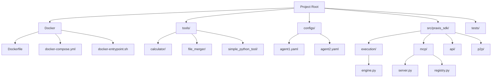
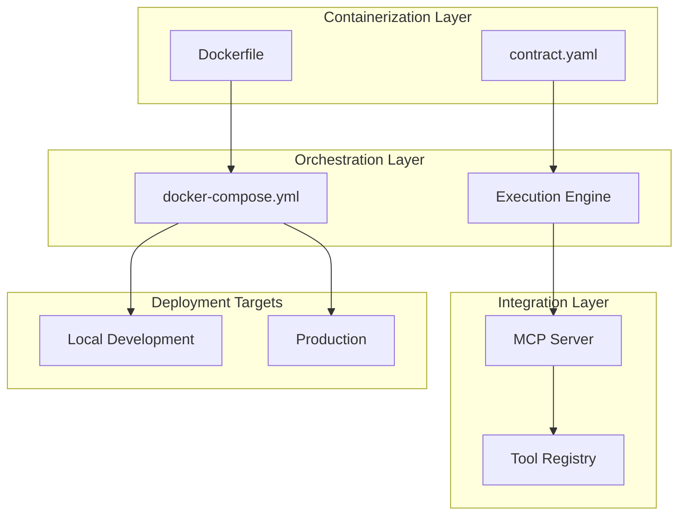
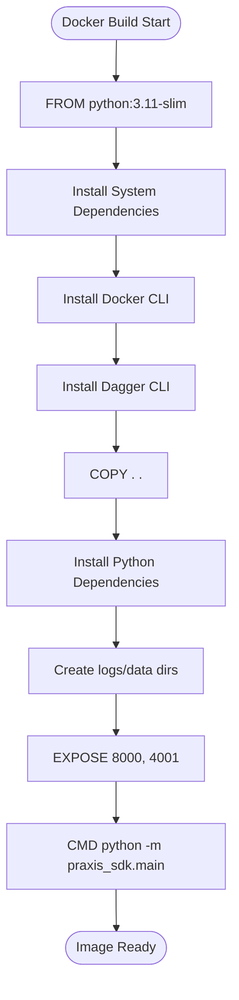
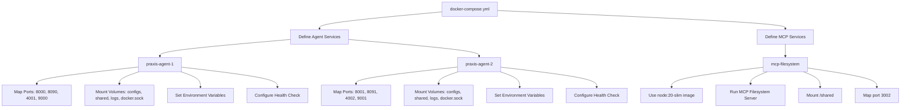
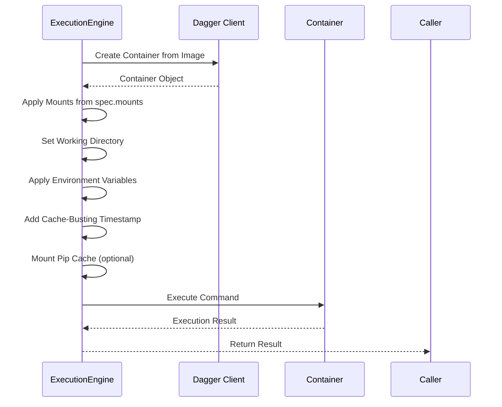
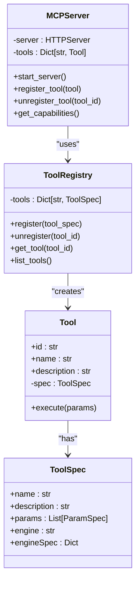
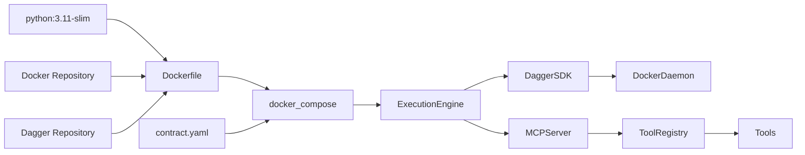

# Tool Deployment Process

## Table of Contents
1. [Introduction](#introduction)
2. [Project Structure](#project-structure)
3. [Core Components](#core-components)
4. [Architecture Overview](#architecture-overview)
5. [Detailed Component Analysis](#detailed-component-analysis)
6. [Dependency Analysis](#dependency-analysis)
7. [Performance Considerations](#performance-considerations)
8. [Troubleshooting Guide](#troubleshooting-guide)
9. [Conclusion](#conclusion)

## Introduction
The Praxis Python SDK provides a robust framework for deploying and managing containerized tools within a distributed agent system. This document details the complete tool deployment pipeline, from code changes to running containers, with a focus on Docker-based containerization, MCP server integration, resource management, and operational best practices. The system supports multiple execution engines including Dagger, Docker SDK, and local execution, enabling flexible deployment strategies for various tool types and requirements.

## Project Structure
The project follows a modular structure with clear separation of concerns. The root directory contains configuration files, Docker assets, and core source code. The `tools` directory houses individual tool implementations with their contracts, while `configs` contains agent-specific YAML configurations. The `src/praxis_sdk` directory contains the core Python package with modules for execution, MCP integration, P2P communication, and API services.

**Diagram sources**
- [Dockerfile](file://Dockerfile)
- [docker-compose.yml](file://docker-compose.yml)
- [tools/calculator/main.py](file://tools/calculator/main.py)
- [configs/agent1.yaml](file://configs/agent1.yaml)

**Section sources**
- [Dockerfile](file://Dockerfile)
- [docker-compose.yml](file://docker-compose.yml)
- [configs/agent1.yaml](file://configs/agent1.yaml)

## Core Components
The tool deployment pipeline consists of several core components that work together to containerize, deploy, and manage tools. The Dockerfile defines the base image and dependencies, while docker-compose orchestrates multi-container deployments. The execution engine handles container creation and management, and the MCP server integrates tools into the agent ecosystem. Each tool has a contract.yaml file that specifies its execution parameters and requirements.

**Section sources**
- [Dockerfile](file://Dockerfile)
- [docker-compose.yml](file://docker-compose.yml)
- [src/praxis_sdk/execution/engine.py](file://src/praxis_sdk/execution/engine.py)
- [src/praxis_sdk/mcp/server.py](file://src/praxis_sdk/mcp/server.py)

## Architecture Overview
The tool deployment architecture follows a layered approach with clear separation between containerization, orchestration, and integration layers. Tools are containerized using Docker with specific base images and dependencies. The docker-compose configuration manages multi-container deployments for local and production environments. The MCP server acts as an integration layer, exposing tool capabilities to agents. The execution engine manages the container lifecycle from build to execution.

**Diagram sources**
- [Dockerfile](file://Dockerfile)
- [docker-compose.yml](file://docker-compose.yml)
- [src/praxis_sdk/execution/engine.py](file://src/praxis_sdk/execution/engine.py)
- [src/praxis_sdk/mcp/server.py](file://src/praxis_sdk/mcp/server.py)

## Detailed Component Analysis

### Docker Configuration Analysis
The Dockerfile defines the container environment for the Praxis SDK. It uses python:3.11-slim as the base image, ensuring a lightweight footprint while providing Python 3.11 compatibility. The Dockerfile installs system dependencies for libp2p, Docker CLI, and Dagger CLI, which are essential for the execution engine. Python dependencies are installed via pip, including FastAPI for the API server, trio for async operations, and dagger-io for containerized execution.

**Diagram sources**
- [Dockerfile](file://Dockerfile#L1-L75)

**Section sources**
- [Dockerfile](file://Dockerfile#L1-L75)

### Docker Compose Configuration Analysis
The docker-compose.yml file orchestrates the deployment of multiple services including agent instances and external MCP servers. It defines two agent services (praxis-agent-1 and praxis-agent-2) with specific port mappings for HTTP API, WebSocket, P2P, and SSE. The configuration includes volume mounts for shared data, configurations, and the Docker socket, enabling container-in-container execution. Environment variables configure agent behavior, and health checks ensure service readiness.

**Diagram sources**
- [docker-compose.yml](file://docker-compose.yml#L1-L154)

**Section sources**
- [docker-compose.yml](file://docker-compose.yml#L1-L154)

### Execution Engine Analysis
The execution engine (engine.py) manages the containerized execution of tools using the Dagger framework. It creates containers from specified base images, mounts required directories, sets environment variables, and executes commands. The engine applies environment variables from tool specifications, including a cache-busting timestamp to prevent unwanted caching. It supports mounting pip caches for Python environments as an optimization.

**Diagram sources**
- [src/praxis_sdk/execution/engine.py](file://src/praxis_sdk/execution/engine.py#L183-L203)

**Section sources**
- [src/praxis_sdk/execution/engine.py](file://src/praxis_sdk/execution/engine.py#L1-L250)

### MCP Server Integration Analysis
The MCP (Model Context Protocol) server integrates containerized tools into the agent ecosystem. Tools are registered with the MCP server, which exposes their capabilities to agents. The server manages tool discovery and invocation, acting as a bridge between the agent logic and the execution environment. The registry maintains a list of available tools and their contracts, enabling dynamic capability discovery.

**Diagram sources**
- [src/praxis_sdk/mcp/server.py](file://src/praxis_sdk/mcp/server.py)
- [src/praxis_sdk/mcp/registry.py](file://src/praxis_sdk/mcp/registry.py)

**Section sources**
- [src/praxis_sdk/mcp/server.py](file://src/praxis_sdk/mcp/server.py)
- [src/praxis_sdk/mcp/registry.py](file://src/praxis_sdk/mcp/registry.py)

## Dependency Analysis
The tool deployment pipeline has a well-defined dependency chain. The Dockerfile depends on the base Python image and external repositories for Docker and Dagger CLIs. The docker-compose configuration depends on the Dockerfile and tool contracts. The execution engine depends on the Dagger SDK and Docker daemon. Tools depend on their specified base images and mounted volumes. The MCP server depends on the execution engine for tool execution.

**Diagram sources**
- [Dockerfile](file://Dockerfile)
- [docker-compose.yml](file://docker-compose.yml)
- [src/praxis_sdk/execution/engine.py](file://src/praxis_sdk/execution/engine.py)
- [src/praxis_sdk/mcp/server.py](file://src/praxis_sdk/mcp/server.py)

**Section sources**
- [Dockerfile](file://Dockerfile)
- [docker-compose.yml](file://docker-compose.yml)
- [src/praxis_sdk/execution/engine.py](file://src/praxis_sdk/execution/engine.py)

## Performance Considerations
The tool deployment process includes several performance optimizations. The Dockerfile uses a slim base image to reduce image size and improve download times. The execution engine implements pip cache mounting for Python tools to avoid repeated package downloads. Cache-busting timestamps prevent unwanted caching in the Dagger execution engine. The docker-compose configuration enables resource limits in production deployments to prevent resource exhaustion.

Key performance considerations:
- **Image Size**: Using python:3.11-slim reduces base image size
- **Dependency Caching**: Pip cache mounting speeds up Python tool execution
- **Build Caching**: Dagger's build cache with cache-busting timestamps
- **Resource Allocation**: docker-compose allows CPU and memory limits
- **Startup Time**: Minimal dependencies reduce container startup time
- **Network Isolation**: Dedicated Docker network reduces network overhead

**Section sources**
- [Dockerfile](file://Dockerfile)
- [docker-compose.yml](file://docker-compose.yml)
- [src/praxis_sdk/execution/engine.py](file://src/praxis_sdk/execution/engine.py)

## Troubleshooting Guide
Common deployment issues and their solutions:

### Missing Dependencies
**Symptom**: Container fails to start with "command not found" errors
**Solution**: Ensure all required system dependencies are installed in the Dockerfile. For Python packages, verify they are included in the pip install command.

### Permission Errors
**Symptom**: Permission denied when accessing mounted volumes
**Solution**: Ensure the container user has appropriate permissions. Use volume mount options to set correct ownership, or run with appropriate user IDs.

### Port Conflicts
**Symptom**: "port already allocated" errors during docker-compose up
**Solution**: Check for other processes using the same ports. Modify port mappings in docker-compose.yml to use different host ports.

### Docker Socket Access
**Symptom**: "Cannot connect to the Docker daemon" errors
**Solution**: Ensure /var/run/docker.sock is properly mounted and accessible. Verify Docker daemon is running on the host.

### Network Connectivity
**Symptom**: Agents cannot discover each other
**Solution**: Verify docker-compose network configuration. Check firewall settings and ensure mDNS is properly configured.

### Environment Variables
**Symptom**: Tools fail due to missing configuration
**Solution**: Verify environment variables are properly passed through docker-compose environment section or env_file.

**Section sources**
- [Dockerfile](file://Dockerfile)
- [docker-compose.yml](file://docker-compose.yml)
- [docker-entrypoint.sh](file://docker-entrypoint.sh)

## Conclusion
The Praxis SDK provides a comprehensive tool deployment pipeline that leverages Docker and docker-compose for containerization and orchestration. The system supports multiple execution engines with a focus on isolation and reproducibility. The MCP server integration enables seamless tool discovery and invocation within the agent ecosystem. By following the documented patterns for base image selection, dependency management, and resource allocation, developers can deploy tools efficiently and reliably in both development and production environments.

**Referenced Files in This Document**   
- [Dockerfile](file://Dockerfile)
- [docker-compose.yml](file://docker-compose.yml)
- [docker-compose.dev.yml](file://docker-compose.dev.yml)
- [docker-entrypoint.sh](file://docker-entrypoint.sh)
- [src/praxis_sdk/execution/engine.py](file://src/praxis_sdk/execution/engine.py)
- [src/praxis_sdk/mcp/server.py](file://src/praxis_sdk/mcp/server.py)
- [src/praxis_sdk/mcp/registry.py](file://src/praxis_sdk/mcp/registry.py)
- [tools/calculator/main.py](file://tools/calculator/main.py)
- [tools/calculator/contract.yaml](file://tools/calculator/contract.yaml)
- [configs/agent1.yaml](file://configs/agent1.yaml)