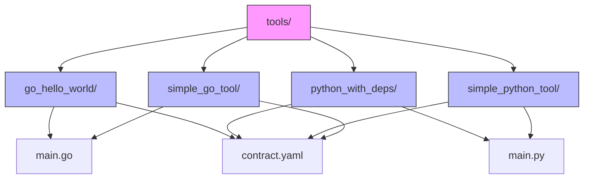
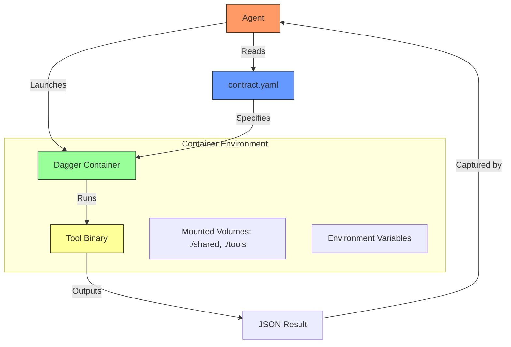
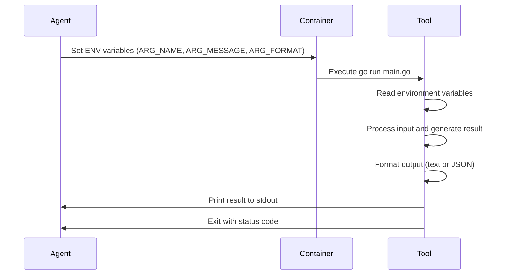
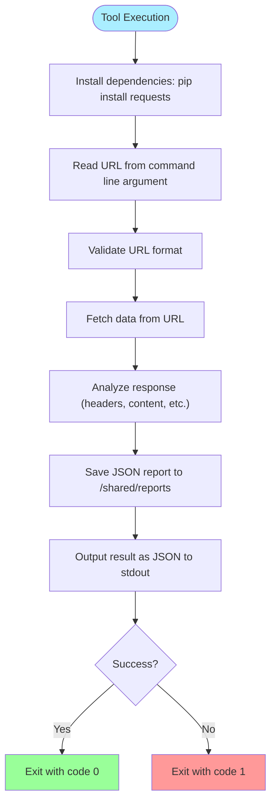
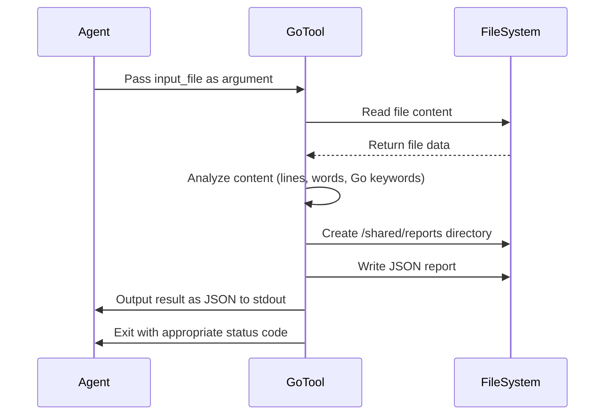

# Tool Implementation Examples


## Table of Contents
1. [Introduction](#introduction)
2. [Project Structure](#project-structure)
3. [Core Components](#core-components)
4. [Architecture Overview](#architecture-overview)
5. [Detailed Component Analysis](#detailed-component-analysis)
6. [Dependency Analysis](#dependency-analysis)
7. [Performance Considerations](#performance-considerations)
8. [Troubleshooting Guide](#troubleshooting-guide)
9. [Conclusion](#conclusion)

## Introduction
This document provides a comprehensive analysis of tool implementation patterns across different programming languages within the Praxis framework. It focuses on real-world examples from the codebase, including Go and Python tools executed via Dagger. The analysis covers entry points, parameter handling, dependency management, execution environment interaction, and structured output patterns. Special attention is given to comparing simple scripts versus tools with external dependencies, demonstrating best practices for tool design, error handling, and integration with the orchestration system.

## Project Structure
The project organizes tools in a dedicated `tools/` directory, with each tool having its own subdirectory containing source code and configuration. Tools are implemented in multiple languages (primarily Python and Go), following a consistent pattern of having a `main.py` or `main.go` entry point and a `contract.yaml` specification file. The contract defines execution parameters, engine requirements, and integration metadata.



**Diagram sources**
- [go_hello_world/main.go](file://tools/go_hello_world/main.go)
- [python_with_deps/main.py](file://tools/python_with_deps/main.py)
- [simple_python_tool/main.py](file://tools/simple_python_tool/main.py)
- [simple_go_tool/main.go](file://tools/simple_go_tool/main.go)

**Section sources**
- [go_hello_world/main.go](file://tools/go_hello_world/main.go)
- [python_with_deps/main.py](file://tools/python_with_deps/main.py)
- [simple_python_tool/main.py](file://tools/simple_python_tool/main.py)
- [simple_go_tool/main.go](file://tools/simple_go_tool/main.go)

## Core Components
The core components analyzed in this document include language-specific tools that demonstrate different implementation patterns: Go-based tools using environment variables for input, Python tools with external dependencies, and simple Python/Go tools that process files. These components illustrate how tools receive configuration, interact with their execution environment, handle errors, and return structured results through standard output.

**Section sources**
- [go_hello_world/main.go](file://tools/go_hello_world/main.go)
- [python_with_deps/main.py](file://tools/python_with_deps/main.py)
- [simple_python_tool/main.py](file://tools/simple_python_tool/main.py)
- [simple_go_tool/main.go](file://tools/simple_go_tool/main.go)

## Architecture Overview
The architecture follows a containerized execution model where tools run in isolated environments managed by Dagger. Each tool is defined by a contract that specifies the container image, command to execute, mounted volumes, and environment variables. The agent orchestrates tool execution by passing parameters through environment variables or command-line arguments, capturing stdout for result processing.



**Diagram sources**
- [go_hello_world/contract.yaml](file://tools/go_hello_world/contract.yaml)
- [python_with_deps/contract.yaml](file://tools/python_with_deps/contract.yaml)
- [simple_python_tool/contract.yaml](file://tools/simple_python_tool/contract.yaml)
- [simple_go_tool/contract.yaml](file://tools/simple_go_tool/contract.yaml)

## Detailed Component Analysis

### Go Hello World Tool Analysis
The `go_hello_world` tool demonstrates a Go implementation that receives parameters through environment variables and supports multiple output formats. It showcases system introspection capabilities and proper error handling in Go.



**Diagram sources**
- [go_hello_world/main.go](file://tools/go_hello_world/main.go#L1-L82)
- [go_hello_world/contract.yaml](file://tools/go_hello_world/contract.yaml#L1-L65)

**Section sources**
- [go_hello_world/main.go](file://tools/go_hello_world/main.go#L1-L82)
- [go_hello_world/contract.yaml](file://tools/go_hello_world/contract.yaml#L1-L65)

### Python with Dependencies Tool Analysis
The `python_with_deps` tool demonstrates how to handle external dependencies in a Python tool. It uses pip to install the requests library at runtime and performs HTTP requests to analyze URLs, saving reports to a shared directory.



**Diagram sources**
- [python_with_deps/main.py](file://tools/python_with_deps/main.py#L1-L96)
- [python_with_deps/contract.yaml](file://tools/python_with_deps/contract.yaml#L1-L15)

**Section sources**
- [python_with_deps/main.py](file://tools/python_with_deps/main.py#L1-L96)
- [python_with_deps/contract.yaml](file://tools/python_with_deps/contract.yaml#L1-L15)

### Simple Python Tool Analysis
The `simple_python_tool` demonstrates a basic file processing pattern in Python. It reads a text file, performs statistical analysis, saves a report, and outputs results in JSON format. This pattern shows how tools can process input files and generate structured output.

```mermaid
classDiagram
class TextAnalyzer {
+analyze_text(input_file : str) dict
+main() void
}
class Result {
success : bool
file : str
analysis : dict
timestamp : str
}
TextAnalyzer --> Result : "produces"
TextAnalyzer --> "shared/reports" : "writes"
note right of TextAnalyzer
Reads input file and generates
statistics on lines, words,
characters, sentences, and
paragraphs. Saves report to
shared directory and outputs
JSON to stdout.
end note
```

**Diagram sources**
- [simple_python_tool/main.py](file://tools/simple_python_tool/main.py#L1-L85)
- [simple_python_tool/contract.yaml](file://tools/simple_python_tool/contract.yaml#L1-L15)

**Section sources**
- [simple_python_tool/main.py](file://tools/simple_python_tool/main.py#L1-L85)
- [simple_python_tool/contract.yaml](file://tools/simple_python_tool/contract.yaml#L1-L15)

### Simple Go Tool Analysis
The `simple_go_tool` demonstrates a Go implementation for file analysis with Go-specific metrics such as counting Go keywords and uppercase words. It shows how Go tools can leverage the language's standard library for file operations and JSON serialization.



**Diagram sources**
- [simple_go_tool/main.go](file://tools/simple_go_tool/main.go#L1-L121)
- [simple_go_tool/contract.yaml](file://tools/simple_go_tool/contract.yaml#L1-L15)

**Section sources**
- [simple_go_tool/main.go](file://tools/simple_go_tool/main.go#L1-L121)
- [simple_go_tool/contract.yaml](file://tools/simple_go_tool/contract.yaml#L1-L15)

## Dependency Analysis
The tools demonstrate two distinct dependency management patterns: tools with external dependencies that require installation at runtime (like `python_with_deps` using requests), and self-contained tools that use only standard libraries. The contract.yaml files specify the base container images and initialization commands needed to set up the execution environment.

```mermaid
graph TD
PythonSlim["python:3.11-slim"] --> PythonWithDeps
GolangAlpine["golang:1.21-alpine"] --> GoHelloWorld
GolangAlpine --> SimpleGoTool
PythonWithDeps["python_with_deps"] --> Requests["requests library"]
GoHelloWorld["go_hello_world"] --> GoStdLib["Go Standard Library"]
SimpleGoTool["simple_go_tool"] --> GoStdLib
SimplePythonTool["simple_python_tool"] --> PythonStdLib["Python Standard Library"]
style PythonWithDeps fill:#f99
style Requests fill:#99f
note above of PythonWithDeps
Requires external dependency installation
via pip during container execution
end note
note above of SimplePythonTool
Uses only Python standard library
No external dependencies required
end note
```

**Diagram sources**
- [python_with_deps/contract.yaml](file://tools/python_with_deps/contract.yaml)
- [simple_python_tool/contract.yaml](file://tools/simple_python_tool/contract.yaml)
- [go_hello_world/contract.yaml](file://tools/go_hello_world/contract.yaml)
- [simple_go_tool/contract.yaml](file://tools/simple_go_tool/contract.yaml)

**Section sources**
- [python_with_deps/contract.yaml](file://tools/python_with_deps/contract.yaml)
- [simple_python_tool/contract.yaml](file://tools/simple_python_tool/contract.yaml)
- [go_hello_world/contract.yaml](file://tools/go_hello_world/contract.yaml)
- [simple_go_tool/contract.yaml](file://tools/simple_go_tool/contract.yaml)

## Performance Considerations
Tools should be designed with performance in mind, particularly regarding dependency installation time and resource usage. Python tools with external dependencies incur startup overhead from pip installation, while Go tools compile at runtime in the container. File I/O operations should be optimized, and network requests should have appropriate timeouts. The shared volume mounting pattern allows for efficient data exchange between tools and the host system without network overhead.

## Troubleshooting Guide
Common issues in tool implementation include missing dependencies, incorrect file paths, and improper error handling. Tools should validate their inputs and provide clear error messages. Exit codes should reflect success (0) or failure (non-zero) states. When debugging, check the contract.yaml for correct command syntax and mounted volumes, verify that environment variables are properly passed, and ensure that the container image contains all required tools and libraries.

**Section sources**
- [go_hello_world/main.go](file://tools/go_hello_world/main.go)
- [python_with_deps/main.py](file://tools/python_with_deps/main.py)
- [simple_python_tool/main.py](file://tools/simple_python_tool/main.py)
- [simple_go_tool/main.go](file://tools/simple_go_tool/main.go)

## Conclusion
The analyzed tools demonstrate effective patterns for implementing multi-language tools within the Praxis framework. Key best practices include using structured output (JSON), proper error handling with meaningful exit codes, leveraging containerization for dependency management, and following consistent interface patterns. The contract.yaml specification provides a declarative way to define tool requirements and execution parameters, enabling reliable orchestration across different programming languages and execution environments.

**Referenced Files in This Document**   
- [go_hello_world/main.go](file://tools/go_hello_world/main.go)
- [go_hello_world/contract.yaml](file://tools/go_hello_world/contract.yaml)
- [python_with_deps/main.py](file://tools/python_with_deps/main.py)
- [python_with_deps/contract.yaml](file://tools/python_with_deps/contract.yaml)
- [simple_python_tool/main.py](file://tools/simple_python_tool/main.py)
- [simple_python_tool/contract.yaml](file://tools/simple_python_tool/contract.yaml)
- [simple_go_tool/main.go](file://tools/simple_go_tool/main.go)
- [simple_go_tool/contract.yaml](file://tools/simple_go_tool/contract.yaml)