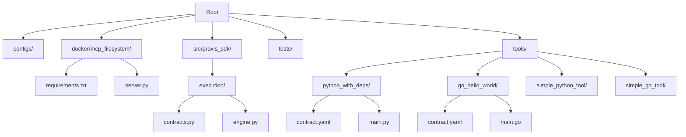
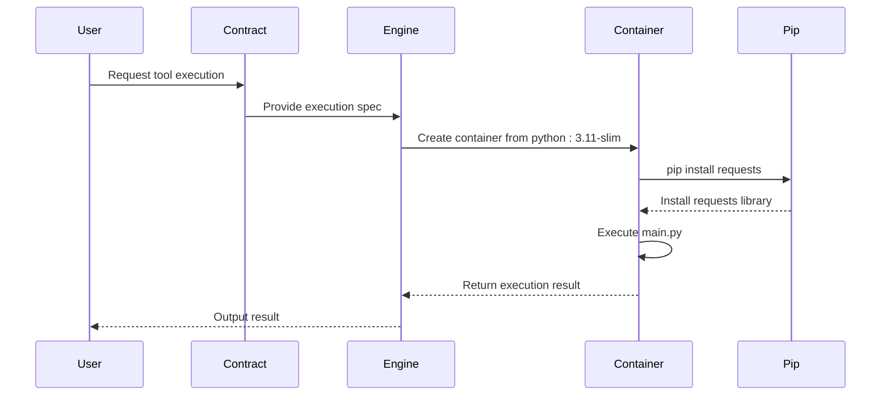
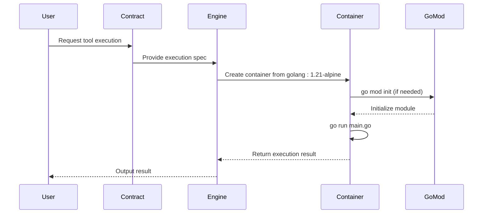
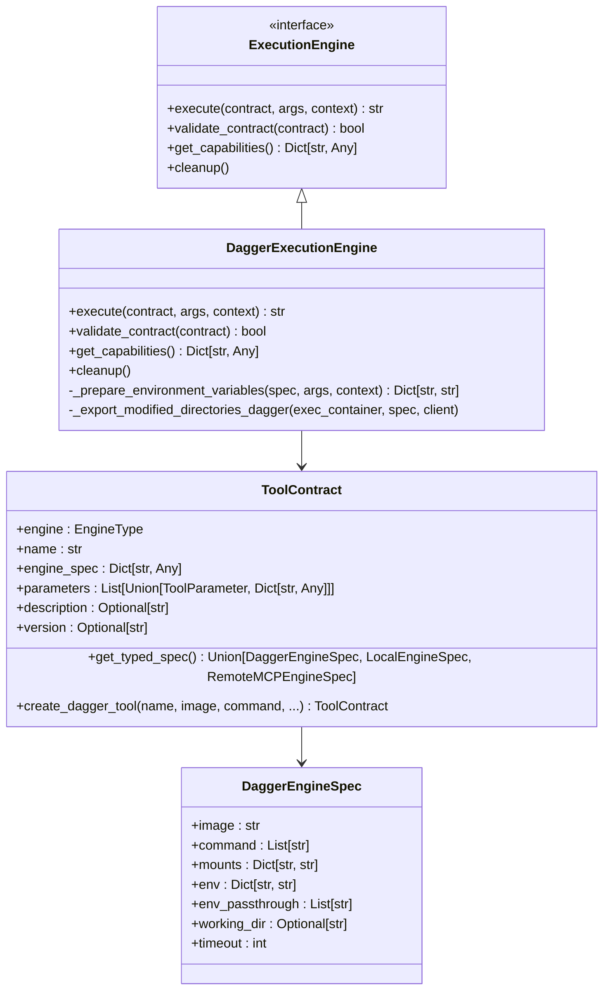
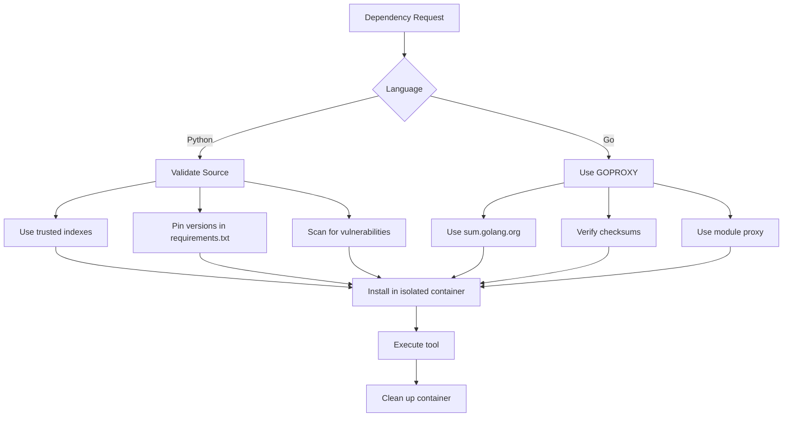
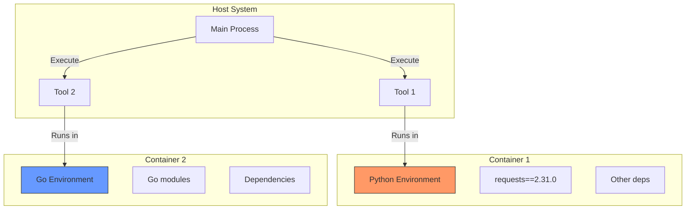
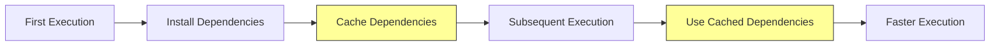

# Dependency Management in Tools


## Table of Contents
1. [Introduction](#introduction)
2. [Project Structure](#project-structure)
3. [Core Components](#core-components)
4. [Architecture Overview](#architecture-overview)
5. [Detailed Component Analysis](#detailed-component-analysis)
6. [Dependency Analysis](#dependency-analysis)
7. [Performance Considerations](#performance-considerations)
8. [Troubleshooting Guide](#troubleshooting-guide)
9. [Conclusion](#conclusion)

## Introduction
This document provides a comprehensive analysis of dependency management in Praxis tools across multiple programming languages. It explores how Python and Go tools handle dependencies, the role of contract.yaml in defining execution environments, security implications of dependency resolution, isolation strategies, and caching mechanisms. The focus is on real-world implementations within the Praxis ecosystem, particularly the `python_with_deps` and `go_hello_world` tools.

## Project Structure
The project follows a modular structure with clear separation between configuration, source code, tools, and tests. Dependencies are managed at multiple levels: system-wide (Dockerfiles), per-tool (contract.yaml), and language-specific (requirements.txt, go.mod). Tools are organized in the `/tools` directory, each with its own implementation and contract definition.



**Diagram sources**
- [tools/python_with_deps/contract.yaml](file://tools/python_with_deps/contract.yaml)
- [tools/go_hello_world/contract.yaml](file://tools/go_hello_world/contract.yaml)
- [docker/mcp_filesystem/requirements.txt](file://docker/mcp_filesystem/requirements.txt)

**Section sources**
- [tools/python_with_deps/contract.yaml](file://tools/python_with_deps/contract.yaml)
- [tools/go_hello_world/contract.yaml](file://tools/go_hello_world/contract.yaml)

## Core Components
The core components for dependency management include:
- **Tool Contracts**: Define execution environment and dependencies via `contract.yaml`
- **Execution Engines**: Handle runtime environment setup and dependency installation
- **Language-Specific Dependency Files**: `requirements.txt` for Python, `go.mod` for Go
- **Containerization**: Uses Dagger and Docker for isolated execution environments

These components work together to ensure reproducible builds, secure dependency resolution, and consistent execution across different environments.

**Section sources**
- [src/praxis_sdk/execution/contracts.py](file://src/praxis_sdk/execution/contracts.py)
- [src/praxis_sdk/execution/engine.py](file://src/praxis_sdk/execution/engine.py)

## Architecture Overview
The architecture employs a container-based execution model where each tool runs in an isolated environment defined by its contract. Dependencies are installed within the container before tool execution, ensuring consistency and preventing conflicts between tools.

```mermaid
graph TB
subgraph "Execution Environment"
Contract[Tool Contract<br>(contract.yaml)]
Engine[Dagger Execution Engine]
Container[Container Runtime<br>(Docker/Dagger)]
end
subgraph "Dependency Management"
Python[Python Tool<br>requirements.txt]
Go[Go Tool<br>go.mod]
Cache[Dependency Cache]
end
User --> |Execute Tool| Contract
Contract --> Engine
Engine --> |Create Container| Container
Python --> |Install deps| Container
Go --> |Install deps| Container
Container --> |Cache deps| Cache
Cache --> |Reuse| Container
style Contract fill:#f9f,stroke:#333
style Engine fill:#bbf,stroke:#333
style Container fill:#9ff,stroke:#333
style Cache fill:#ff9,stroke:#333
```

**Diagram sources**
- [src/praxis_sdk/execution/contracts.py](file://src/praxis_sdk/execution/contracts.py)
- [src/praxis_sdk/execution/engine.py](file://src/praxis_sdk/execution/engine.py)

## Detailed Component Analysis

### Python Dependency Management
The `python_with_deps` tool demonstrates Python dependency management using `pip` within a containerized environment.

#### Execution Flow


**Diagram sources**
- [tools/python_with_deps/contract.yaml](file://tools/python_with_deps/contract.yaml)
- [tools/python_with_deps/main.py](file://tools/python_with_deps/main.py)

**Section sources**
- [tools/python_with_deps/contract.yaml](file://tools/python_with_deps/contract.yaml)
- [tools/python_with_deps/main.py](file://tools/python_with_deps/main.py)

The `python_with_deps` tool uses a `contract.yaml` that specifies the execution environment:

```yaml
name: "url_analyzer"
description: "Fetches and analyzes data from URLs using requests library"
engine: "dagger"
params:
  - name: "url"
    type: "string"
    description: "URL to fetch and analyze"
    required: "true"
engineSpec:
  image: "python:3.11-slim"
  command: ["sh", "-c", "pip install requests && python /shared/tools/python_with_deps/main.py"]
  mounts:
    ./shared: /shared
    ./tools: /shared/tools
  env_passthrough: []
```

Key aspects:
- **Image**: Uses `python:3.11-slim` as base image
- **Command**: Installs `requests` library via `pip` before executing the tool
- **Mounts**: Shares tool directory with container
- **Isolation**: Dependencies are installed within container, not on host

The main.py implementation imports requests within the `fetch_and_analyze_data` function, demonstrating that the dependency is available in the execution environment:

```python
def fetch_and_analyze_data(url: str) -> dict:
    try:
        import requests
        # ... use requests to fetch data
    except ImportError:
        return {
            "success": False,
            "error": "requests library not available - pip install may have failed"
        }
```

### Go Dependency Management
The `go_hello_world` tool demonstrates Go dependency management using Go modules.

#### Execution Flow


**Diagram sources**
- [tools/go_hello_world/contract.yaml](file://tools/go_hello_world/contract.yaml)
- [tools/go_hello_world/main.go](file://tools/go_hello_world/main.go)

**Section sources**
- [tools/go_hello_world/contract.yaml](file://tools/go_hello_world/contract.yaml)
- [tools/go_hello_world/main.go](file://tools/go_hello_world/main.go)

The `go_hello_world` contract.yaml specifies:

```yaml
name: go_hello_world
description: "Multi-language Go tool demonstrating Dagger execution with parameter handling and JSON output"
engine: dagger
engine_spec:
  image: "golang:1.21-alpine"
  command:
    - "sh"
    - "-c"
    - "cd /app/tools/go_hello_world && go mod init go_hello_world 2>/dev/null || true && go run main.go"
  env:
    GOPROXY: "https://proxy.golang.org,direct"
    GOSUMDB: "sum.golang.org"
    CGO_ENABLED: "0"
```

Key aspects:
- **Image**: Uses `golang:1.21-alpine` as base image with Go toolchain
- **Command**: Initializes Go module and runs main.go
- **Environment**: Configures GOPROXY and GOSUMDB for secure dependency resolution
- **CGO_ENABLED**: Disabled for static compilation and reduced attack surface

The Go tool leverages Go's built-in dependency management system, ensuring reproducible builds through go.mod and go.sum files.

### Execution Engine Architecture
The execution engine handles dependency installation and environment setup for all tools.

#### Engine Components


**Diagram sources**
- [src/praxis_sdk/execution/contracts.py](file://src/praxis_sdk/execution/contracts.py)
- [src/praxis_sdk/execution/engine.py](file://src/praxis_sdk/execution/engine.py)

**Section sources**
- [src/praxis_sdk/execution/contracts.py](file://src/praxis_sdk/execution/contracts.py)
- [src/praxis_sdk/execution/engine.py](file://src/praxis_sdk/execution/engine.py)

The `DaggerExecutionEngine` class in `engine.py` handles the complete execution lifecycle:

1. **Connection**: Establishes connection to Dagger engine
2. **Container Creation**: Creates container from specified image
3. **Mounting**: Mounts required directories (tools, shared)
4. **Environment Setup**: Applies environment variables and passthrough
5. **Execution**: Runs the specified command
6. **Output Retrieval**: Streams and returns execution output
7. **Export**: Exports modified directories back to host

The engine ensures dependencies are installed in isolated environments, preventing conflicts between tools.

## Dependency Analysis

### Security Implications
Dependency resolution has significant security implications that are addressed through several mechanisms:



**Diagram sources**
- [tools/python_with_deps/contract.yaml](file://tools/python_with_deps/contract.yaml)
- [tools/go_hello_world/contract.yaml](file://tools/go_hello_world/contract.yaml)
- [src/praxis_sdk/execution/engine.py](file://src/praxis_sdk/execution/engine.py)

**Section sources**
- [tools/python_with_deps/contract.yaml](file://tools/python_with_deps/contract.yaml)
- [tools/go_hello_world/contract.yaml](file://tools/go_hello_world/contract.yaml)
- [src/praxis_sdk/execution/engine.py](file://src/praxis_sdk/execution/engine.py)

Security strategies include:
- **Trusted Sources**: Python dependencies from PyPI, Go dependencies from official proxy
- **Version Pinning**: Explicit version specification in dependency files
- **Checksum Verification**: Go modules use sum.golang.org for checksum validation
- **Isolated Execution**: Dependencies installed in container, not on host
- **Minimal Images**: Using slim/alpine base images to reduce attack surface

### Isolation Mechanisms
The execution engine isolates dependency installation using containerization:



**Diagram sources**
- [src/praxis_sdk/execution/engine.py](file://src/praxis_sdk/execution/engine.py)

**Section sources**
- [src/praxis_sdk/execution/engine.py](file://src/praxis_sdk/execution/engine.py)

Each tool runs in its own container with isolated dependencies, preventing version conflicts and ensuring reproducible builds.

### Caching Strategies
The system implements caching to improve performance for repeated executions:



**Diagram sources**
- [src/praxis_sdk/execution/engine.py](file://src/praxis_sdk/execution/engine.py)

**Section sources**
- [src/praxis_sdk/execution/engine.py](file://src/praxis_sdk/execution/engine.py)

The `DaggerExecutionEngine` includes optional pip cache mounting:

```python
# Add pip cache mounting for Python environments (optional optimization)
if 'python' in spec.image.lower() or any('pip' in cmd for cmd in spec.command if isinstance(cmd, str)):
    try:
        pip_cache_dir = Path.home() / '.cache' / 'pip'
        if pip_cache_dir.exists():
            host_pip_cache = client.host().directory(str(pip_cache_dir))
            container = container.with_directory('/root/.cache/pip', host_pip_cache)
    except Exception as cache_error:
        logger.warning(f"Could not mount pip cache: {cache_error}")
```

This allows reuse of downloaded packages across executions, significantly reducing installation time.

## Performance Considerations
Dependency management impacts performance in several ways:

1. **Installation Time**: Package installation can be slow, especially with many dependencies
2. **Network Usage**: Downloading packages consumes bandwidth
3. **Disk Usage**: Dependencies consume storage space
4. **Startup Time**: Container creation and dependency installation add overhead

Optimization strategies include:
- **Caching**: Reusing downloaded packages
- **Slim Images**: Using minimal base images
- **Parallel Installation**: Installing multiple packages simultaneously
- **Pre-built Images**: Using images with common dependencies pre-installed

The containerized approach ensures consistent performance across environments while allowing optimization through caching and efficient image design.

## Troubleshooting Guide
Common dependency-related issues and solutions:

### Python Dependency Issues
- **ImportError**: Ensure `pip install` command is in `engineSpec.command`
- **Version Conflicts**: Use isolated containers for each tool
- **Network Issues**: Verify internet access from container
- **Permission Errors**: Run container with appropriate user permissions

### Go Dependency Issues
- **Module Initialization**: Ensure `go mod init` is in command sequence
- **Proxy Issues**: Verify GOPROXY environment variable
- **Checksum Verification**: Ensure GOSUMDB is properly configured
- **CGO Issues**: Set CGO_ENABLED=0 for static compilation

### General Troubleshooting
- **Check Logs**: Examine container output for error messages
- **Verify Mounts**: Ensure tool directories are properly mounted
- **Test Commands**: Run commands manually in container for debugging
- **Check Permissions**: Ensure files are readable by container user

**Section sources**
- [tools/python_with_deps/main.py](file://tools/python_with_deps/main.py)
- [tools/go_hello_world/main.go](file://tools/go_hello_world/main.go)
- [src/praxis_sdk/execution/engine.py](file://src/praxis_sdk/execution/engine.py)

## Conclusion
The Praxis tool ecosystem provides a robust framework for dependency management across multiple languages. By leveraging containerization, language-specific dependency systems, and well-defined contracts, it ensures reproducible builds, secure dependency resolution, and isolated execution environments. Key takeaways include:

1. **Python tools** use `requirements.txt` and `pip install` within containerized environments
2. **Go tools** leverage Go modules with secure proxy and checksum verification
3. **contract.yaml** defines the execution environment and dependency installation process
4. **Security** is prioritized through trusted sources, version pinning, and isolated execution
5. **Performance** is optimized through caching and efficient container design

This approach enables reliable, secure, and efficient execution of tools with complex dependency requirements.

**Referenced Files in This Document**   
- [contract.yaml](file://tools/python_with_deps/contract.yaml)
- [main.py](file://tools/python_with_deps/main.py)
- [contract.yaml](file://tools/go_hello_world/contract.yaml)
- [main.go](file://tools/go_hello_world/main.go)
- [requirements.txt](file://docker/mcp_filesystem/requirements.txt)
- [contracts.py](file://src/praxis_sdk/execution/contracts.py)
- [engine.py](file://src/praxis_sdk/execution/engine.py)