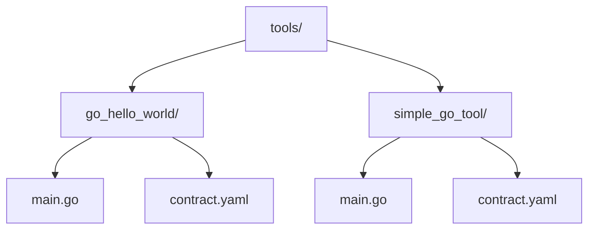
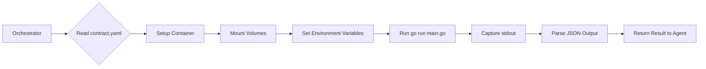
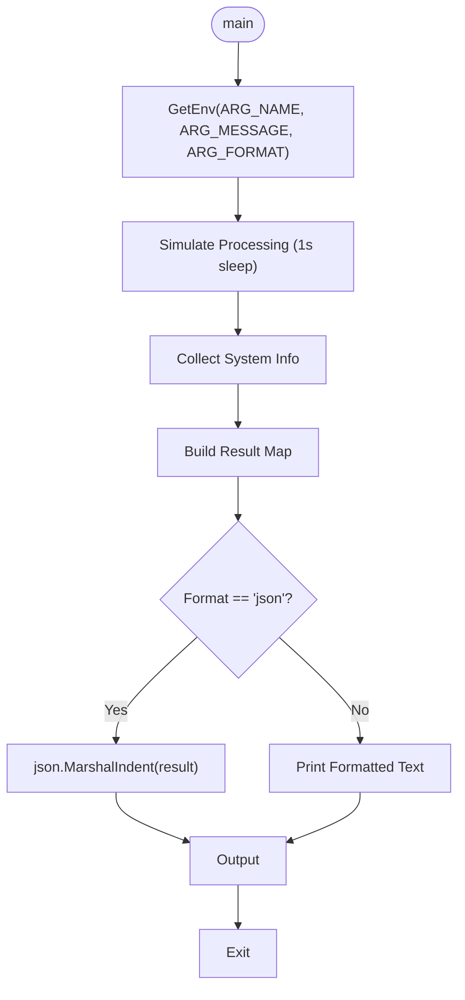
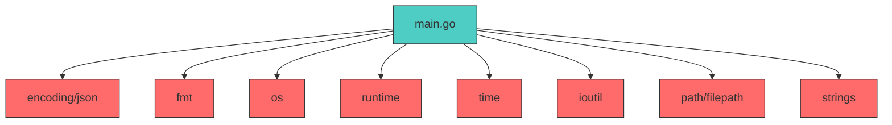

# Go Tool Implementations


## Table of Contents
1. [Introduction](#introduction)
2. [Project Structure](#project-structure)
3. [Core Components](#core-components)
4. [Architecture Overview](#architecture-overview)
5. [Detailed Component Analysis](#detailed-component-analysis)
6. [Dependency Analysis](#dependency-analysis)
7. [Performance Considerations](#performance-considerations)
8. [Troubleshooting Guide](#troubleshooting-guide)
9. [Conclusion](#conclusion)

## Introduction
This document provides a comprehensive analysis of Go-based tool implementations within the Praxis framework. It focuses on two representative examples: `go_hello_world` and `simple_go_tool`. These tools demonstrate how Go binaries are compiled and executed in containerized environments using Dagger, how input is handled via environment variables or command-line arguments, and how structured JSON output is produced for integration with the agent system. The analysis covers entry point patterns, configuration through contract files, error handling, and best practices for building reliable and observable Go tools.

## Project Structure
The Go tools are located under the `tools/` directory, each in its own subdirectory with a consistent structure: a `main.go` source file and a `contract.yaml` specification. This modular layout enables isolated development, testing, and deployment of individual tools while maintaining uniformity across the codebase.



**Diagram sources**
- [main.go](file://tools/go_hello_world/main.go#L1-L82)
- [contract.yaml](file://tools/go_hello_world/contract.yaml#L1-L65)
- [main.go](file://tools/simple_go_tool/main.go#L1-L121)
- [contract.yaml](file://tools/simple_go_tool/contract.yaml#L1-L15)

**Section sources**
- [main.go](file://tools/go_hello_world/main.go#L1-L82)
- [contract.yaml](file://tools/go_hello_world/contract.yaml#L1-L65)
- [main.go](file://tools/simple_go_tool/main.go#L1-L121)
- [contract.yaml](file://tools/simple_go_tool/contract.yaml#L1-L15)

## Core Components
The core components of Go tool implementations in Praxis include the Go entry point (`main.go`), the tool contract (`contract.yaml`), and the execution engine interface (Dagger). The `main.go` file defines the logic and output structure, while `contract.yaml` specifies execution parameters, environment setup, and integration metadata. Together, they enable reproducible, containerized execution of Go tools within the Praxis orchestration system.

**Section sources**
- [main.go](file://tools/go_hello_world/main.go#L1-L82)
- [contract.yaml](file://tools/go_hello_world/contract.yaml#L1-L65)
- [main.go](file://tools/simple_go_tool/main.go#L1-L121)
- [contract.yaml](file://tools/simple_go_tool/contract.yaml#L1-L15)

## Architecture Overview
Go tools in Praxis are executed within isolated containers managed by Dagger. The execution flow begins with the orchestrator reading the `contract.yaml`, setting up the container environment, mounting necessary directories, and injecting parameters as environment variables or command-line arguments. The Go binary is then compiled and run inside the container, producing structured output (typically JSON) to stdout, which is captured and processed by the execution engine.



**Diagram sources**
- [contract.yaml](file://tools/go_hello_world/contract.yaml#L1-L65)
- [main.go](file://tools/go_hello_world/main.go#L1-L82)
- [contract.yaml](file://tools/simple_go_tool/contract.yaml#L1-L15)
- [main.go](file://tools/simple_go_tool/main.go#L1-L121)

## Detailed Component Analysis

### go_hello_world Analysis
The `go_hello_world` tool demonstrates parameter handling via environment variables and conditional output formatting. It retrieves input values using the `getEnv()` helper function, supports both text and JSON output modes, and includes system-level diagnostics such as Go version and OS architecture.

#### Entry Point and Parameter Handling
```go
name := getEnv("ARG_NAME", "World")
message := getEnv("ARG_MESSAGE", "Hello from Go!")
format := strings.ToLower(getEnv("ARG_FORMAT", "text"))
```
Parameters are prefixed with `ARG_` and passed through Dagger's environment injection mechanism. Default values ensure robustness when inputs are missing.

#### Structured Output Pattern
The tool constructs a result map with standardized fields like `success`, `timestamp`, and `system_info`, then conditionally serializes it to JSON or prints it in human-readable format.



**Diagram sources**
- [main.go](file://tools/go_hello_world/main.go#L25-L80)

**Section sources**
- [main.go](file://tools/go_hello_world/main.go#L1-L82)
- [contract.yaml](file://tools/go_hello_world/contract.yaml#L1-L65)

### simple_go_tool Analysis
The `simple_go_tool` implements a file analyzer that reads an input file, computes text statistics (lines, words, Go keywords), and writes a JSON report to a shared directory. It uses command-line arguments for input and follows Go idioms for error handling and struct-based JSON output.

#### Command-Line Interface
The tool expects exactly one argument: the path to the input file.
```go
if len(os.Args) != 2 {
    fmt.Println("Usage: go_analyzer <input_file>")
    os.Exit(1)
}
```

#### Structured Result and Error Handling
The `Result` struct enforces a consistent output schema with `success`, `error`, and `analysis` fields. Errors are returned in-band via the JSON structure, enabling downstream systems to handle failures gracefully.

```mermaid
classDiagram
class Result {
+bool Success
+string Tool
+map[string]interface{} Analysis
+string Error
+string Timestamp
}
class analyzeFile {
+Result analyzeFile(string inputFile)
}
class countGoKeywords {
+int countGoKeywords([]string words)
}
analyzeFile --> Result : returns
countGoKeywords --> Result : used in
```

**Diagram sources**
- [main.go](file://tools/simple_go_tool/main.go#L10-L20)
- [main.go](file://tools/simple_go_tool/main.go#L25-L45)

**Section sources**
- [main.go](file://tools/simple_go_tool/main.go#L1-L121)
- [contract.yaml](file://tools/simple_go_tool/contract.yaml#L1-L15)

## Dependency Analysis
Go tools in Praxis rely on minimal external dependencies, leveraging the standard library for JSON, I/O, and system introspection. Vendoring is not used, but reproducibility is ensured through containerized builds with pinned base images (e.g., `golang:1.21-alpine`). The `CGO_ENABLED=0` setting enables static linking, producing portable binaries.



**Diagram sources**
- [main.go](file://tools/go_hello_world/main.go#L3-L9)
- [main.go](file://tools/simple_go_tool/main.go#L3-L10)

**Section sources**
- [main.go](file://tools/go_hello_world/main.go#L3-L9)
- [main.go](file://tools/simple_go_tool/main.go#L3-L10)

## Performance Considerations
Go tools benefit from fast startup times and efficient execution due to static compilation and minimal runtime overhead. The use of `CGO_ENABLED=0` reduces binary size and eliminates external library dependencies. For large files, streaming I/O could replace `ioutil.ReadFile()` to reduce memory usage. Parallel processing is not utilized but could be added via goroutines for CPU-intensive tasks.

## Troubleshooting Guide
Common issues include missing input parameters, file permission errors, and JSON marshaling failures. Logs should include timestamps and structured error messages. The `go_hello_world` tool includes diagnostic output (e.g., Go version, OS) to aid debugging. Always validate input paths and handle errors explicitly before attempting JSON output.

**Section sources**
- [main.go](file://tools/go_hello_world/main.go#L55-L75)
- [main.go](file://tools/simple_go_tool/main.go#L25-L35)

## Conclusion
Go tools in the Praxis framework demonstrate a clean, reliable pattern for building containerized microservices. By leveraging Go's simplicity, strong typing, and excellent standard library, these tools achieve high performance and maintainability. Key best practices include using structured JSON output, handling errors gracefully, and relying on containerization for reproducible builds. Future enhancements could include support for streaming input/output and integration with distributed tracing.

**Referenced Files in This Document**   
- [main.go](file://tools/go_hello_world/main.go)
- [contract.yaml](file://tools/go_hello_world/contract.yaml)
- [main.go](file://tools/simple_go_tool/main.go)
- [contract.yaml](file://tools/simple_go_tool/contract.yaml)