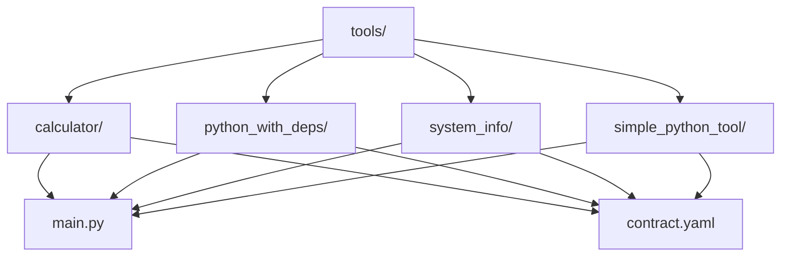
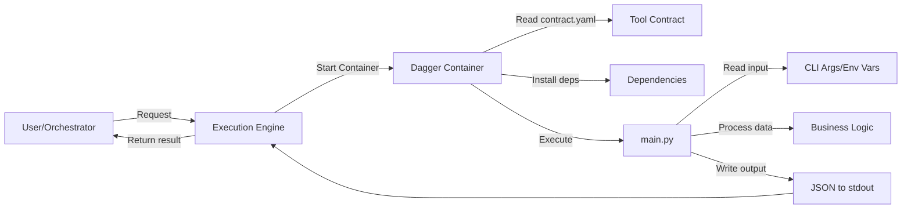
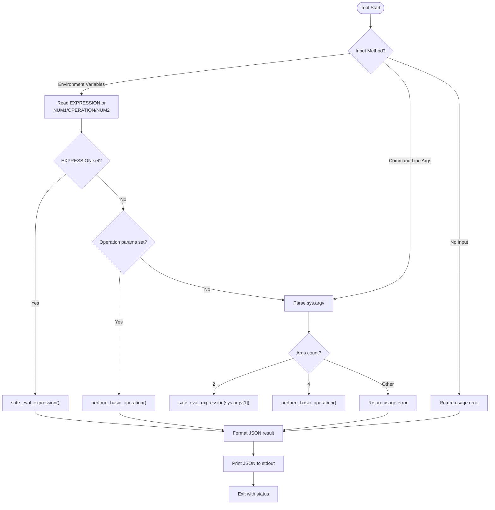
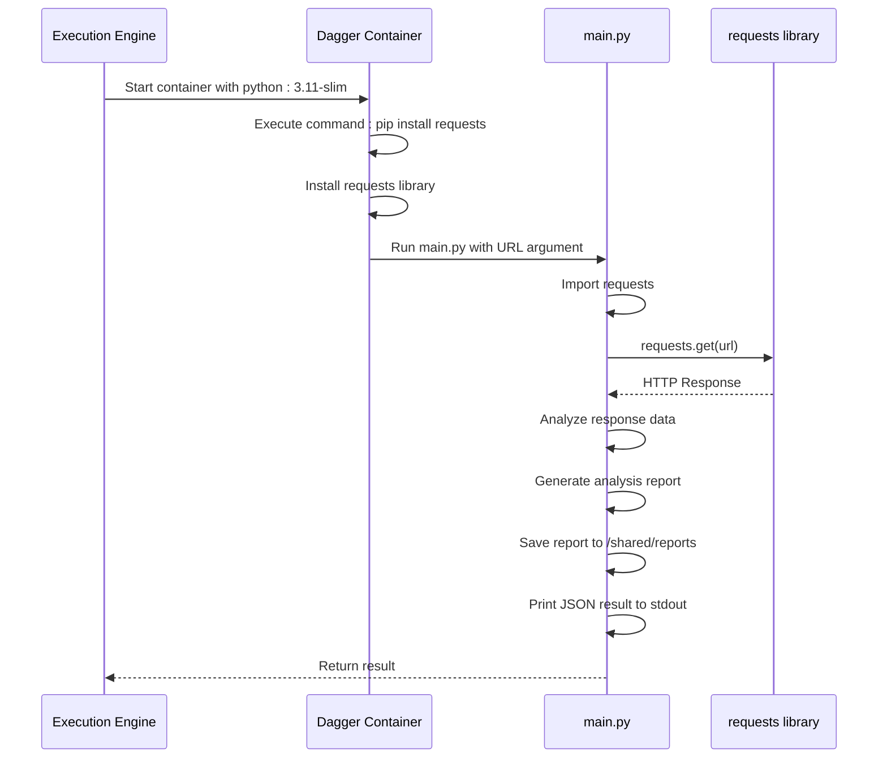
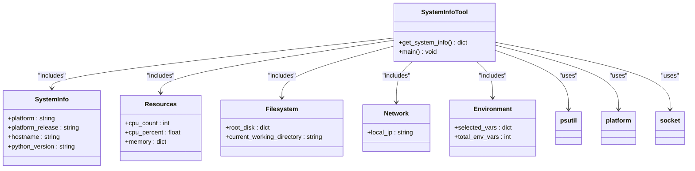
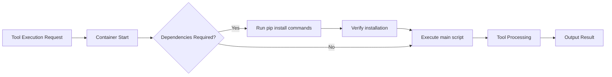
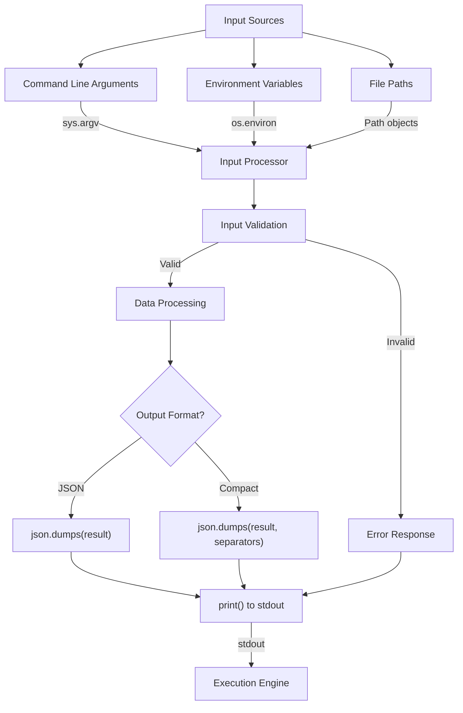
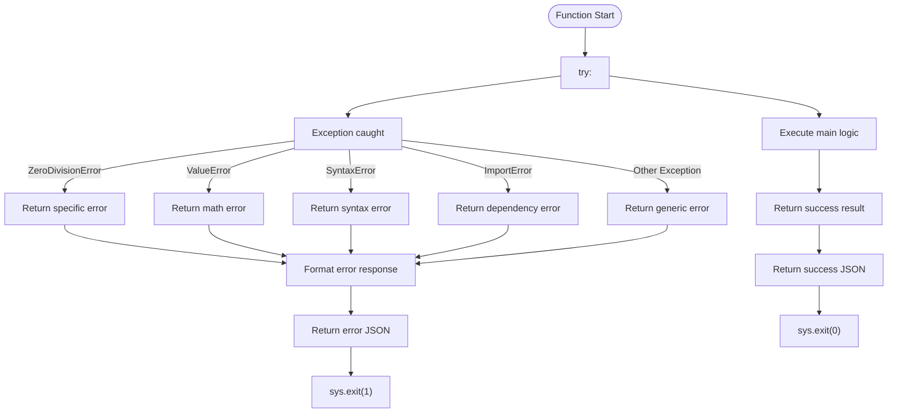
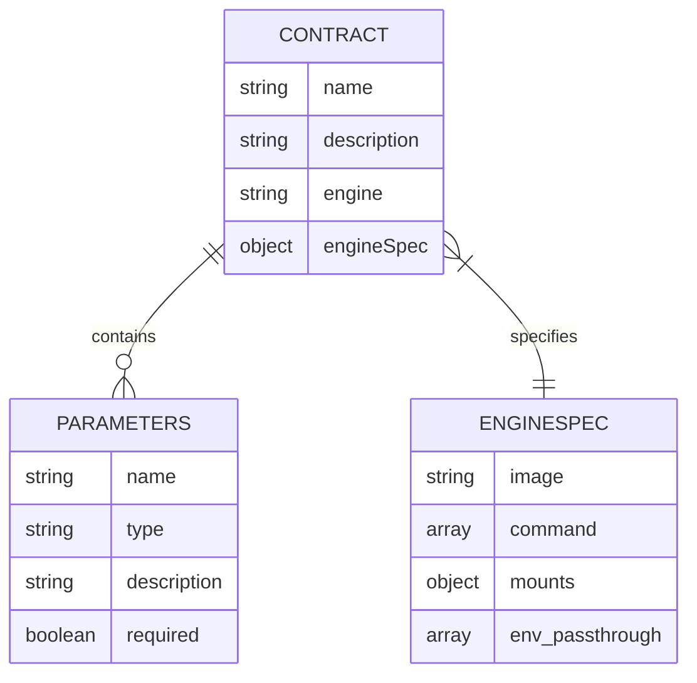

# Python Tool Implementations

## Table of Contents
1. [Introduction](#introduction)
2. [Project Structure](#project-structure)
3. [Core Components](#core-components)
4. [Architecture Overview](#architecture-overview)
5. [Detailed Component Analysis](#detailed-component-analysis)
6. [Dependency Management](#dependency-management)
7. [Input/Output Handling](#inputoutput-handling)
8. [Error Handling and Logging](#error-handling-and-logging)
9. [Tool Contracts and Execution Engine Integration](#tool-contracts-and-execution-engine-integration)
10. [Testing and Isolation](#testing-and-isolation)

## Introduction
This document provides a comprehensive analysis of Python-based tool implementations within the Praxis framework. The focus is on understanding how Python tools are structured, how they interact with the execution engine, manage dependencies, handle input/output, and implement best practices for error handling and logging. The analysis draws from real examples in the codebase including calculator, python_with_deps, system_info, and simple_python_tool to illustrate common patterns and implementation strategies.

## Project Structure
The project follows a modular structure with tools organized in a dedicated directory. Each tool has its own subdirectory containing implementation code and configuration files. The structure promotes isolation and reusability of individual tools while maintaining a consistent interface through standardized contracts.

**Diagram sources**
- [tools/calculator/main.py](file://tools/calculator/main.py)
- [tools/python_with_deps/main.py](file://tools/python_with_deps/main.py)
- [tools/system_info/main.py](file://tools/system_info/main.py)
- [tools/simple_python_tool/main.py](file://tools/simple_python_tool/main.py)

**Section sources**
- [tools/calculator/main.py](file://tools/calculator/main.py)
- [tools/python_with_deps/main.py](file://tools/python_with_deps/main.py)
- [tools/system_info/main.py](file://tools/system_info/main.py)
- [tools/simple_python_tool/main.py](file://tools/simple_python_tool/main.py)

## Core Components
The core components of Python tool implementations in the Praxis framework include the main execution script, the contract definition file, and the execution environment configuration. These components work together to provide a standardized interface for tool execution within containerized environments.

The main.py file contains the primary logic of each tool, implementing functions for data processing, analysis, or external service interaction. The contract.yaml file defines the tool's interface, parameters, and execution requirements. Together, these components enable consistent tool behavior and integration with the Praxis execution engine.

**Section sources**
- [tools/calculator/main.py](file://tools/calculator/main.py)
- [tools/calculator/contract.yaml](file://tools/calculator/contract.yaml)
- [tools/simple_python_tool/main.py](file://tools/simple_python_tool/main.py)
- [tools/simple_python_tool/contract.yaml](file://tools/simple_python_tool/contract.yaml)

## Architecture Overview
The architecture of Python tool implementations follows a containerized execution model where each tool runs in an isolated environment defined by its contract. Tools receive input through command-line arguments or environment variables, process data, and output results as JSON to stdout. The execution engine manages the lifecycle of these tools, handling dependency installation, environment setup, and result collection.

**Diagram sources**
- [tools/python_with_deps/contract.yaml](file://tools/python_with_deps/contract.yaml)
- [tools/system_info/contract.yaml](file://tools/system_info/contract.yaml)
- [tools/calculator/main.py](file://tools/calculator/main.py)

## Detailed Component Analysis

### Calculator Tool Analysis
The calculator tool demonstrates multiple input methods and safe expression evaluation. It supports both environment variables and command-line arguments, providing flexibility in how it receives input. The tool implements a secure expression evaluator that restricts allowed functions and characters to prevent code injection.

**Diagram sources**
- [tools/calculator/main.py](file://tools/calculator/main.py#L1-L157)

**Section sources**
- [tools/calculator/main.py](file://tools/calculator/main.py#L1-L157)
- [tools/calculator/contract.yaml](file://tools/calculator/contract.yaml#L1-L14)

### Python with Dependencies Tool Analysis
The python_with_deps tool demonstrates how to manage external Python packages within the Praxis framework. This tool uses the requests library to fetch and analyze data from URLs, requiring dependency installation at runtime through pip.

**Diagram sources**
- [tools/python_with_deps/main.py](file://tools/python_with_deps/main.py#L1-L95)
- [tools/python_with_deps/contract.yaml](file://tools/python_with_deps/contract.yaml#L1-L14)

**Section sources**
- [tools/python_with_deps/main.py](file://tools/python_with_deps/main.py#L1-L95)
- [tools/python_with_deps/contract.yaml](file://tools/python_with_deps/contract.yaml#L1-L14)

### System Information Tool Analysis
The system_info tool provides comprehensive system monitoring capabilities, collecting information about CPU, memory, disk, network, and environment variables. It demonstrates advanced configuration through environment variables and conditional output formatting.

**Diagram sources**
- [tools/system_info/main.py](file://tools/system_info/main.py#L1-L132)
- [tools/system_info/contract.yaml](file://tools/system_info/contract.yaml#L1-L18)

**Section sources**
- [tools/system_info/main.py](file://tools/system_info/main.py#L1-L132)
- [tools/system_info/contract.yaml](file://tools/system_info/contract.yaml#L1-L18)

## Dependency Management
Python tools in the Praxis framework manage dependencies through runtime installation specified in the contract.yaml file. The execution environment handles dependency installation before running the tool's main script.

The python_with_deps tool demonstrates this pattern by including a pip install command in its engineSpec.command field. This approach ensures that required packages are available when the tool executes, without requiring a custom Docker image.

**Diagram sources**
- [tools/python_with_deps/contract.yaml](file://tools/python_with_deps/contract.yaml#L1-L14)
- [tools/system_info/contract.yaml](file://tools/system_info/contract.yaml#L1-L18)

**Section sources**
- [tools/python_with_deps/contract.yaml](file://tools/python_with_deps/contract.yaml#L1-L14)
- [tools/system_info/contract.yaml](file://tools/system_info/contract.yaml#L1-L18)

## Input/Output Handling
Python tools in the Praxis framework use multiple methods for input and output handling. Input can be provided through command-line arguments, environment variables, or file paths, while output is consistently returned as JSON to stdout.

The calculator tool demonstrates multiple input methods, accepting expressions through environment variables (EXPRESSION) or command-line arguments. The system_info tool uses environment variables (DETAILED, FORMAT) to control output behavior, showing how configuration can be passed to tools.

**Diagram sources**
- [tools/calculator/main.py](file://tools/calculator/main.py#L1-L157)
- [tools/system_info/main.py](file://tools/system_info/main.py#L1-L132)

**Section sources**
- [tools/calculator/main.py](file://tools/calculator/main.py#L1-L157)
- [tools/system_info/main.py](file://tools/system_info/main.py#L1-L132)

## Error Handling and Logging
Python tools implement comprehensive error handling to ensure robust execution in containerized environments. Each tool follows a consistent pattern of returning structured JSON responses with success flags and error messages.

The calculator tool demonstrates exception handling for various error types including ZeroDivisionError, ValueError, and SyntaxError, providing specific error messages for each case. The system_info tool uses try-except blocks for each system information category, allowing partial results even when some data cannot be collected.

**Diagram sources**
- [tools/calculator/main.py](file://tools/calculator/main.py#L1-L157)
- [tools/system_info/main.py](file://tools/system_info/main.py#L1-L132)

**Section sources**
- [tools/calculator/main.py](file://tools/calculator/main.py#L1-L157)
- [tools/system_info/main.py](file://tools/system_info/main.py#L1-L132)

## Tool Contracts and Execution Engine Integration
Tool contracts defined in contract.yaml files provide the interface between Python tools and the Praxis execution engine. These contracts specify the tool's name, description, parameters, and execution requirements.

The contract.yaml structure includes:
- **name**: Unique identifier for the tool
- **description**: Human-readable description of tool functionality
- **engine**: Execution engine to use (dagger)
- **params**: List of input parameters with type and description
- **engineSpec**: Execution environment configuration including container image, command, mounts, and environment variables to pass through

**Diagram sources**
- [tools/calculator/contract.yaml](file://tools/calculator/contract.yaml#L1-L14)
- [tools/python_with_deps/contract.yaml](file://tools/python_with_deps/contract.yaml#L1-L14)
- [tools/system_info/contract.yaml](file://tools/system_info/contract.yaml#L1-L18)

**Section sources**
- [tools/calculator/contract.yaml](file://tools/calculator/contract.yaml#L1-L14)
- [tools/python_with_deps/contract.yaml](file://tools/python_with_deps/contract.yaml#L1-L14)
- [tools/system_info/contract.yaml](file://tools/system_info/contract.yaml#L1-L18)

## Testing and Isolation
Python tools can be tested in isolation using unit tests and mock inputs. The modular design allows tools to be executed independently of the full Praxis framework, facilitating local development and testing.

The simple_python_tool demonstrates a straightforward testing pattern, accepting a file path as input and generating a report. This tool can be tested locally by providing a sample text file and verifying the output statistics.

```mermaid
flowchart LR
Test[Testing Process] --> Setup["Set up test environment"]
Setup --> Mock["Create mock inputs"]
Mock --> Execute["Run tool with mock inputs"]
Execute --> Validate["Validate output structure"]
Validate --> Check["Check result accuracy"]
Check --> Report["Generate test report"]
Report --> CI["Integrate with CI/CD"]
```

**Diagram sources**
- [tools/simple_python_tool/main.py](file://tools/simple_python_tool/main.py#L1-L84)
- [tools/simple_python_tool/contract.yaml](file://tools/simple_python_tool/contract.yaml#L1-L14)

**Section sources**
- [tools/simple_python_tool/main.py](file://tools/simple_python_tool/main.py#L1-L84)
- [tools/simple_python_tool/contract.yaml](file://tools/simple_python_tool/contract.yaml#L1-L14)

**Referenced Files in This Document**   
- [tools/calculator/main.py](file://tools/calculator/main.py)
- [tools/calculator/contract.yaml](file://tools/calculator/contract.yaml)
- [tools/python_with_deps/main.py](file://tools/python_with_deps/main.py)
- [tools/python_with_deps/contract.yaml](file://tools/python_with_deps/contract.yaml)
- [tools/system_info/main.py](file://tools/system_info/main.py)
- [tools/system_info/contract.yaml](file://tools/system_info/contract.yaml)
- [tools/simple_python_tool/main.py](file://tools/simple_python_tool/main.py)
- [tools/simple_python_tool/contract.yaml](file://tools/simple_python_tool/contract.yaml)