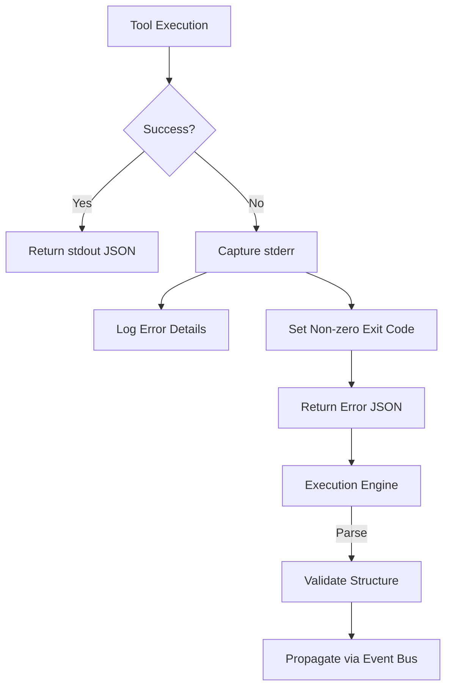
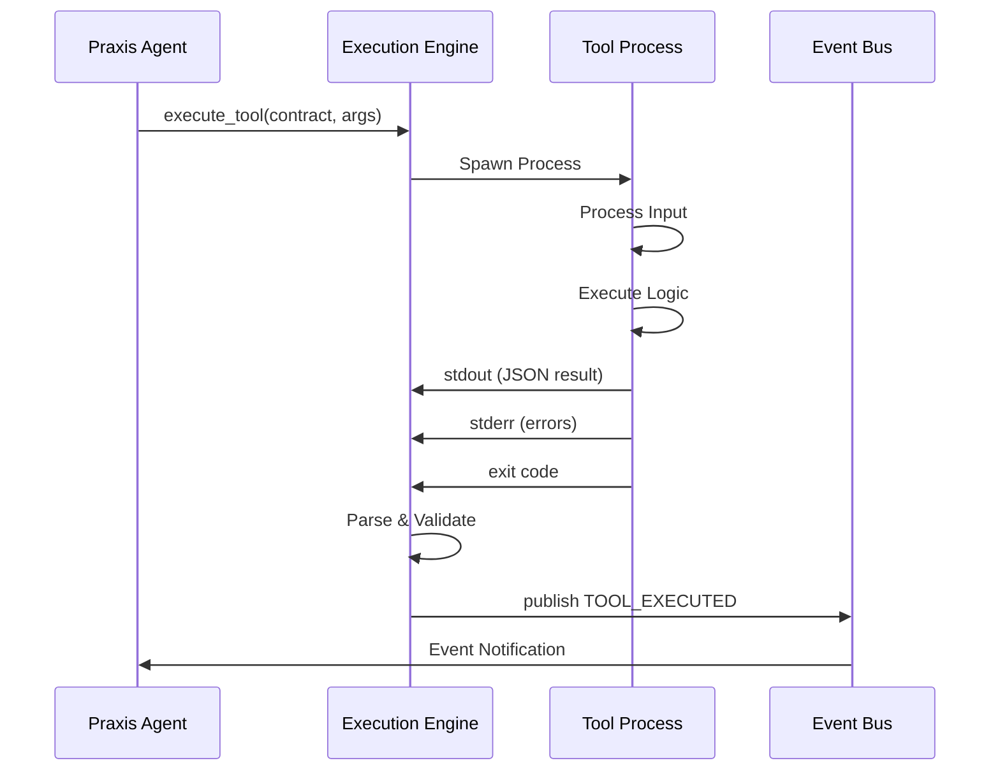

# Tool Communication and Data Flow


## Table of Contents
1. [Introduction](#introduction)
2. [Standardized Communication Protocol](#standardized-communication-protocol)
3. [Message Format Specification](#message-format-specification)
4. [Tool Implementation Examples](#tool-implementation-examples)
5. [Error Handling Mechanisms](#error-handling-mechanisms)
6. [Execution Engine Processing](#execution-engine-processing)
7. [Debugging Strategies](#debugging-strategies)
8. [Best Practices](#best-practices)

## Introduction
This document details the standardized communication patterns between Praxis agents and tools. The system enables interoperability across different programming languages by establishing a consistent input/output protocol. Tools receive configuration and input parameters through stdin and return results via stdout, ensuring language-agnostic integration. The execution engine orchestrates tool invocation, captures output, validates results, and propagates them through the event bus for downstream processing.

## Standardized Communication Protocol

The Praxis framework implements a standardized communication protocol that ensures consistent interaction between agents and tools regardless of implementation language. All tools follow a uniform pattern for receiving input and returning results.

Tools receive input parameters and configuration through multiple channels:
- **Environment variables**: Configuration and simple parameters
- **Command-line arguments**: Direct input values
- **stdin**: Complex input data or configuration

Tools return results exclusively through:
- **stdout**: JSON-serialized results
- **stderr**: Error messages and diagnostic information
- **Exit codes**: Execution status (0 for success, non-zero for failure)

This protocol enables the execution engine to interact with tools uniformly, abstracting away implementation details and language-specific considerations.

```mermaid
flowchart TD
Agent[Praxis Agent] --> |Invoke| Tool[Tool Execution]
subgraph ToolExecution
Direction LR
Input[Input Sources] --> Env[Environment Variables]
Input --> CLI[Command Line Arguments]
Input --> Stdin[stdin]
Tool --> |stdout| Output[JSON Results]
Tool --> |stderr| Errors[Error Messages]
Tool --> |Exit Code| Status[Execution Status]
end
Tool --> |Results| Engine[Execution Engine]
Engine --> |Parse & Validate| EventBus[Event Bus]
```

**Diagram sources**
- [main.py](file://tools/calculator/main.py)
- [main.py](file://tools/python_with_deps/main.py)
- [engine.py](file://src/praxis_sdk/execution/engine.py)

**Section sources**
- [main.py](file://tools/calculator/main.py)
- [main.py](file://tools/python_with_deps/main.py)

## Message Format Specification

The communication protocol defines a structured message format for tool input and output. While input can be provided through various methods, output follows a strict JSON serialization pattern on stdout.

### Input Parameters Structure
Tools can receive input through environment variables, command-line arguments, or stdin. The contract.yaml file defines the expected parameters:

```yaml
params:
  - name: "expression"
    type: "string"
    description: "Mathematical expression to evaluate"
    required: "false"
  - name: "operation"
    type: "string"
    description: "Basic operation: add, subtract, multiply, divide"
    required: "false"
```

### Output Result Structure
All tools must return results as JSON-serialized objects on stdout with the following structure:

```json
{
  "success": true,
  "result": "operation result",
  "metadata": {
    "tool": "tool name",
    "timestamp": "ISO format timestamp"
  }
}
```

For error conditions:

```json
{
  "success": false,
  "error": "error description",
  "error_type": "error classification"
}
```

The execution engine expects this standardized format to parse and validate results consistently across all tools.

## Tool Implementation Examples

### Calculator Tool (Simple Data)

The calculator tool demonstrates basic parameter handling and simple data processing. It accepts mathematical expressions or operations through environment variables or command-line arguments.

**Section sources**
- [main.py](file://tools/calculator/main.py)
- [contract.yaml](file://tools/calculator/contract.yaml)

#### Input Handling
```python
def main():
    expression = os.environ.get('EXPRESSION') or os.environ.get('expression')
    operation = os.environ.get('OPERATION') or os.environ.get('operation')
    num1_str = os.environ.get('NUM1') or os.environ.get('num1')
    num2_str = os.environ.get('NUM2') or os.environ.get('num2')
    
    if len(sys.argv) >= 2:
        # Handle command-line arguments
        if len(sys.argv) == 2:
            result = safe_eval_expression(sys.argv[1])
        elif len(sys.argv) == 4:
            num1 = float(sys.argv[1])
            operation = sys.argv[2]
            num2 = float(sys.argv[3])
            result = perform_basic_operation(num1, num2, operation.lower())
```

#### Output Serialization
```python
result = {
    "success": True,
    "expression": expression,
    "result": result_value,
    "result_type": type(result_value).__name__
}

print(json.dumps(result, indent=2))
```

### Python with Dependencies Tool (Complex Payloads)

The python_with_deps tool demonstrates handling complex payloads and external dependencies. It fetches and analyzes data from URLs using the requests library.

**Section sources**
- [main.py](file://tools/python_with_deps/main.py)
- [contract.yaml](file://tools/python_with_deps/contract.yaml)

#### Complex Input Processing
```python
def main():
    if len(sys.argv) != 2:
        print("Usage: python main.py <url>")
        sys.exit(1)
    
    url = sys.argv[1]
    if not url.startswith(('http://', 'https://')):
        url = 'https://' + url
    
    result = fetch_and_analyze_data(url)
```

#### Rich Output with Metadata
```python
analysis = {
    "url": url,
    "status_code": response.status_code,
    "content_length": len(content),
    "content_type": headers.get('content-type', 'unknown'),
    "response_time_ms": response.elapsed.total_seconds() * 1000
}

result = {
    "success": True,
    "tool": "url_analyzer",
    "analysis": analysis,
    "timestamp": datetime.datetime.utcnow().isoformat() + "Z"
}

print(json.dumps(result, indent=2))
```

## Error Handling Mechanisms

The Praxis framework implements a comprehensive error handling system that ensures reliable communication between agents and tools.

### Exit Code Signaling
Tools communicate execution status through exit codes:
- **Exit code 0**: Successful execution
- **Non-zero exit codes**: Execution failure

```python
if not result.get("success", False):
    sys.exit(1)
```

### Standardized Error Output
Error information is provided through stderr while maintaining the JSON output format on stdout:

```python
return {
    "success": False,
    "error": "Division by zero"
}
```

### Execution Engine Error Handling
The execution engine captures and processes errors systematically:



**Diagram sources**
- [main.py](file://tools/calculator/main.py)
- [main.py](file://tools/python_with_deps/main.py)
- [engine.py](file://src/praxis_sdk/execution/engine.py)

**Section sources**
- [main.py](file://tools/calculator/main.py)
- [main.py](file://tools/python_with_deps/main.py)

## Execution Engine Processing

The execution engine serves as the intermediary between Praxis agents and tools, managing the entire execution lifecycle.

### Output Capture and Parsing
The engine captures tool output and parses the JSON response:

```python
result = await engine.execute(contract, args, timeout)
```

### Result Validation
The engine validates the structure and content of tool responses:

```python
if result.success:
    logger.info(f"Tool {contract.name} executed successfully")
else:
    logger.warning(f"Tool {contract.name} failed: {result.error}")
```

### Event Propagation
Successful results are propagated through the event bus:

```python
await self.event_bus.publish_data(
    EventType.TOOL_EXECUTED,
    {
        "tool_name": contract.name,
        "engine": str(contract.engine),
        "success": result.success,
        "duration": result.duration,
        "error": result.error
    },
    source=f"agent.{self.agent_name}"
)
```



**Diagram sources**
- [engine.py](file://src/praxis_sdk/execution/engine.py)
- [agent.py](file://src/praxis_sdk/agent.py)

**Section sources**
- [engine.py](file://src/praxis_sdk/execution/engine.py)
- [agent.py](file://src/praxis_sdk/agent.py)

## Debugging Strategies

Effective debugging of communication failures and data serialization issues requires a systematic approach.

### Log Analysis
Examine execution engine logs for detailed processing information:

```
⚡ REAL DAGGER ENGINE: Starting execution of 'calculator'
   📊 Arguments: {'expression': '2+2'}
   🔧 Context: {}
   📦 Container Image: python:3.11-slim
```

### Output Inspection
Verify tool output format and content:

```bash
# Test tool directly
EXPRESSION='2+2' python tools/calculator/main.py

# Check JSON validity
python -m json.tool < output.json
```

### Environment Verification
Ensure required environment variables are properly passed:

```python
# In tool code
print(f"DEBUG: EXPRESSION={os.environ.get('EXPRESSION')}", file=sys.stderr)
```

### Step-by-Step Validation
1. Verify tool contract parameters
2. Check input parameter mapping
3. Validate JSON output structure
4. Confirm exit code signaling
5. Examine event bus propagation

## Best Practices

### Input/Output Management
For large inputs or outputs, consider streaming or file-based approaches:

```python
# For large inputs, read from stdin
if not expression and not operation:
    input_data = sys.stdin.read().strip()
    if input_data:
        try:
            params = json.loads(input_data)
            expression = params.get('expression')
        except json.JSONDecodeError:
            pass
```

### Error Resilience
Implement comprehensive error handling:

```python
try:
    result = perform_operation()
    output = {"success": True, "result": result}
except ValueError as e:
    output = {"success": False, "error": f"Invalid input: {str(e)}", "error_type": "validation"}
except Exception as e:
    output = {"success": False, "error": str(e), "error_type": "execution"}
```

### Performance Optimization
For streaming data, implement incremental processing:

```python
def process_large_dataset(stream):
    """Process data in chunks for memory efficiency"""
    results = []
    chunk_size = 1000
    
    for chunk in read_in_chunks(stream, chunk_size):
        processed = process_chunk(chunk)
        results.extend(processed)
        
        # Periodic output for long-running processes
        if len(results) % 10000 == 0:
            print(json.dumps({"progress": len(results)}), file=sys.stderr)
    
    return results
```

### Testing and Validation
Implement thorough testing:

```python
def test_calculator_tool():
    """Test calculator tool with various inputs"""
    import subprocess
    import json
    
    # Test basic arithmetic
    result = subprocess.run(
        ['python', 'tools/calculator/main.py', '2+2'],
        capture_output=True,
        text=True
    )
    
    output = json.loads(result.stdout)
    assert output["success"] == True
    assert output["result"] == 4
```

**Referenced Files in This Document**   
- [main.py](file://tools/calculator/main.py)
- [contract.yaml](file://tools/calculator/contract.yaml)
- [main.py](file://tools/python_with_deps/main.py)
- [contract.yaml](file://tools/python_with_deps/contract.yaml)
- [engine.py](file://src/praxis_sdk/execution/engine.py)
- [agent.py](file://src/praxis_sdk/agent.py)