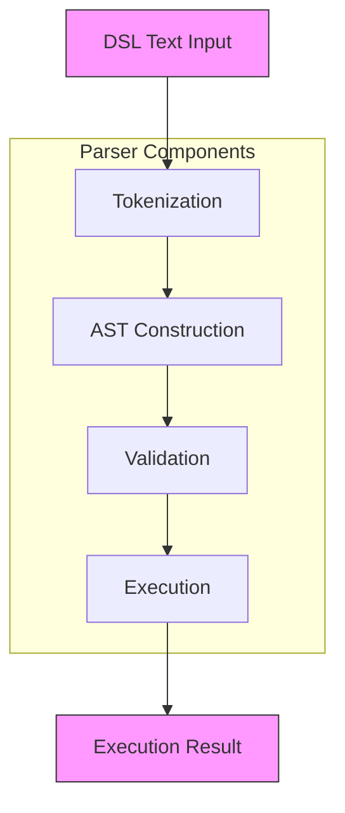
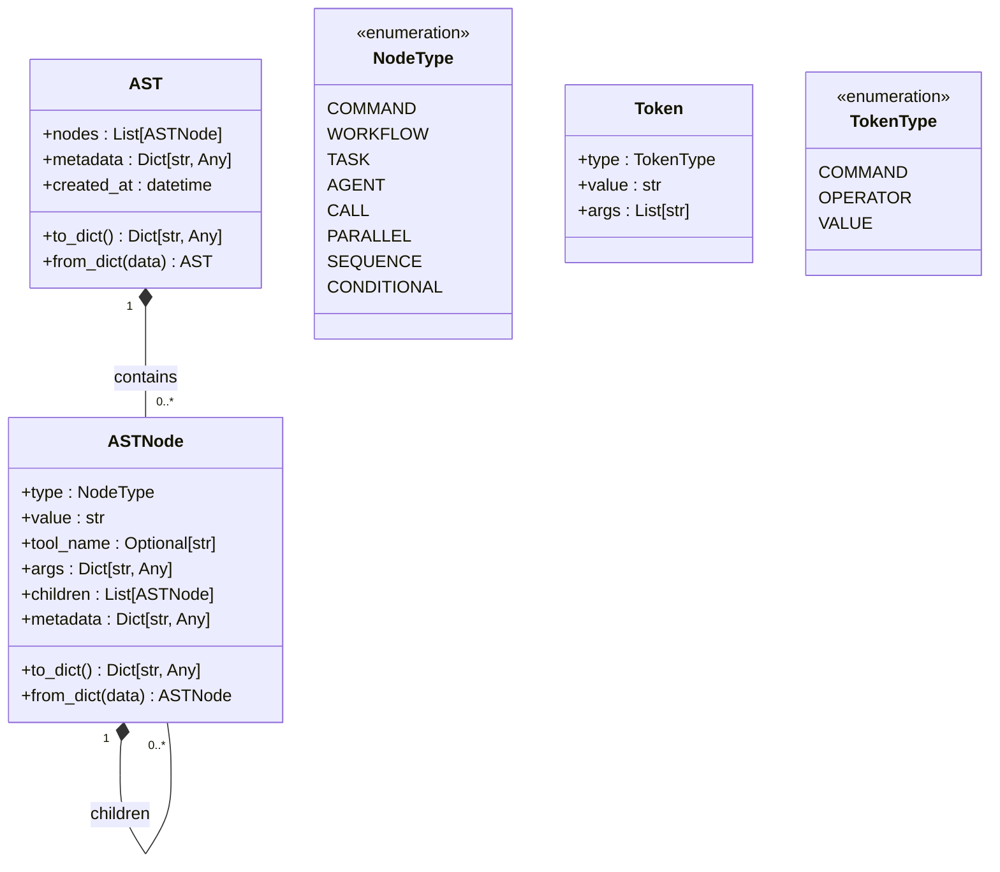
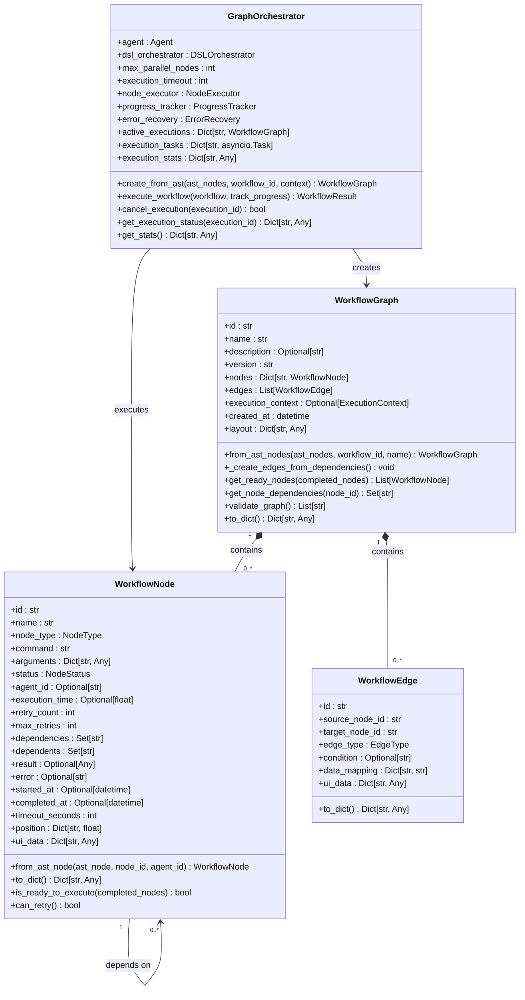
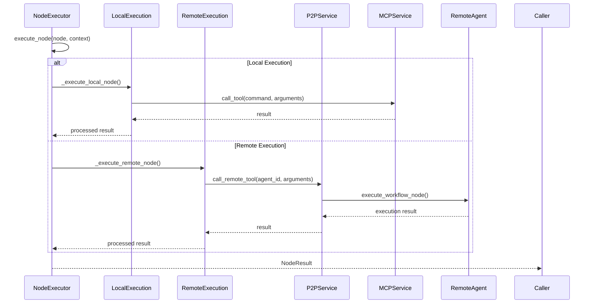
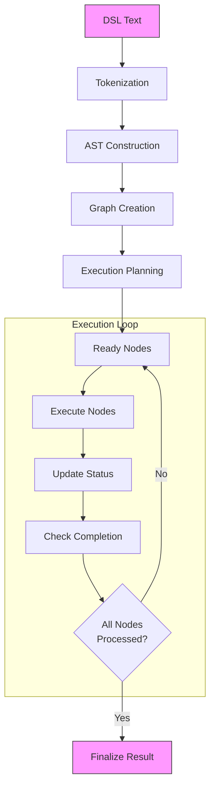
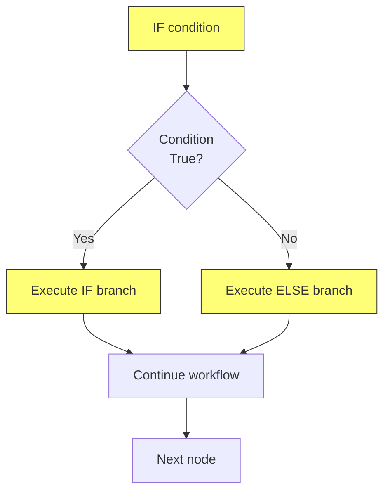
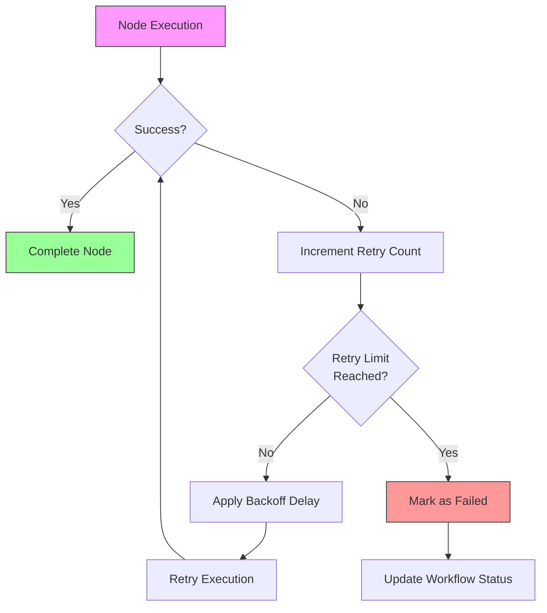
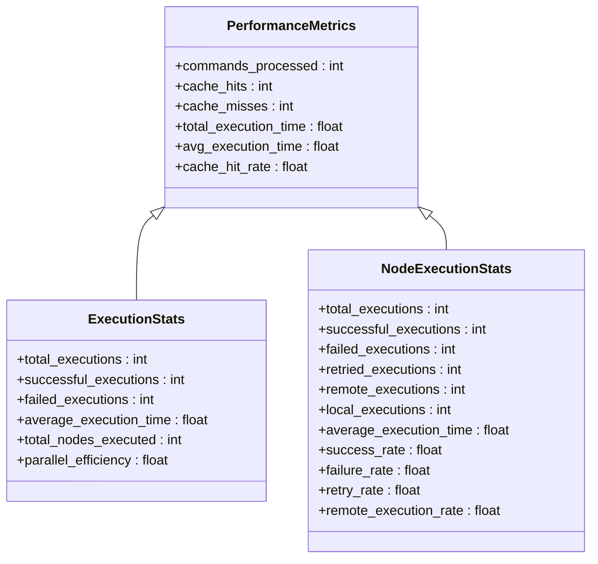
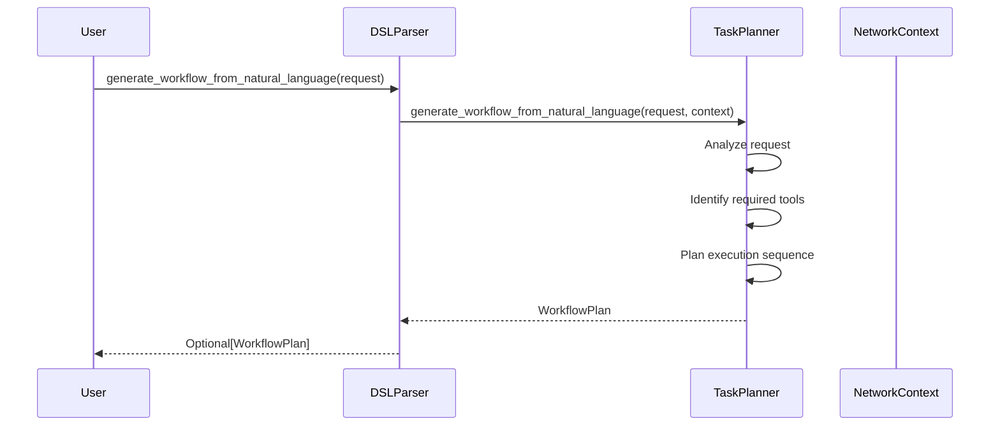

# Workflow Orchestration

## Table of Contents
1. [Introduction](#introduction)
2. [DSL Processing Pipeline](#dsl-processing-pipeline)
3. [AST Structure and Node Types](#ast-structure-and-node-types)
4. [Graph Orchestration System](#graph-orchestration-system)
5. [Node Execution and P2P Delegation](#node-execution-and-p2p-delegation)
6. [Workflow Execution Flow](#workflow-execution-flow)
7. [Conditional Logic and Control Flow](#conditional-logic-and-control-flow)
8. [Error Handling and Retry Mechanisms](#error-handling-and-retry-mechanisms)
9. [Performance Monitoring and Statistics](#performance-monitoring-and-statistics)
10. [Integration with LLM Planning](#integration-with-llm-planning)

## Introduction
The workflow orchestration system provides a comprehensive framework for executing complex workflows using both domain-specific language (DSL) and graph-based execution models. The system enables users to define workflows through a structured DSL syntax that is parsed into an Abstract Syntax Tree (AST), which is then transformed into an executable graph structure. This document details the architecture, components, and functionality of the orchestration system, focusing on the DSL parser, AST builder, graph orchestrator, and node executor components. The system supports advanced features including parallel execution, conditional branching, error recovery, and distributed task delegation through peer-to-peer (P2P) networks.

## DSL Processing Pipeline

The DSL processing pipeline transforms human-readable workflow definitions into executable structures through a multi-stage process. This pipeline begins with tokenization of the DSL text, followed by AST construction, validation, and finally execution. The `AdvancedDSLParser` class serves as the central component that coordinates these stages, providing a unified interface for parsing and executing DSL commands.

**Diagram sources**
- [parser.py](file://src/praxis_sdk/dsl/parser.py#L1-L100)

**Section sources**
- [parser.py](file://src/praxis_sdk/dsl/parser.py#L1-L100)

## AST Structure and Node Types

The Abstract Syntax Tree (AST) serves as the intermediate representation of DSL commands, capturing the hierarchical structure and semantic meaning of workflow definitions. The AST is composed of nodes that represent different types of operations and control structures. Each node contains metadata about its type, value, arguments, and child nodes for composite structures.

**Diagram sources**
- [types.py](file://src/praxis_sdk/dsl/types.py#L1-L100)

**Section sources**
- [types.py](file://src/praxis_sdk/dsl/types.py#L1-L100)

## Graph Orchestration System

The graph orchestration system manages the execution of workflows represented as directed acyclic graphs (DAGs). The `GraphOrchestrator` class coordinates the execution of nodes according to their dependencies, handling parallel and sequential execution patterns while providing real-time progress tracking and error recovery capabilities.

**Diagram sources**
- [graph_orchestrator.py](file://src/praxis_sdk/workflow/graph_orchestrator.py#L1-L100)
- [models.py](file://src/praxis_sdk/workflow/models.py#L1-L100)

**Section sources**
- [graph_orchestrator.py](file://src/praxis_sdk/workflow/graph_orchestrator.py#L1-L100)
- [models.py](file://src/praxis_sdk/workflow/models.py#L1-L100)

## Node Execution and P2P Delegation

The node execution system handles the actual execution of individual workflow nodes, supporting both local execution and remote delegation through P2P networks. The `NodeExecutor` class determines the appropriate execution strategy based on the node configuration and agent availability, implementing retry logic and error recovery mechanisms.

**Diagram sources**
- [node_executor.py](file://src/praxis_sdk/workflow/node_executor.py#L1-L100)

**Section sources**
- [node_executor.py](file://src/praxis_sdk/workflow/node_executor.py#L1-L100)

## Workflow Execution Flow

The workflow execution flow illustrates the complete process from DSL input to final execution result. This flow encompasses the transformation of DSL text into an executable graph, the orchestration of node execution according to dependencies, and the collection of results with comprehensive error handling.

**Diagram sources**
- [parser.py](file://src/praxis_sdk/dsl/parser.py#L1-L100)
- [graph_orchestrator.py](file://src/praxis_sdk/workflow/graph_orchestrator.py#L1-L100)

**Section sources**
- [parser.py](file://src/praxis_sdk/dsl/parser.py#L1-L100)
- [graph_orchestrator.py](file://src/praxis_sdk/workflow/graph_orchestrator.py#L1-L100)

## Conditional Logic and Control Flow

The system supports conditional logic through the CONDITIONAL node type, enabling workflows to make decisions based on runtime conditions. The AST builder parses IF/ELSE constructs into conditional nodes that contain separate branches for different execution paths.

**Diagram sources**
- [ast_builder.py](file://src/praxis_sdk/dsl/ast_builder.py#L1-L100)

**Section sources**
- [ast_builder.py](file://src/praxis_sdk/dsl/ast_builder.py#L1-L100)

## Error Handling and Retry Mechanisms

The orchestration system implements comprehensive error handling and retry mechanisms to ensure robust workflow execution. Each component includes specific error handling strategies, with the node executor implementing retry logic for transient failures and the graph orchestrator managing workflow-level error recovery.

**Diagram sources**
- [node_executor.py](file://src/praxis_sdk/workflow/node_executor.py#L1-L100)

**Section sources**
- [node_executor.py](file://src/praxis_sdk/workflow/node_executor.py#L1-L100)

## Performance Monitoring and Statistics

The system includes comprehensive performance monitoring and statistics collection across all components. The parser, orchestrator, and executor components track execution metrics such as processing time, cache hit rates, and success/failure rates, providing insights into workflow performance and system efficiency.

**Diagram sources**
- [parser.py](file://src/praxis_sdk/dsl/parser.py#L1-L100)
- [graph_orchestrator.py](file://src/praxis_sdk/workflow/graph_orchestrator.py#L1-L100)
- [node_executor.py](file://src/praxis_sdk/workflow/node_executor.py#L1-L100)

**Section sources**
- [parser.py](file://src/praxis_sdk/dsl/parser.py#L1-L100)
- [graph_orchestrator.py](file://src/praxis_sdk/workflow/graph_orchestrator.py#L1-L100)
- [node_executor.py](file://src/praxis_sdk/workflow/node_executor.py#L1-L100)

## Integration with LLM Planning

The workflow orchestration system integrates with LLM-based planning capabilities, allowing natural language requests to be transformed into executable workflows. The `AdvancedDSLParser` includes functionality to generate workflow plans from natural language input by leveraging a task planner component.

**Diagram sources**
- [parser.py](file://src/praxis_sdk/dsl/parser.py#L1-L100)

**Section sources**
- [parser.py](file://src/praxis_sdk/dsl/parser.py#L1-L100)

**Referenced Files in This Document**   
- [parser.py](file://src/praxis_sdk/dsl/parser.py)
- [ast_builder.py](file://src/praxis_sdk/dsl/ast_builder.py)
- [types.py](file://src/praxis_sdk/dsl/types.py)
- [graph_orchestrator.py](file://src/praxis_sdk/workflow/graph_orchestrator.py)
- [node_executor.py](file://src/praxis_sdk/workflow/node_executor.py)
- [models.py](file://src/praxis_sdk/workflow/models.py)