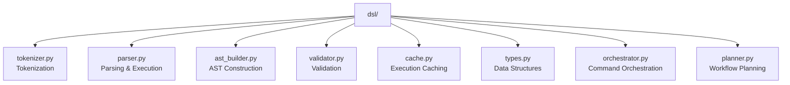
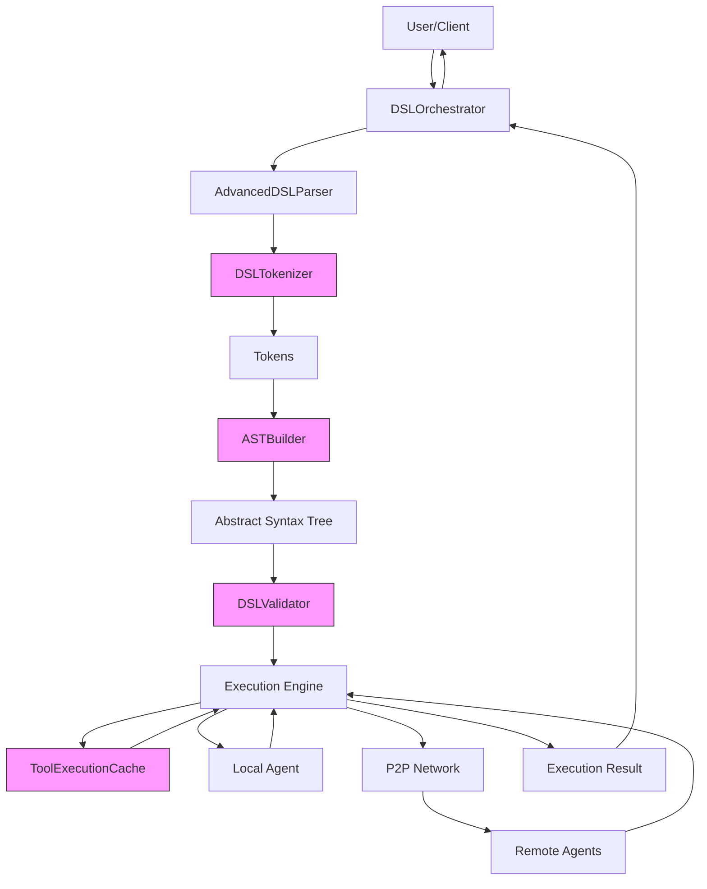
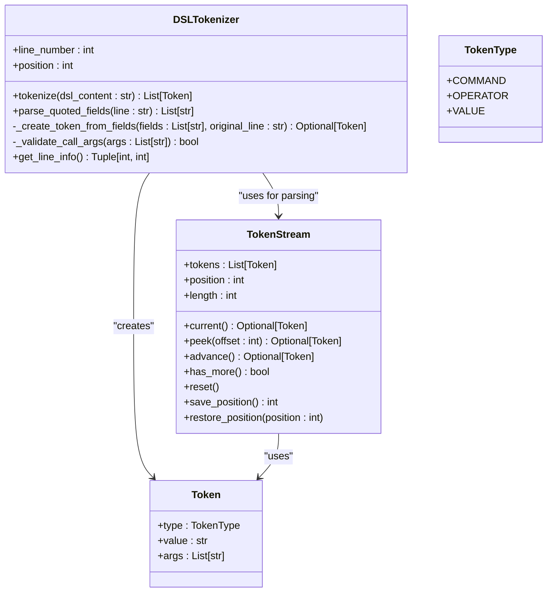
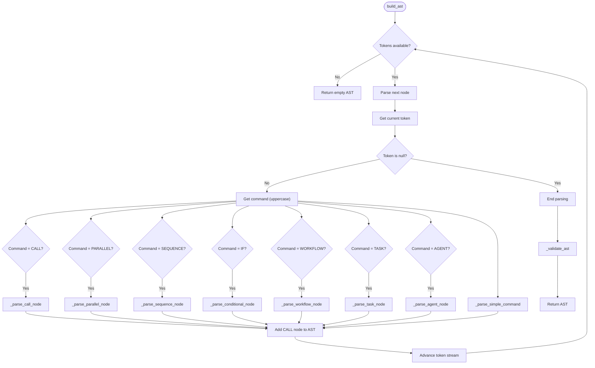
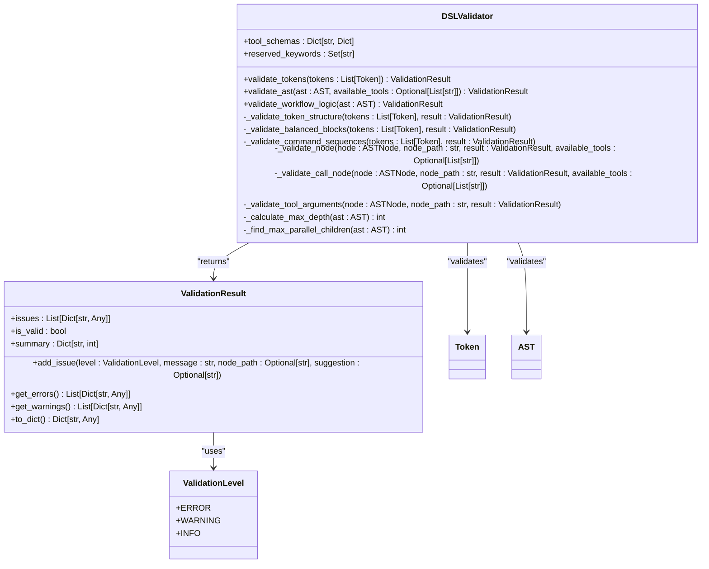
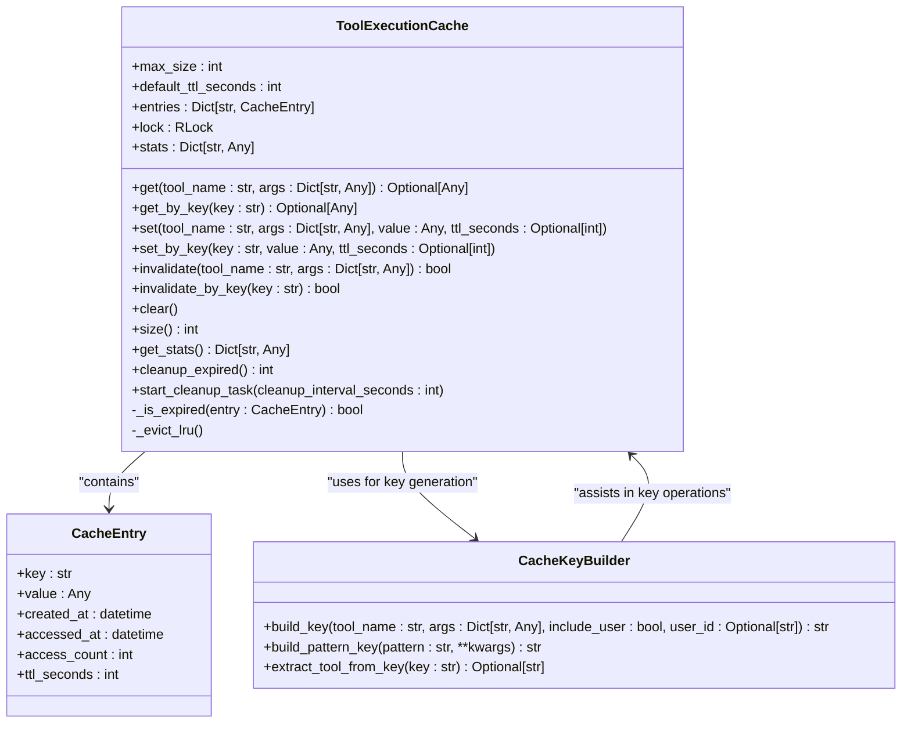
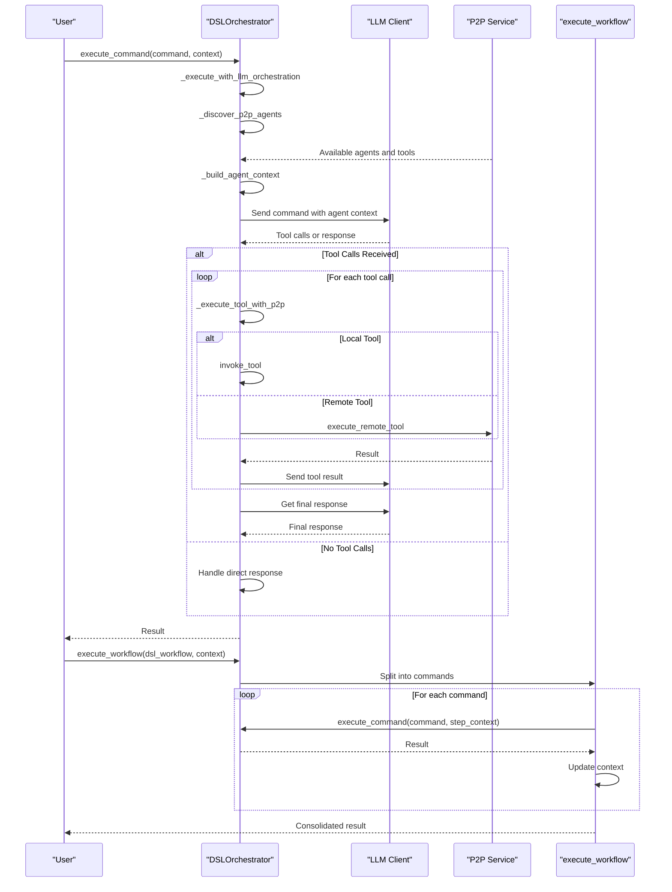
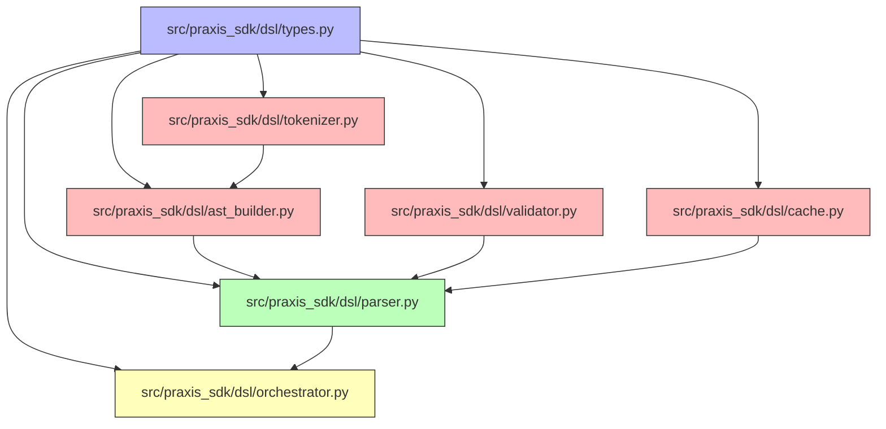

# DSL Orchestration


## Table of Contents
1. [Introduction](#introduction)
2. [Project Structure](#project-structure)
3. [Core Components](#core-components)
4. [Architecture Overview](#architecture-overview)
5. [Detailed Component Analysis](#detailed-component-analysis)
6. [Dependency Analysis](#dependency-analysis)
7. [Performance Considerations](#performance-considerations)
8. [Troubleshooting Guide](#troubleshooting-guide)
9. [Conclusion](#conclusion)

## Introduction
The DSL Orchestration system is a comprehensive framework for processing and executing domain-specific language (DSL) commands within a distributed agent network. This system enables both simple command execution and complex workflow orchestration through a multi-layered architecture that includes tokenization, parsing, abstract syntax tree (AST) construction, validation, caching, and execution. The system supports advanced control flow constructs including parallel execution, sequential workflows, conditional logic, and task dependencies. It integrates with local and remote agents through a peer-to-peer (P2P) network, allowing for distributed tool execution and resource sharing. The orchestration system leverages large language models (LLMs) for natural language understanding and intelligent command routing, making it accessible through both structured DSL syntax and natural language requests.

## Project Structure
The DSL orchestration system is organized within the `src/praxis_sdk/dsl` directory, containing specialized modules for each stage of the DSL processing pipeline. The structure follows a clean separation of concerns, with distinct components for tokenization, parsing, AST building, validation, caching, and orchestration.



**Diagram sources**
- [src/praxis_sdk/dsl/tokenizer.py](file://src/praxis_sdk/dsl/tokenizer.py)
- [src/praxis_sdk/dsl/parser.py](file://src/praxis_sdk/dsl/parser.py)
- [src/praxis_sdk/dsl/ast_builder.py](file://src/praxis_sdk/dsl/ast_builder.py)
- [src/praxis_sdk/dsl/validator.py](file://src/praxis_sdk/dsl/validator.py)
- [src/praxis_sdk/dsl/cache.py](file://src/praxis_sdk/dsl/cache.py)
- [src/praxis_sdk/dsl/types.py](file://src/praxis_sdk/dsl/types.py)
- [src/praxis_sdk/dsl/orchestrator.py](file://src/praxis_sdk/dsl/orchestrator.py)

**Section sources**
- [src/praxis_sdk/dsl/tokenizer.py](file://src/praxis_sdk/dsl/tokenizer.py)
- [src/praxis_sdk/dsl/parser.py](file://src/praxis_sdk/dsl/parser.py)
- [src/praxis_sdk/dsl/ast_builder.py](file://src/praxis_sdk/dsl/ast_builder.py)
- [src/praxis_sdk/dsl/validator.py](file://src/praxis_sdk/dsl/validator.py)
- [src/praxis_sdk/dsl/cache.py](file://src/praxis_sdk/dsl/cache.py)
- [src/praxis_sdk/dsl/types.py](file://src/praxis_sdk/dsl/types.py)
- [src/praxis_sdk/dsl/orchestrator.py](file://src/praxis_sdk/dsl/orchestrator.py)

## Core Components
The DSL orchestration system consists of several core components that work together to process and execute DSL commands. The tokenizer breaks down raw DSL text into structured tokens, handling complex quoting and escaping rules. The parser coordinates the entire processing pipeline, integrating tokenization, AST building, validation, and execution. The AST builder converts token sequences into a hierarchical abstract syntax tree that represents the workflow structure. The validator ensures syntactic and semantic correctness of both tokens and the AST. The cache module optimizes performance by storing results of expensive tool executions. The orchestrator serves as the entry point, managing command execution and integrating with the agent network. These components are supported by a comprehensive type system that defines the data structures used throughout the DSL processing pipeline.

**Section sources**
- [src/praxis_sdk/dsl/tokenizer.py](file://src/praxis_sdk/dsl/tokenizer.py)
- [src/praxis_sdk/dsl/parser.py](file://src/praxis_sdk/dsl/parser.py)
- [src/praxis_sdk/dsl/ast_builder.py](file://src/praxis_sdk/dsl/ast_builder.py)
- [src/praxis_sdk/dsl/validator.py](file://src/praxis_sdk/dsl/validator.py)
- [src/praxis_sdk/dsl/cache.py](file://src/praxis_sdk/dsl/cache.py)
- [src/praxis_sdk/dsl/types.py](file://src/praxis_sdk/dsl/types.py)
- [src/praxis_sdk/dsl/orchestrator.py](file://src/praxis_sdk/dsl/orchestrator.py)

## Architecture Overview
The DSL orchestration system follows a pipeline architecture where commands flow through multiple processing stages before execution. The process begins with the orchestrator receiving a command, which is then passed to the parser for comprehensive processing. The parser first uses the tokenizer to convert the DSL text into tokens, then the AST builder constructs a hierarchical representation of the workflow. The validator checks both the token sequence and the AST for correctness before execution proceeds. During execution, the parser coordinates node evaluation, leveraging the cache to avoid redundant tool executions. The system supports both local execution and distributed execution through the P2P network, with the orchestrator making intelligent routing decisions based on agent capabilities.



**Diagram sources**
- [src/praxis_sdk/dsl/orchestrator.py](file://src/praxis_sdk/dsl/orchestrator.py#L150-L200)
- [src/praxis_sdk/dsl/parser.py](file://src/praxis_sdk/dsl/parser.py#L50-L100)
- [src/praxis_sdk/dsl/tokenizer.py](file://src/praxis_sdk/dsl/tokenizer.py#L20-L50)
- [src/praxis_sdk/dsl/ast_builder.py](file://src/praxis_sdk/dsl/ast_builder.py#L20-L50)
- [src/praxis_sdk/dsl/validator.py](file://src/praxis_sdk/dsl/validator.py#L20-L50)
- [src/praxis_sdk/dsl/cache.py](file://src/praxis_sdk/dsl/cache.py#L20-L50)

## Detailed Component Analysis

### Tokenizer Analysis
The DSL tokenizer is responsible for converting raw DSL text into structured tokens that can be processed by the parser. It handles complex text parsing requirements including quoted strings, escape sequences, and command arguments. The tokenizer processes input line by line, skipping comments and empty lines, and converts each line into a sequence of fields that respect quoting rules.



**Diagram sources**
- [src/praxis_sdk/dsl/tokenizer.py](file://src/praxis_sdk/dsl/tokenizer.py#L20-L300)

**Section sources**
- [src/praxis_sdk/dsl/tokenizer.py](file://src/praxis_sdk/dsl/tokenizer.py#L20-L300)

### Parser and Execution Engine Analysis
The AdvancedDSLParser serves as the central processing engine for DSL commands, coordinating tokenization, AST building, validation, and execution. It provides a comprehensive API for parsing and executing DSL content, with support for caching, performance monitoring, and agent integration. The parser implements a node-based execution model where different node types (CALL, PARALLEL, SEQUENCE, CONDITIONAL) are handled by specialized execution methods.

```mermaid
sequenceDiagram
participant User as "User"
participant Orchestrator as "DSLOrchestrator"
participant Parser as "AdvancedDSLParser"
participant Tokenizer as "DSLTokenizer"
participant ASTBuilder as "ASTBuilder"
participant Validator as "DSLValidator"
participant Cache as "ToolExecutionCache"
participant Agent as "AgentInterface"
User->>Orchestrator : execute_command(command, context)
Orchestrator->>Parser : parse_and_execute(dsl_content, context)
Parser->>Tokenizer : tokenize(dsl_content)
Tokenizer-->>Parser : List[Token]
Parser->>Validator : validate_tokens(tokens)
Validator-->>Parser : ValidationResult
Parser->>ASTBuilder : build_ast(tokens)
ASTBuilder-->>Parser : AST
Parser->>Validator : validate_ast(ast, available_tools)
Validator-->>Parser : ValidationResult
Parser->>Parser : execute_ast(ast, context)
loop For each AST node
Parser->>Parser : _execute_node(node, context)
alt CALL Node
Parser->>Cache : get(tool_name, args)
alt Cache Hit
Cache-->>Parser : cached result
Parser->>Parser : return cached result
else Cache Miss
Cache-->>Parser : None
Parser->>Agent : execute_tool_with_agent(tool_name, args)
Agent-->>Parser : execution result
Parser->>Cache : set(tool_name, args, result)
end
elif PARALLEL Node
Parser->>Parser : _execute_parallel_node(node, context)
Parser->>Parser : asyncio.gather(*tasks)
elif SEQUENCE Node
Parser->>Parser : _execute_sequence_node(node, context)
loop For each child
Parser->>Parser : _execute_node(child, context)
end
elif CONDITIONAL Node
Parser->>Parser : _execute_conditional_node(node, context)
end
end
Parser-->>Orchestrator : ExecutionResult
Orchestrator-->>User : result
```

**Diagram sources**
- [src/praxis_sdk/dsl/parser.py](file://src/praxis_sdk/dsl/parser.py#L50-L700)

**Section sources**
- [src/praxis_sdk/dsl/parser.py](file://src/praxis_sdk/dsl/parser.py#L50-L700)

### AST Builder Analysis
The ASTBuilder converts token sequences into a hierarchical abstract syntax tree that represents the structure of the DSL workflow. It handles various node types including CALL, PARALLEL, SEQUENCE, and CONDITIONAL, constructing a tree that preserves the intended execution semantics. The builder uses a token stream with lookahead capabilities to parse nested structures and block terminators.



**Diagram sources**
- [src/praxis_sdk/dsl/ast_builder.py](file://src/praxis_sdk/dsl/ast_builder.py#L20-L500)

**Section sources**
- [src/praxis_sdk/dsl/ast_builder.py](file://src/praxis_sdk/dsl/ast_builder.py#L20-L500)

### Validator Analysis
The DSLValidator provides comprehensive validation of both tokens and the abstract syntax tree, ensuring syntactic and semantic correctness before execution. It performs multiple levels of validation including token structure, balanced blocks, command sequences, and AST semantics. The validator returns detailed results with error, warning, and informational messages, supporting both immediate feedback and batch processing.



**Diagram sources**
- [src/praxis_sdk/dsl/validator.py](file://src/praxis_sdk/dsl/validator.py#L20-L600)

**Section sources**
- [src/praxis_sdk/dsl/validator.py](file://src/praxis_sdk/dsl/validator.py#L20-L600)

### Cache Module Analysis
The ToolExecutionCache provides performance optimization by storing results of expensive tool executions and serving them from memory on subsequent requests. The cache is thread-safe with LRU (Least Recently Used) eviction and TTL (Time To Live) support, ensuring memory efficiency and data freshness. It supports both synchronous and asynchronous cleanup operations to remove expired entries.



**Diagram sources**
- [src/praxis_sdk/dsl/cache.py](file://src/praxis_sdk/dsl/cache.py#L20-L350)

**Section sources**
- [src/praxis_sdk/dsl/cache.py](file://src/praxis_sdk/dsl/cache.py#L20-L350)

### Orchestrator Analysis
The DSLOrchestrator serves as the primary interface for executing DSL commands, integrating with the P2P network and LLM-based orchestration. It routes all commands through LLM analysis to determine the appropriate tools and agents for execution, supporting both natural language requests and structured DSL commands. The orchestrator manages workflow execution, error handling, and context propagation across sequential commands.



**Diagram sources**
- [src/praxis_sdk/dsl/orchestrator.py](file://src/praxis_sdk/dsl/orchestrator.py#L150-L800)

**Section sources**
- [src/praxis_sdk/dsl/orchestrator.py](file://src/praxis_sdk/dsl/orchestrator.py#L150-L800)

## Dependency Analysis
The DSL orchestration system components are interconnected in a pipeline architecture where each component depends on the previous stage's output. The orchestrator depends on the parser for command execution, which in turn depends on the tokenizer, AST builder, validator, and cache. The types module is a foundational dependency for all components, providing the shared data structures. The validator depends on the types for AST and token definitions, while the AST builder depends on both types and the tokenizer's TokenStream. The cache module is used by the parser during execution to optimize performance. This dependency structure ensures a clean separation of concerns while enabling efficient data flow through the processing pipeline.



**Diagram sources**
- [src/praxis_sdk/dsl/types.py](file://src/praxis_sdk/dsl/types.py)
- [src/praxis_sdk/dsl/tokenizer.py](file://src/praxis_sdk/dsl/tokenizer.py)
- [src/praxis_sdk/dsl/ast_builder.py](file://src/praxis_sdk/dsl/ast_builder.py)
- [src/praxis_sdk/dsl/validator.py](file://src/praxis_sdk/dsl/validator.py)
- [src/praxis_sdk/dsl/cache.py](file://src/praxis_sdk/dsl/cache.py)
- [src/praxis_sdk/dsl/parser.py](file://src/praxis_sdk/dsl/parser.py)
- [src/praxis_sdk/dsl/orchestrator.py](file://src/praxis_sdk/dsl/orchestrator.py)

**Section sources**
- [src/praxis_sdk/dsl/types.py](file://src/praxis_sdk/dsl/types.py)
- [src/praxis_sdk/dsl/tokenizer.py](file://src/praxis_sdk/dsl/tokenizer.py)
- [src/praxis_sdk/dsl/ast_builder.py](file://src/praxis_sdk/dsl/ast_builder.py)
- [src/praxis_sdk/dsl/validator.py](file://src/praxis_sdk/dsl/validator.py)
- [src/praxis_sdk/dsl/cache.py](file://src/praxis_sdk/dsl/cache.py)
- [src/praxis_sdk/dsl/parser.py](file://src/praxis_sdk/dsl/parser.py)
- [src/praxis_sdk/dsl/orchestrator.py](file://src/praxis_sdk/dsl/orchestrator.py)

## Performance Considerations
The DSL orchestration system incorporates several performance optimization strategies to ensure efficient command processing and execution. The ToolExecutionCache provides significant performance benefits by storing results of expensive operations and serving them from memory on subsequent requests. The cache implements LRU (Least Recently Used) eviction with TTL (Time To Live) support, preventing memory bloat while maintaining data freshness. For large workflows, the system supports parallel execution through the PARALLEL node type, allowing multiple tasks to run concurrently and reducing overall execution time. The parser maintains performance statistics including execution time, cache hit rates, and command processing metrics, enabling monitoring and optimization. The tokenizer and AST builder are designed to process input in a single pass where possible, minimizing computational overhead. For distributed execution, the orchestrator intelligently routes commands to appropriate agents, reducing network latency and bandwidth usage by executing tasks on the most suitable nodes.

**Section sources**
- [src/praxis_sdk/dsl/cache.py](file://src/praxis_sdk/dsl/cache.py)
- [src/praxis_sdk/dsl/parser.py](file://src/praxis_sdk/dsl/parser.py)
- [src/praxis_sdk/dsl/orchestrator.py](file://src/praxis_sdk/dsl/orchestrator.py)

## Troubleshooting Guide
When encountering issues with the DSL orchestration system, consider the following common problems and solutions:

1. **Syntax Errors**: If you receive DSLSyntaxError messages, check your command syntax, particularly quoting and escaping. Ensure that quoted strings are properly closed and escape sequences are correctly formatted.

2. **Validation Failures**: DSLValidationError messages indicate semantic issues such as missing required arguments or invalid tool names. Verify that all required parameters are provided and that tool names match available capabilities.

3. **Cache Issues**: If expecting cached results but getting cache misses, check the TTL settings and ensure that the tool name and arguments exactly match previous executions. The cache key is generated from the tool name and arguments, so any variation will result in a miss.

4. **Execution Failures**: When commands fail to execute, check agent availability and tool registration. Use the help command to verify available tools, and ensure that the P2P network is properly connected if using remote agents.

5. **Performance Problems**: For slow execution, examine the cache hit rate using get_stats(). Consider increasing the cache size or TTL for frequently used operations. For large workflows, use PARALLEL blocks to execute independent tasks concurrently.

6. **LLM Orchestration Issues**: If natural language commands are not being handled correctly, verify the LLM configuration and check the system prompt in the orchestrator. Ensure that agent discovery is working properly to provide accurate tool availability information.

**Section sources**
- [src/praxis_sdk/dsl/tokenizer.py](file://src/praxis_sdk/dsl/tokenizer.py)
- [src/praxis_sdk/dsl/validator.py](file://src/praxis_sdk/dsl/validator.py)
- [src/praxis_sdk/dsl/cache.py](file://src/praxis_sdk/dsl/cache.py)
- [src/praxis_sdk/dsl/orchestrator.py](file://src/praxis_sdk/dsl/orchestrator.py)

## Conclusion
The DSL orchestration system provides a robust framework for processing and executing domain-specific language commands in both local and distributed environments. By combining structured DSL syntax with natural language understanding through LLM integration, the system offers flexible and intuitive command interfaces. The modular architecture with clear separation of concerns enables maintainability and extensibility, while the comprehensive validation and error handling ensure reliability. Performance optimizations through caching and parallel execution make the system suitable for both simple commands and complex workflows. The integration with the P2P network allows for resource sharing and distributed processing, making it well-suited for agent-based systems. Future enhancements could include more sophisticated workflow planning, enhanced error recovery mechanisms, and improved performance monitoring capabilities.

**Referenced Files in This Document**   
- [src/praxis_sdk/dsl/tokenizer.py](file://src/praxis_sdk/dsl/tokenizer.py)
- [src/praxis_sdk/dsl/parser.py](file://src/praxis_sdk/dsl/parser.py)
- [src/praxis_sdk/dsl/ast_builder.py](file://src/praxis_sdk/dsl/ast_builder.py)
- [src/praxis_sdk/dsl/validator.py](file://src/praxis_sdk/dsl/validator.py)
- [src/praxis_sdk/dsl/cache.py](file://src/praxis_sdk/dsl/cache.py)
- [src/praxis_sdk/dsl/types.py](file://src/praxis_sdk/dsl/types.py)
- [src/praxis_sdk/dsl/orchestrator.py](file://src/praxis_sdk/dsl/orchestrator.py)