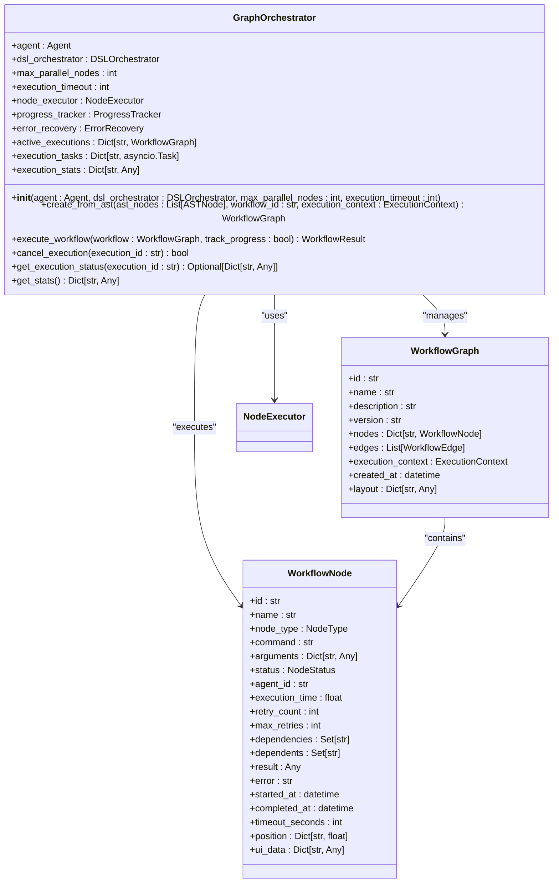
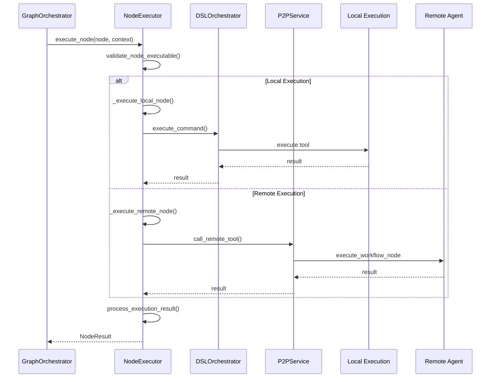
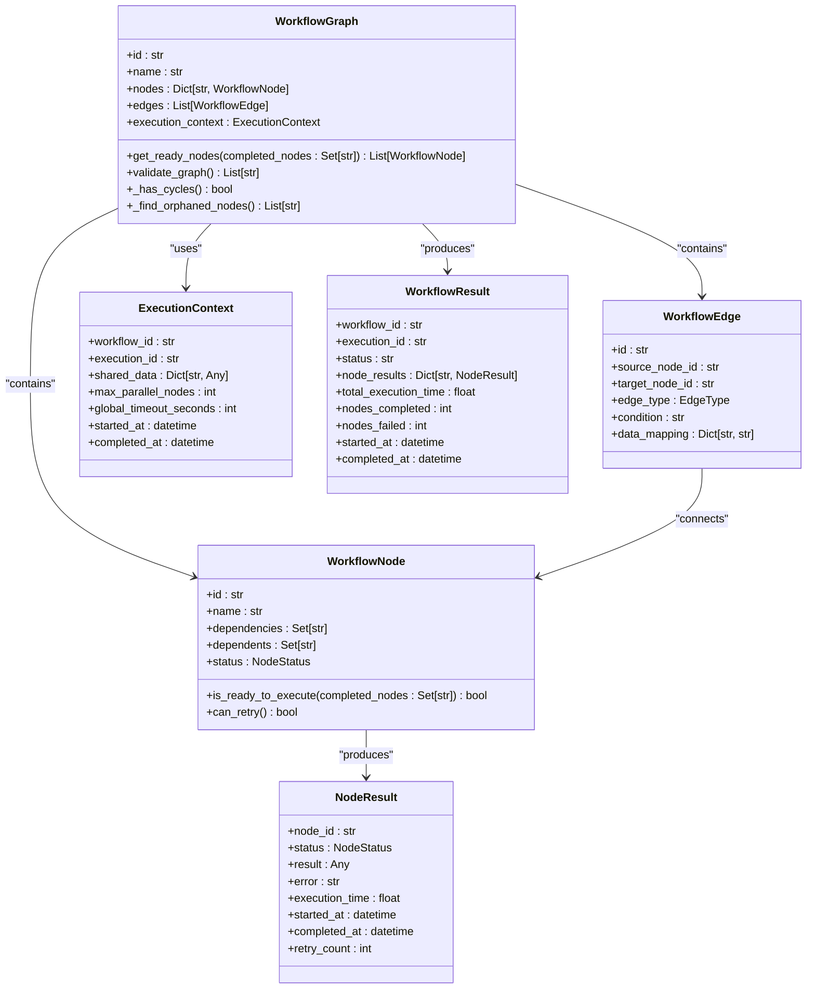
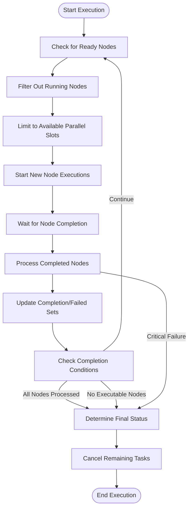
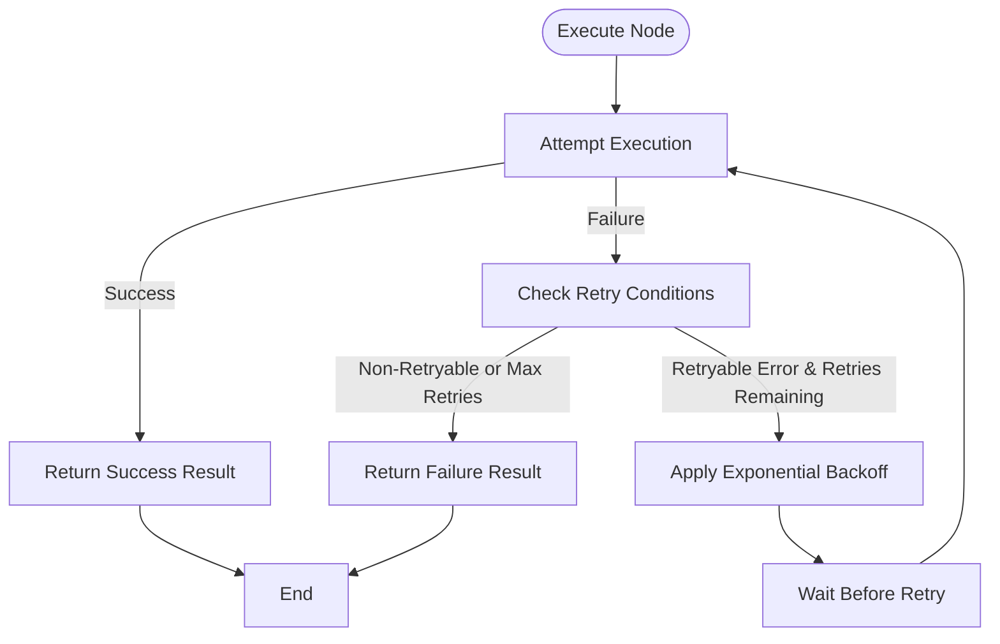
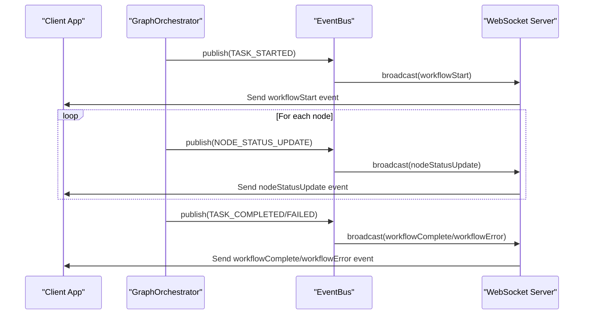
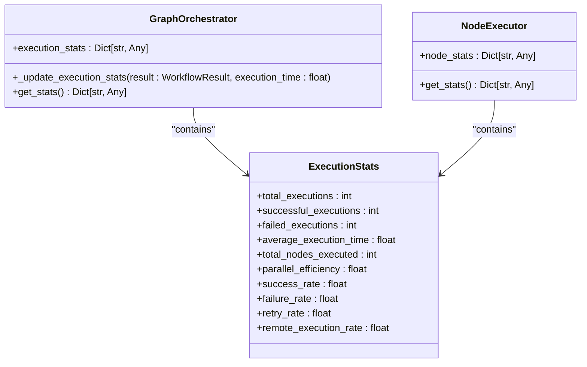
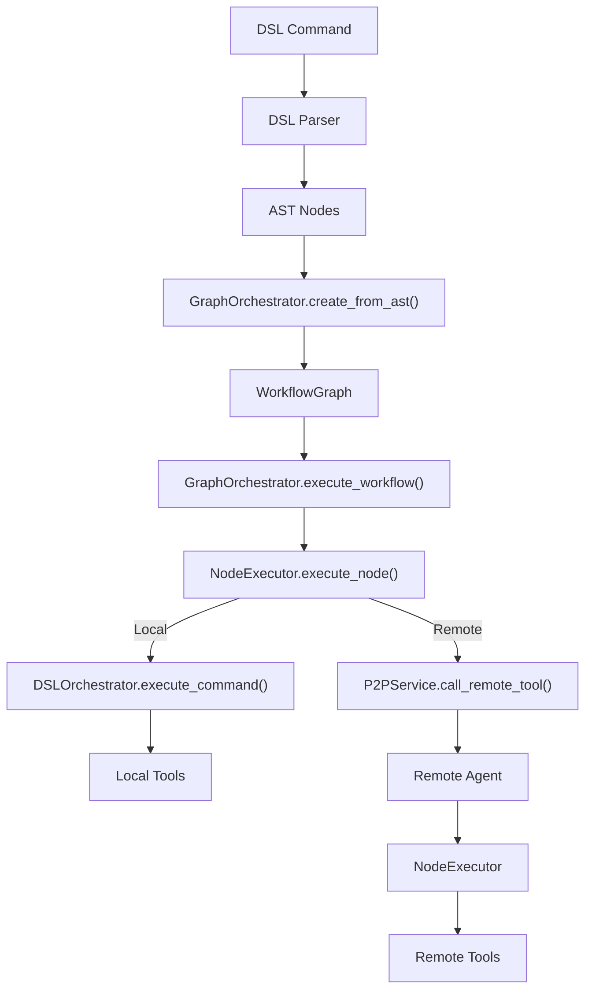

# Graph-Based Execution

## Table of Contents
1. [Introduction](#introduction)
2. [Core Components](#core-components)
3. [Graph Orchestration](#graph-orchestration)
4. [Node Execution](#node-execution)
5. [Workflow Graph Structure](#workflow-graph-structure)
6. [Execution Flow](#execution-flow)
7. [Error Handling and Recovery](#error-handling-and-recovery)
8. [Progress Tracking and Events](#progress-tracking-and-events)
9. [Performance and Statistics](#performance-and-statistics)
10. [Integration with DSL and Agent Systems](#integration-with-dsl-and-agent-systems)

## Introduction
The Graph-Based Execution system is a comprehensive workflow orchestration engine that manages the execution of complex, directed acyclic graphs (DAGs) composed of interconnected nodes. This system enables parallel and sequential execution of tasks, real-time progress tracking, error recovery, and integration with distributed agent networks through P2P communication. The architecture is designed to handle workflows of varying complexity, from simple linear sequences to sophisticated parallel and conditional execution patterns. The system provides robust mechanisms for monitoring execution status, handling failures, and ensuring reliable task completion across distributed environments.

## Core Components

The graph-based execution system consists of several core components that work together to orchestrate workflow execution. The primary components include the GraphOrchestrator, NodeExecutor, and supporting data models defined in the workflow module. The GraphOrchestrator serves as the central controller that manages the overall workflow execution, coordinating the execution of individual nodes according to their dependencies and execution constraints. The NodeExecutor handles the execution of individual workflow nodes, determining whether to execute them locally or delegate them to remote agents via P2P communication. The system also includes comprehensive data models that define the structure of workflow graphs, nodes, edges, and execution contexts.

**Section sources**
- [graph_orchestrator.py](file://src/praxis_sdk/workflow/graph_orchestrator.py#L1-L50)
- [node_executor.py](file://src/praxis_sdk/workflow/node_executor.py#L1-L50)
- [models.py](file://src/praxis_sdk/workflow/models.py#L1-L50)

## Graph Orchestration

The GraphOrchestrator class is the central component responsible for managing the execution of workflow graphs. It provides functionality for creating workflow graphs from Abstract Syntax Tree (AST) nodes, executing workflows with progress tracking, canceling active executions, and retrieving execution status. The orchestrator supports parallel execution of nodes up to a configurable limit, ensuring efficient utilization of system resources while maintaining execution order constraints defined by node dependencies.

**Diagram sources**
- [graph_orchestrator.py](file://src/praxis_sdk/workflow/graph_orchestrator.py#L100-L150)
- [models.py](file://src/praxis_sdk/workflow/models.py#L100-L200)

## Node Execution

The NodeExecutor class is responsible for executing individual workflow nodes. It determines the appropriate execution strategy based on the node configuration, choosing between local execution and remote execution via P2P delegation. The executor handles retry logic for failed nodes, manages execution context, and processes execution results. It integrates with the DSL orchestrator for local execution and with the P2P service for remote execution, providing a unified interface for node execution regardless of the execution location.

**Diagram sources**
- [node_executor.py](file://src/praxis_sdk/workflow/node_executor.py#L50-L100)
- [graph_orchestrator.py](file://src/praxis_sdk/workflow/graph_orchestrator.py#L500-L550)

## Workflow Graph Structure

The workflow graph structure is defined by several data classes that represent the components of a directed acyclic graph (DAG). The WorkflowGraph class contains a collection of WorkflowNode objects connected by WorkflowEdge objects. Each node represents an executable task with its dependencies, while edges represent the relationships between nodes. The graph structure supports various edge types including sequence, parallel, conditional, and data flow connections, enabling complex workflow patterns.

**Diagram sources**
- [models.py](file://src/praxis_sdk/workflow/models.py#L100-L500)

## Execution Flow

The execution flow of a workflow graph follows a systematic process that ensures proper dependency resolution and efficient parallel execution. The orchestrator continuously monitors the execution state, identifying nodes that are ready to execute based on their dependencies. It manages a pool of running nodes, respecting the maximum parallel execution limit, and processes completed nodes to update the execution state and trigger subsequent nodes.

**Diagram sources**
- [graph_orchestrator.py](file://src/praxis_sdk/workflow/graph_orchestrator.py#L300-L450)

## Error Handling and Recovery

The system implements comprehensive error handling and recovery mechanisms to ensure robust workflow execution. Each node can be configured with a maximum number of retry attempts, and the NodeExecutor automatically handles retry logic for transient failures. The system distinguishes between retryable and non-retryable errors based on error message patterns, allowing for intelligent recovery from network issues and temporary failures while avoiding infinite retry loops for permanent errors.

**Diagram sources**
- [node_executor.py](file://src/praxis_sdk/workflow/node_executor.py#L150-L250)

## Progress Tracking and Events

The system provides real-time progress tracking through WebSocket events and event bus notifications. The GraphOrchestrator emits various progress update events throughout the execution lifecycle, including workflow start, node completion, and workflow completion events. These events contain detailed information about the execution state, enabling external systems to monitor progress and provide user feedback.

**Diagram sources**
- [graph_orchestrator.py](file://src/praxis_sdk/workflow/graph_orchestrator.py#L700-L800)

## Performance and Statistics

The system collects detailed performance statistics for both workflow execution and individual node execution. The GraphOrchestrator maintains metrics such as total executions, successful and failed executions, average execution time, and parallel efficiency. Similarly, the NodeExecutor tracks statistics for node execution, including success rate, failure rate, retry rate, and remote execution rate. These statistics provide valuable insights into system performance and can be used for optimization and monitoring.

**Diagram sources**
- [graph_orchestrator.py](file://src/praxis_sdk/workflow/graph_orchestrator.py#L150-L200)
- [node_executor.py](file://src/praxis_sdk/workflow/node_executor.py#L50-L100)

## Integration with DSL and Agent Systems

The graph-based execution system is tightly integrated with the DSL orchestrator and agent systems, enabling seamless execution of workflows defined in the DSL language. The GraphOrchestrator can create workflow graphs from DSL AST nodes, and the NodeExecutor can execute nodes using the DSL orchestrator for local execution or delegate to remote agents via P2P communication. This integration allows for flexible execution strategies and distributed workflow processing across multiple agents.

**Diagram sources**
- [graph_orchestrator.py](file://src/praxis_sdk/workflow/graph_orchestrator.py#L200-L300)
- [node_executor.py](file://src/praxis_sdk/workflow/node_executor.py#L100-L150)
- [dsl/orchestrator.py](file://src/praxis_sdk/dsl/orchestrator.py#L50-L100)
- [agent.py](file://src/praxis_sdk/agent.py#L50-L100)

**Referenced Files in This Document**   
- [graph_orchestrator.py](file://src/praxis_sdk/workflow/graph_orchestrator.py)
- [node_executor.py](file://src/praxis_sdk/workflow/node_executor.py)
- [models.py](file://src/praxis_sdk/workflow/models.py)
- [dsl/orchestrator.py](file://src/praxis_sdk/dsl/orchestrator.py)
- [agent.py](file://src/praxis_sdk/agent.py)