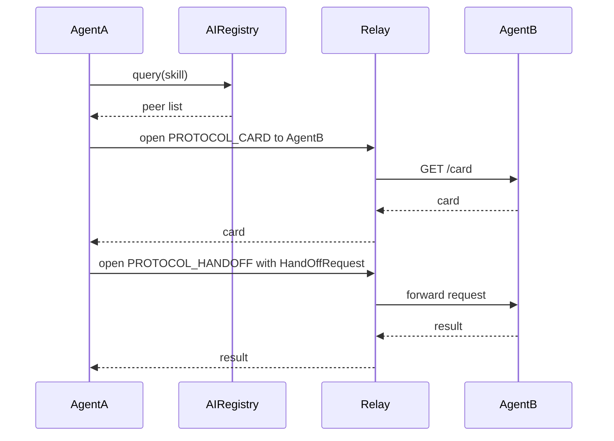

# Decentralized Agent to Agent Protocols

This document describes the peer to peer protocols used by the SDK to allow one agent to discover another and delegate work. Two custom libp2p protocols are defined:

```python
from libp2p.custom_types import TProtocol

PROTOCOL_CARD: TProtocol = TProtocol("/ai-agent/card/1.0.0")
PROTOCOL_HANDOFF: TProtocol = TProtocol("/ai-agent/handoff/1.0.0")
```

The `card` protocol exposes information about an agent and the skills it implements, while the `handoff` protocol allows an agent to invoke those skills remotely.

## Card Protocol

The card protocol acts like the Google A2A Card. When a peer opens a stream to `PROTOCOL_CARD`, the handler makes a local HTTP request to the agent's `/card` endpoint and returns the response over the stream.

```python
async def handle_card(stream: INetStream) -> None:
    peer_id_str = str(stream.muxed_conn.peer_id)
    timestamp = datetime.datetime.now(datetime.timezone.utc).isoformat()
    cfg = get_p2p_config()
    card_url = f"{cfg.agent_host.url}/card"
    async with httpx.AsyncClient(timeout=2.0) as client:
        response = await client.get(card_url)
        response.raise_for_status()
    await stream.write(response.content)
```

The returned card contains a list of skills with their paths and schemas. Each skill simply corresponds to an HTTP endpoint hosted locally by the agent.

## Handoff Protocol

The handoff protocol is similar to OpenAI's Swarm handoff mechanism. It enables one agent to delegate an action to another by sending a `HandOffRequest` JSON payload. The receiving handler maps the request to a local HTTP call and streams back the result.

```python
class HandOffRequest(pydantic.BaseModel):
    method: str
    path: str
    params: dict = pydantic.Field(default={})
    input_data: str | None = pydantic.Field(default=None)
```

```python
async def handle_handoff(stream: INetStream) -> None:
    payload_bytes = await stream.read()
    payload = HandOffRequest.parse_obj(payload_bytes)
    base_url = f"{get_p2p_config().agent_host.url}"
    formatted_path = payload.path.format(**payload.params) if payload.params else payload.path
    request_url = f"{base_url}/{formatted_path.lstrip('/')}"
    async with httpx.AsyncClient(timeout=10.0) as client:
        response = await client.request(payload.method.upper(), request_url, json=payload.input_data)
        response.raise_for_status()
    await stream.write(response.content)
```

## Discovery and Delegation Flow

1. **Discover peers** – Agent A queries the AI Registry for agents that expose the desired skill.
2. **Fetch cards** – For each candidate peer, Agent A opens a `PROTOCOL_CARD` stream via the relay to retrieve its card.
3. **Select peer** – Using the card information, Agent A chooses the most relevant agent skill.
4. **Delegate task** – Agent A opens a `PROTOCOL_HANDOFF` stream and sends a `HandOffRequest` describing which local endpoint of skill to invoke on Agent B.
5. **Receive result** – Agent B executes the endpoint and streams the result back to Agent A.

### Sequence Diagram



### C4 Component Diagram

```plantuml

```
