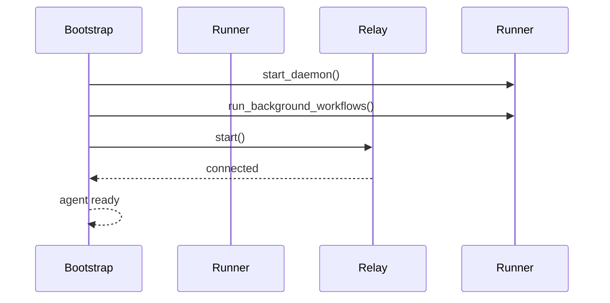
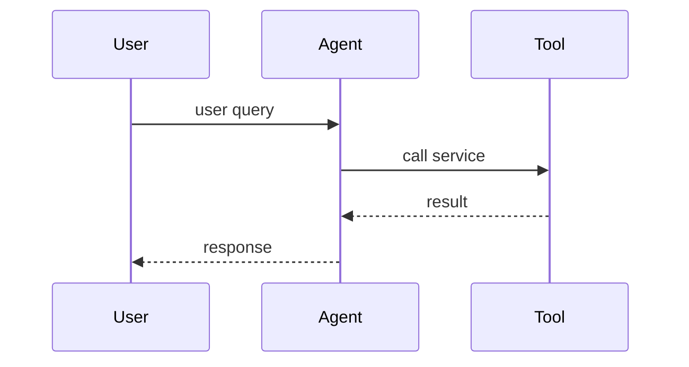
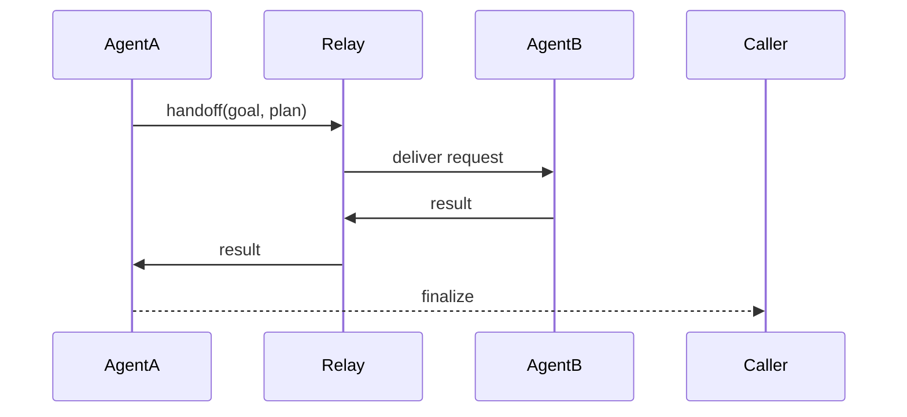
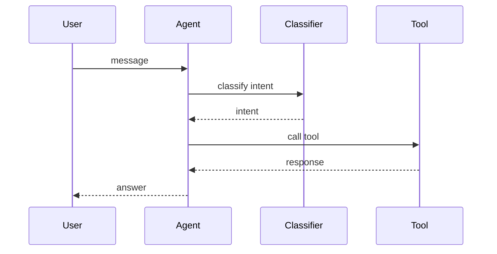

# Sequence Diagrams

The following diagrams outline typical interactions with the SDK agent.

- **bootstrapping.mmd** – shows how the agent initializes its workflow runner and connects to the relay when the service starts.

- **tool-interaction.mmd** – depicts the agent receiving a user request and invoking an external tool to fulfil it.

- **agent-handoff.mmd** – illustrates one agent delegating a request to another via the relay service and returning the result.

- **user-chat.mmd** – demonstrates the conversational flow where a user message is classified, triggers a tool call and the agent replies back.

