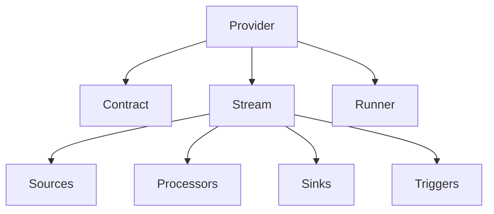

# Base Data Provider 

A modular system for managing data contracts, streams, and integrations with support for both synchronous and asynchronous operations.

## Quickstart

```python
from base_provider import provider_builder
from base_provider.config import get_provider_config

# Initialize with default config
config = get_provider_config()
provider = provider_builder(config)

# Fetch contract
contract = provider.contract.spec

# Query data
result = await provider.query({"filter": "example"})

# Subscribe to stream
topic = await provider.subscribe({"filter": "example"})
```

**Minimal Config (.env)**:
```ini
DOMAIN=my_provider
VERSION=v1
KAFKA_BOOTSTRAP_URI=kafka://localhost:9092
```

## Core Architecture

### Component Diagram


### Data Flow
1. **Initialization**: Provider builds contract and configures stream
2. **Execution**: Runner processes data through sources → processors → sinks
3. **Delivery**: Results returned directly (sync) or via Kafka topic (async)

## Modules

### 1. Contract (`contract/`)
Defines data specifications and SLAs.

**Key Features**:
- Schema validation
- Version management
- Mode support (sync/async)

**Usage**:
```python
from base_provider.contract import get_data_contract

contract = get_data_contract()
spec = contract.spec
```

### 2. Stream (`stream/`)
Orchestrates data pipelines.

**Components**:
- Sources: Data ingestion
- Processors: Transformation logic
- Sinks: Output destinations
- Triggers: Pipeline activation

**Example**:
```python
stream = stream_builder()
await stream.process_batch(data, filters={...})
```

### 3. Sinks (`sinks/`)
Output handlers including Kafka integration.

**Implementations**:

| Class | Description |
|-------|-------------|
| `BaseDataSink` | Fallback implementation |
| `KafkaDataSink` | Async Kafka publishing |

**Kafka Example**:
```python
sink = get_kafka_data_sink()
await sink.write(data, topic="events")
```

### 4. Runner (`runner/`)
Executes data operations.

**Methods**:
- `run_once()`: Single batch processing
- `run()`: Continuous streaming

## API Endpoints

| Endpoint | Method | Description |
|----------|--------|-------------|
| `/v1/contract` | GET | Get contract specification |
| `/v1/query` | POST | Execute sync query |
| `/v1/subscribe` | POST | Create async subscription |

## Configuration

**Environment Variables**:

| Variable                              | Required | Example |
|---------------------------------------|--------|-------------|
| `DOMAIN`                              | Yes | `my_provider` |
| `KAFKA_BOOTSTRAP_URI`                 | For async | `kafka://cluster:9092` |
| `VERSION`                                    | Yes | `v1` |

## Deployment

### 1. Local Development
```bash
uvicorn base_provider.entrypoint:app --reload
```

### 2. Production (Ray Serve)
```python
from base_provider.ray_entrypoint import provider_builder
serve.run(provider_builder({...}))
```

## Source Structure
```
/src
├── contract/       # Data contracts
├── processors/     # Data transformations
├── runner/         # Execution logic
├── sinks/          # Output handlers
├── sources/        # Data ingestion
├── stream/         # Pipeline orchestration
├── triggers/       # Event initiators
├── bootstrap.py    # Provider initialization
└── config.py       # Core configuration
```

## Requirements
- Python 3.10+
- Dependencies:
  ```text
  pydantic>=2.0
  fastapi>=0.95.0
  ray[serve]>=2.5.0
  faststream[kafka]
  ```